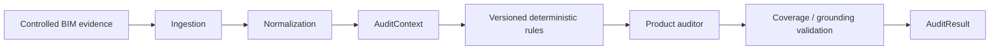
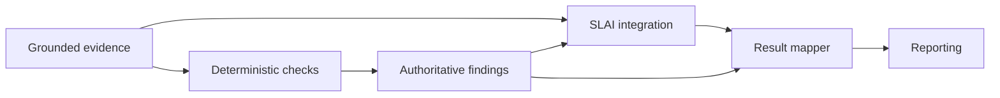
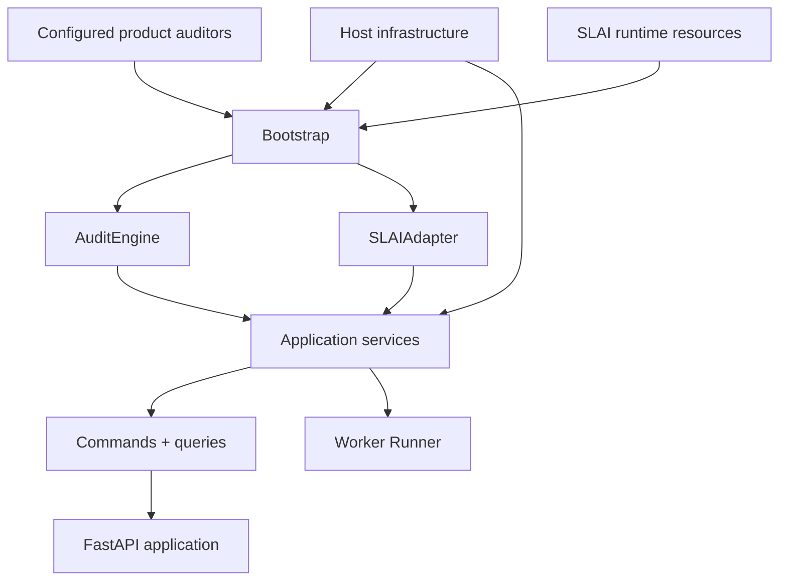
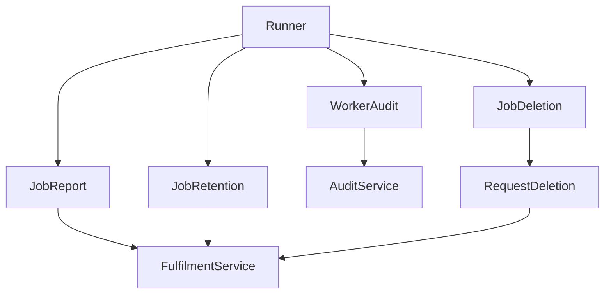
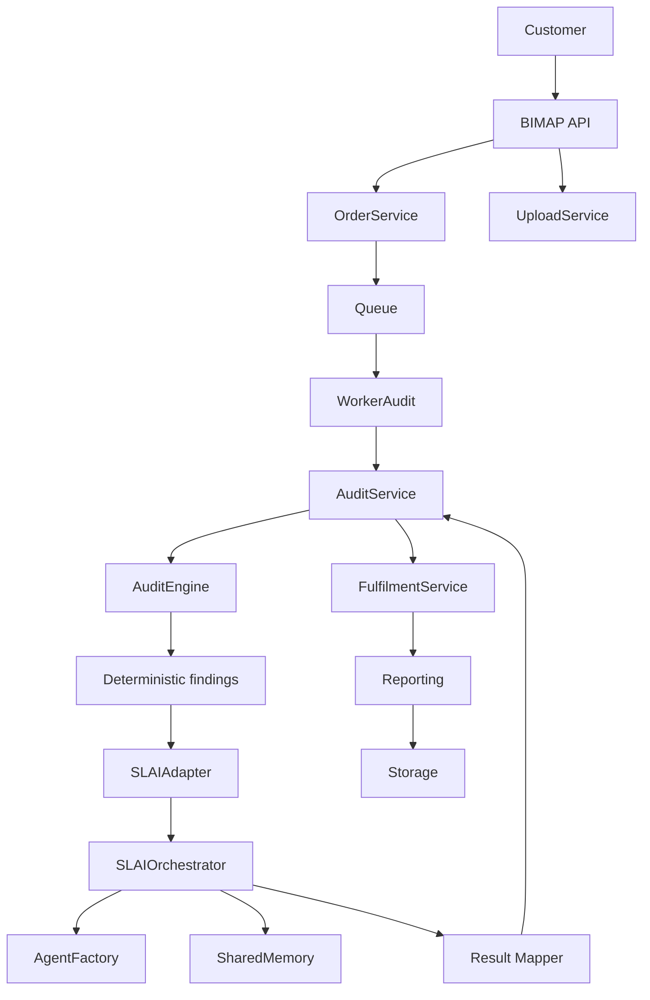

# R3D BIM Audit Platform — BIMAP

**BIMAP** is an evidence-grounded BIM quality intelligence platform for Revit-family and project-level BIM auditing.

The platform combines a deterministic, version-controlled BIM Audit Engine with a governed integration boundary to **SLAI**. Deterministic BIM findings remain authoritative; SLAI provides explicitly authorized contextual reasoning, quality/privacy/safety evaluation, language synthesis, orchestration, and other supplemental capabilities around grounded BIMAP evidence.

BIMAP is designed to operate as an application inside the SLAI repository while maintaining a strict internal dependency architecture.

---

## 1. Core purpose

BIMAP is intended to transform controlled BIM evidence into reproducible and auditable quality results.

The platform separates five concerns that are often incorrectly mixed together in BIM automation systems:

1. **BIM evidence and provenance**
2. **Deterministic BIM validation**
3. **Application and commercial workflow**
4. **Supplemental AI reasoning**
5. **Reporting and delivery**

The governing principle is:

> **BIMAP owns BIM audit meaning. SLAI supplies governed reasoning capabilities around that meaning.**

SLAI does not replace deterministic BIM rules, canonical evidence, product policy, order state, findings, or report contracts.

---

# 2. Supported BIMAP products

BIMAP currently defines three stable internal product identifiers.

| Product | Internal identifier | Primary scope |
|---|---|---|
| Revit Family Audit | `family_audit` | Revit-family evidence |
| BIM QA | `bim_qa` | Project/model evidence |
| Combined Audit | `combined_audit` | Correlated family + project evidence |

Customer-facing names, pricing, tiers, and limits are represented separately through the domain product catalog.

This prevents implementation identifiers from becoming commercial configuration.

---

# 3. Analytical model

BIMAP follows an evidence-first audit model.



The deterministic Audit Engine must be usable independently of SLAI.

SLAI is invoked only after BIMAP has established grounded evidence and deterministic audit state.



Arbitrary model output is not automatically converted into an authoritative BIMAP finding.

---

# 4. Canonical dependency hierarchy

BIMAP uses an explicit dependency hierarchy.

The important rule is not merely directory order; it is the direction of knowledge.

Lower layers must not depend on higher orchestration or infrastructure layers.

```text
LEVEL 8
┌─────────────────────────────────────────────┐
│ __main__.py                                 │
│ process entry point                         │
└───────────────────────┬─────────────────────┘
                        ↓
LEVEL 7
┌─────────────────────────────────────────────┐
│ bootstrap.py                                │
│ composition root                            │
└───────────┬───────────────┬─────────────────┘
            ↓               ↓
LEVEL 6
┌──────────────┐  ┌──────────────┐  ┌─────────────────────┐
│ api/         │  │ workers/     │  │ concrete adapters   │
│              │  │              │  │ incl. slai/         │
└──────┬───────┘  └──────┬───────┘  └──────────┬──────────┘
       │                 │                     │
       └─────────────────┼─────────────────────┘
                         ↓
LEVEL 5
┌─────────────────────────────────────────────┐
│ app/                                        │
│ commands / queries / services               │
└──────────────┬──────────────────┬───────────┘
               ↓                  ↓
LEVEL 4
┌─────────────────────────┐   ┌─────────────────────────┐
│ audit_engine/           │   │ app/ports/              │
│ deterministic analysis  │   │ dependency inversion    │
└─────────────┬───────────┘   └─────────────┬───────────┘
              │                             │
              ↓                             │
LEVEL 3                                     │
┌─────────────────────────┐                 │
│ reporting/              │                 │
└─────────────┬───────────┘                 │
              └──────────────┬──────────────┘
                             ↓
LEVEL 2
┌─────────────────────────────────────────────┐
│ contracts/                                  │
│ external/versioned interchange contracts    │
└───────────────────────┬─────────────────────┘
                        ↓
LEVEL 1
┌─────────────────────────────────────────────┐
│ domain/                                     │
│ canonical BIMAP business concepts           │
└─────────────────────────────────────────────┘
```

`slai/` is a concrete external-runtime integration subsystem. Its application-facing adapter implements the SLAI application port and therefore belongs conceptually with the outer adapters rather than underneath the deterministic Audit Engine.

---

# 5. Repository structure

```text
bimap/
├── __init__.py
├── __main__.py
├── bootstrap.py
├── version.py
├── README.md
├── LICENSE
│
├── api/
│   ├── app.py
│   ├── dependencies.py
│   ├── middleware/
│   ├── routes/
│   └── utils/
│
├── app/
│   ├── commands/
│   ├── queries/
│   ├── services/
│   ├── ports/
│   └── utils/
│
├── audit_engine/
│   ├── context.py
│   ├── engine.py
│   ├── result.py
│   ├── ingestion/
│   ├── normalization/
│   ├── rules/
│   ├── rfa/
│   ├── bim_qa/
│   ├── combined/
│   ├── validation/
│   └── utils/
│
├── contracts/
│   ├── versions.py
│   ├── evidence.py
│   ├── family_evidence.py
│   ├── project_evidence.py
│   ├── requirement.py
│   ├── finding.py
│   ├── order.py
│   ├── audit_job.py
│   ├── report_manifest.py
│   ├── schema_export.py
│   ├── schema/
│   └── utils/
│
├── domain/
│   ├── evidence/
│   ├── findings/
│   ├── governance/
│   ├── orders/
│   ├── products/
│   ├── reports/
│   ├── requirements/
│   └── utils/
│
├── reporting/
│   ├── artifact_manifest.py
│   ├── package_builder.py
│   ├── report_builder.py
│   ├── serializers/
│   ├── templates/
│   └── utils/
│
├── slai/
│   ├── adapter.py
│   ├── agent_policy.py
│   ├── governance.py
│   ├── health.py
│   ├── job_envelope.py
│   ├── orchestration.py
│   ├── result_mapper.py
│   └── utils/
│
├── workers/
│   ├── engine.py
│   ├── runner.py
│   ├── reports.py
│   ├── jobs/
│   └── utils/
│
├── configs/
│   ├── bimap.yaml
│   ├── products.yaml
│   ├── retention.yaml
│   └── slai_profile.yaml
│
├── docs/
│
└── frontend/
```

---

# 6. Composition root

`bootstrap.py` is BIMAP's **only composition root**.

Its responsibility is wiring, not business logic.



Bootstrap does not:

- invent product definitions;
- create empty rule registries;
- select arbitrary rule versions;
- create placeholder storage;
- create in-memory persistence as a hidden production default;
- invent payment-provider behavior;
- invent authentication policy;
- infer customer authorization;
- silently create report-rendering policy;
- parse undocumented configuration formats.

Those dependencies must be explicit.

---

# 7. Bootstrap inputs

The composition root receives three groups of inputs.

## 7.1 Deterministic audit components

```python
BootstrapAuditComponents(
    rfa=...,
    bim_qa=...,
    combined=...,
)
```

These auditors already own their product-specific analytical policy.

For example:

- `RFAAuditor` owns its configured `RulesExecutor`;
- `BIMQAAuditor` owns its rule executor and Requirement-Evidence Matrix behavior;
- `CombinedAuditor` owns its exact `AuditVersion`, Evidence Graph behavior, and optional correlator.

Bootstrap therefore does not duplicate these policies.

---

## 7.2 Host infrastructure

```python
BootstrapInfrastructure(
    repository=...,
    payment=...,
    clock=...,
    malware=...,
    storage=...,
    queue=...,
    shared_memory=...,
    route_hooks=...,
)
```

Required infrastructure ports are:

- `Repository`
- `Payment`
- `Clock`
- `Malware`
- `Storage`
- `Queue`

Optional capabilities include:

- `Notifications`
- externally owned SLAI `AgentFactory`
- rate limiter
- report/PDF renderer
- admin authorizer
- custom SLAI health/governance components
- custom SLAI task builder

Concrete implementations are deployment responsibilities.

---

## 7.3 Deployment configuration

```python
BootstrapConfiguration(
    catalog=...,
    api_settings=...,
    product_limits=...,
)
```

The configuration object reuses existing authoritative BIMAP types:

- `ProductCatalog`
- `ProductLimits`
- `APISettings`
- `SLAIAgentPolicy` profile structure

No second product or API configuration schema exists inside bootstrap.

---

# 8. SLAI integration

The application boundary is:

```text
AuditService
    │
    ▼
SLAIPort
    ▲
    │
SLAIAdapter
    │
    ▼
SLAIOrchestrator
    │
    ├── SLAIAgentPolicy
    ├── SLAIHealthCheck
    ├── SLAIGovernance
    ├── AgentFactory
    └── SharedMemory
```

`AuditService` does not know about:

- `AgentFactory`;
- `SharedMemory`;
- individual SLAI agents;
- SLAI orchestration phases;
- SLAI runtime configuration.

It depends only on `SLAIPort`.

This is the central dependency-inversion boundary for AI integration.

---

# 9. SLAI agent policy

The current built-in baseline recognizes the following SLAI capabilities.

### Core

- collaborative
- evaluation
- reader
- knowledge
- language
- observability
- planning
- privacy
- quality
- reasoning
- safety

### Conditional

- perception

### Supporting

- execution

### Deferred / disabled

- learning
- adaptive
- qnn

Authorization and runtime availability remain separate concepts.

An agent being permitted by `SLAIAgentPolicy` does not imply that the corresponding SLAI runtime component is available.

That distinction is verified by the SLAI health/readiness layer.

---

# 10. SharedMemory lifecycle

SLAI `SharedMemory` is process-wide state.

BIMAP therefore does not infer lifecycle ownership merely because a SharedMemory object is supplied.

Default behavior:

```python
close_shared_memory_on_shutdown=False
```

This means BIMAP may use the SLAI SharedMemory instance but does not close it.

This is the expected configuration when BIMAP operates inside a larger SLAI process.

Only a host that intentionally grants BIMAP exclusive lifecycle ownership should configure:

```python
close_shared_memory_on_shutdown=True
```

The distinction between:

- retaining BIMAP job-scoped SharedMemory data; and
- owning the global SharedMemory service lifecycle

is deliberate.

They are different concerns.

---

# 11. AgentFactory lifecycle

If no `AgentFactory` is injected into Bootstrap, `SLAIOrchestrator` creates its own factory and owns that factory.

If a factory is injected:

```python
BootstrapInfrastructure(
    ...
    agent_factory=existing_factory,
)
```

the factory remains host-owned and is not shut down by BIMAP.

This allows BIMAP to coexist safely with other SLAI applications.

---

# 12. Application layer

The application layer coordinates business use cases through injected ports.

## Services

### `OrderService`

Owns application coordination around:

- order creation;
- state transitions;
- product selection;
- product limits;
- payment events.

### `UploadService`

Coordinates:

- upload staging;
- storage;
- malware validation;
- order/upload consistency.

### `AuditService`

Coordinates:

1. deterministic Audit Engine execution;
2. authoritative deterministic findings;
3. SLAI supplemental processing;
4. audit result integrity;
5. queue submission where applicable.

### `FulfilmentService`

Coordinates:

- structured report generation;
- artifact packaging;
- storage;
- delivery state;
- notifications;
- retention/deletion operations.

### `ReviewService`

Coordinates governance review state and decisions.

---

# 13. Commands

The composition root constructs one shared instance of each command.

```text
CreateOrder
CancelOrder

CreateUploadSlot
ValidateUploads

BeginCheckout
HandlePayment

EnqueueAudit

ReleaseReport
RequestDeletion
```

The same command instance is reused wherever appropriate.

For example, `RequestDeletion` is shared between:

- the HTTP/application surface; and
- `JobDeletion`.

This prevents duplicate application semantics.

---

# 14. Queries

The composition root constructs:

```text
GetOrder
ListOrders
GetProducts
GetAuditStatus
ListReports
```

Queries do not own persistence. They operate through the repository port.

---

# 15. Worker architecture

BIMAP workers reuse the same application services as synchronous use cases.



Worker code does not reimplement application rules.

---

# 16. API architecture

The API consumes application-level dependencies rather than building its own services.

```text
FastAPI
  │
  ▼
APIDependencies
  │
  ├── APIUseCases
  ├── APIRouteHooks
  ├── APIHealthDependencies
  └── APIAdminDependencies (optional)
```

The health route depends on the application-level `SLAIPort`.

It does not directly depend on:

- `AgentFactory`;
- `SharedMemory`;
- `SLAIHealthCheck`;
- individual agents.

---

# 17. API deployment hooks

Several HTTP concerns are intentionally deployment-owned.

`APIRouteHooks` includes capabilities for:

- authorization;
- upload-manifest validation;
- report-ID resolution;
- signed-download URL issuance;
- deletion admission;
- deletion object resolution;
- payment-signature header configuration.

BIMAP does not fabricate insecure default implementations for these capabilities.

---

# 18. Reporting

The reporting subsystem produces controlled report artifacts from existing BIMAP contracts and results.

Structured output includes capabilities for:

- finding JSON;
- evidence manifests;
- remediation CSV;
- requirement matrices;
- artifact manifests;
- deterministic ZIP packaging.

PDF rendering is optional and requires an injected `ReportRenderer`.

Without a renderer, BIMAP must not claim that PDF generation is configured.

---

# 19. Configuration directory

The repository currently contains:

```text
configs/
├── bimap.yaml
├── products.yaml
├── retention.yaml
└── slai_profile.yaml
```

These files are reserved configuration surfaces.

They should not be consumed by production code until their schemas, validation rules, precedence rules, and failure behavior have been formally defined.

`bootstrap.py` therefore does **not** parse them.

This prevents configuration behavior from becoming an undocumented implicit API.

A future configuration layer should translate validated configuration files into existing objects such as:

```text
ProductCatalog
ProductLimits
APISettings
SLAIAgentPolicy profile
BootstrapConfiguration
```

Bootstrap itself should remain object-based.

---

# 20. Runtime ownership

| Component | Created by Bootstrap | Closed by Bootstrap |
|---|---:|---:|
| `AuditEngine` | Yes | No external lifecycle |
| `SLAIOrchestrator` | Yes | Yes |
| `SLAIAdapter` | Yes | Yes |
| `OrderService` | Yes | No external lifecycle |
| `UploadService` | Yes | No external lifecycle |
| `AuditService` | Yes | No external lifecycle |
| `FulfilmentService` | Yes | No external lifecycle |
| `ReviewService` | Yes | No external lifecycle |
| FastAPI application | Yes | Process/server lifecycle |
| Worker `Runner` | Yes | No external lifecycle |
| Repository adapter | No | No |
| Storage adapter | No | No |
| Payment adapter | No | No |
| Queue adapter | No | No |
| Malware adapter | No | No |
| Notification adapter | No | No |
| Injected `AgentFactory` | No | No |
| Bootstrap-created `AgentFactory` | Indirectly | Yes |
| SLAI `SharedMemory` | No | Only when explicitly authorized |

This ownership model prevents BIMAP from shutting down resources that may also be used by other SLAI applications.

---

# 21. Running inside SLAI

BIMAP is intended to reside inside the SLAI source tree.

Recommended structure:

```text
SLAI/
├── logs/
├── src/
├── modules/
├── data/
├── deployment/
├── bimap.py
│
└── applications/
    └── bimap/
        ├── __init__.py
        ├── __main__.py
        ├── bootstrap.py
        ├── version.py
        ├── api/
        ├── app/
        ├── audit_engine/
        ├── contracts/
        ├── domain/
        ├── reporting/
        ├── slai/
        └── workers/
```

Move bimap.py to the SLAI root directory

And move the below bimap.py to SLAI/deployment
```python
"""
SLAI deployment factory for the R3D BIM Audit Platform.

Location
--------
SLAI/deployment/bimap.py

Architectural role
------------------
This module is the deployment-owned composition boundary between the SLAI host
runtime and the BIMAP application package.

It is permitted to know about:

- concrete persistence implementations;
- object storage;
- payment infrastructure;
- malware scanning infrastructure;
- queue infrastructure;
- SLAI SharedMemory;
- SLAI AgentFactory;
- HTTP authentication/authorization hooks;
- deployment configuration;
- BIMAP product policy; and
- deterministic Audit Engine product construction.

The BIMAP package itself must not depend on this module.
"""

from __future__ import annotations

from ..applications.bimap.bootstrap import (
    Bootstrap,
    BootstrapAuditComponents,
    BootstrapConfiguration,
    BootstrapInfrastructure,
)

from logs.logger import PrettyPrinter, get_logger # pyright: ignore[reportMissingImports]


logger = get_logger("BIMAP Deployment")
printer = PrettyPrinter()


def create_bootstrap() -> Bootstrap:
    """
    Construct one fully configured BIMAP Bootstrap instance.

    This function is intentionally the zero-argument callable consumed by:

        SLAI/bimap.py

    All deployment-specific dependency construction belongs here.
    """

    printer.status(
        "BIMAP",
        "Constructing deployment bootstrap",
        "info",
    )

    raise RuntimeError(
        "BIMAP deployment adapters have not yet been configured. "
        "Provide concrete Repository, Payment, Clock, Malware, Storage, "
        "Queue, APIRouteHooks, SLAI runtime dependencies, product "
        "configuration, and deterministic audit components in "
        "SLAI/deployment/bimap.py."
    )


__all__ = [
    "create_bootstrap",
]
```

The service should execute from the **SLAI repository root** so SLAI-owned modules such as:

```python
from logs.logger import ...
from src.agents.agent_factory import AgentFactory
```

resolve through the host runtime normally.

Do not introduce `sys.path` manipulation inside BIMAP modules.

---

# 22. Level-7 bootstrap versus Level-8 entry point

`bootstrap.py` is the composition root.

It does **not** own:

- command-line parsing;
- Uvicorn/Gunicorn process startup;
- OS signals;
- process exit codes;
- deployment mode selection;
- CLI help;
- worker process loops.

Those concerns belong to:

```text
__main__.py
```

at Level 8.

The dependency must remain:

```text
__main__.py
     ↓
bootstrap.py
     ↓
application graph
```

Never:

```text
bootstrap.py
     ↓
__main__.py
```

---

# 23. Version metadata

Package version metadata is defined only in:

```text
version.py
```

The module is deliberately dependency-neutral.

It does not initialize:

- SLAI;
- logging;
- FastAPI;
- workers;
- the Audit Engine;
- configuration.

Until an intentional first release is selected, the repository is identified as:

```text
0.0.0.dev0
```

A release update requires changing the canonical `VERSION` object in `version.py`.

No second version constant should be introduced elsewhere in BIMAP.

---

# 24. Architectural invariants

The following rules should be treated as architectural constraints.

## Domain

`domain/` must not import:

```text
app/
api/
workers/
slai/
bootstrap.py
```

## Contracts

`contracts/` must not depend on application or infrastructure layers.

## Audit Engine

`audit_engine/` must not import:

```text
app/
api/
workers/
slai/
bootstrap.py
```

The Audit Engine must remain independently reproducible.

## Application ports

`app/ports/` must never import concrete infrastructure adapters.

## Application services

Application services may depend on ports and lower BIMAP capabilities.

They must not construct infrastructure SDK clients themselves.

## SLAI

`slai/adapter.py` implements the application-level SLAI boundary.

Lower domain and contract layers must not depend on it.

## API and workers

API and worker layers consume already-constructed application use cases.

They must not duplicate application lifecycle logic.

## Bootstrap

`bootstrap.py` may know about all concrete runtime layers because it is the composition root.

Business logic does not belong there.

---

# 25. Full execution path

A typical audit lifecycle is:



---

# 26. Failure philosophy

BIMAP follows fail-closed behavior at trust and configuration boundaries.

Examples include:

- unsupported contract versions;
- invalid product identifiers;
- missing deterministic product auditors;
- missing queue configuration;
- malformed SLAI policy;
- unauthorized SLAI capabilities;
- invalid provenance;
- duplicate evidence/finding identifiers;
- invalid route hooks;
- missing infrastructure adapters;
- unsuccessful SLAI readiness;
- invalid report artifacts.

Unknown evidence must not automatically be converted into failed evidence.

Likewise, AI uncertainty must not silently become deterministic certainty.

---

# 27. Determinism and reproducibility

A reproducible deterministic audit requires preservation of:

- source identity;
- evidence identity;
- provenance;
- content hashes;
- contract versions;
- rule identities;
- exact rule versions;
- product identity;
- Combined Audit algorithm version;
- requirement state;
- finding evidence references;
- validation coverage.

SLAI output is supplemental to this deterministic record.

---

# 28. Security principles

BIMAP should maintain the following operational constraints:

- do not log raw customer BIM evidence;
- do not log secrets or payment credentials;
- do not expose unrestricted health diagnostics publicly;
- do not create permissive authorization defaults;
- validate upload content before audit execution;
- validate payment-provider events;
- use explicit request size/header limits;
- keep download URL generation deployment-owned;
- maintain provenance and evidence integrity;
- keep deterministic findings immutable across SLAI processing;
- close only resources BIMAP actually owns.

---

# 29. Development principles

Contributions should maintain the following standards:

1. **One authoritative owner per concept**
2. **Explicit dependency injection**
3. **No hidden infrastructure defaults**
4. **No circular imports**
5. **No wildcard imports in internal runtime code**
6. **Deterministic BIM rules before supplemental AI reasoning**
7. **Version-controlled contracts and deterministic rules**
8. **Ground every authoritative finding in evidence**
9. **Preserve lifecycle ownership boundaries**
10. **Prefer explicit failure over silent fallback**

---

# 30. Current architectural status

The core BIMAP layering now includes:

- canonical domain models;
- external contracts;
- deterministic Audit Engine;
- Family Audit coordinator;
- BIM QA coordinator;
- Combined Audit coordinator;
- application ports;
- application services;
- commands and queries;
- reporting;
- SLAI anti-corruption/integration layer;
- FastAPI API layer;
- worker layer;
- Level-7 composition root;
- dependency-neutral package version metadata.

The next outer layer is the executable process entry point:

```text
__main__.py
```

That module should remain small and delegate runtime construction to `Bootstrap`.

---

# License

See [`LICENSE`](LICENSE).

---

## R3D BIM Audit Platform

**Deterministic where facts must be reproducible.  
Evidence-grounded where conclusions must be defensible.  
AI-assisted where contextual intelligence adds value.**
