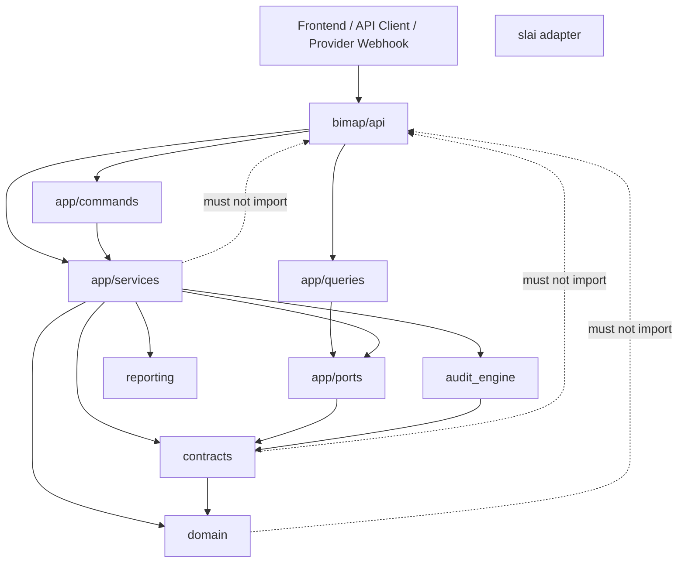
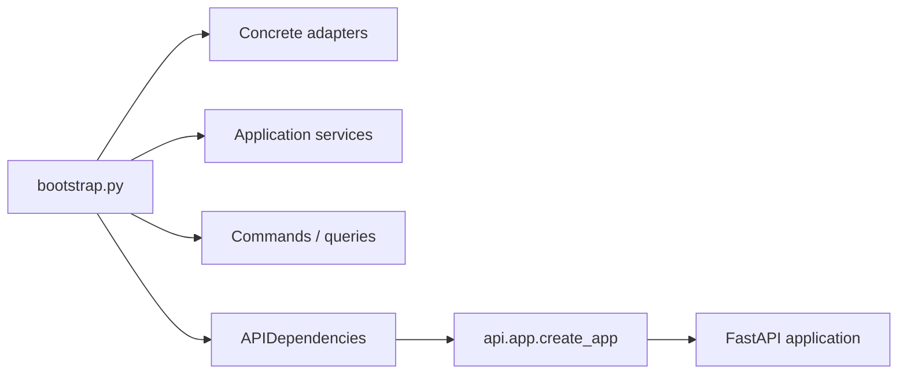
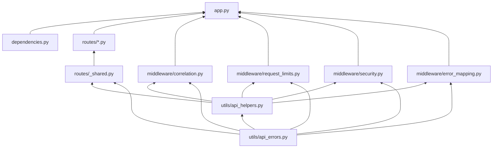
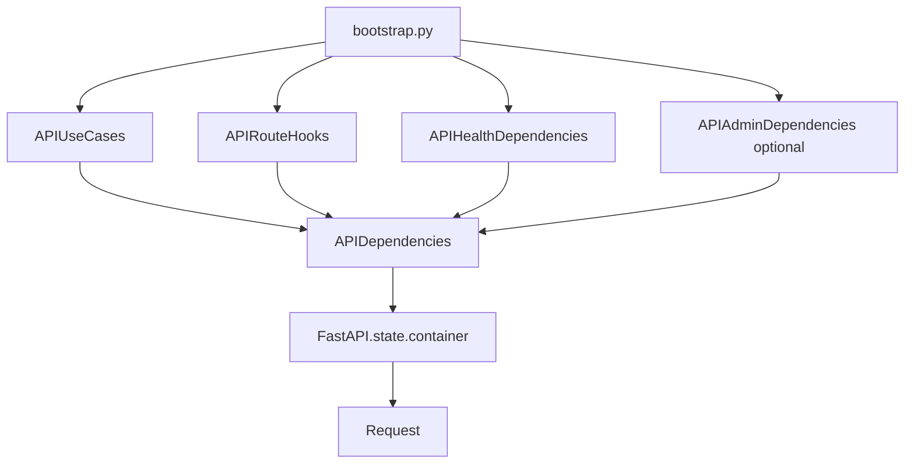
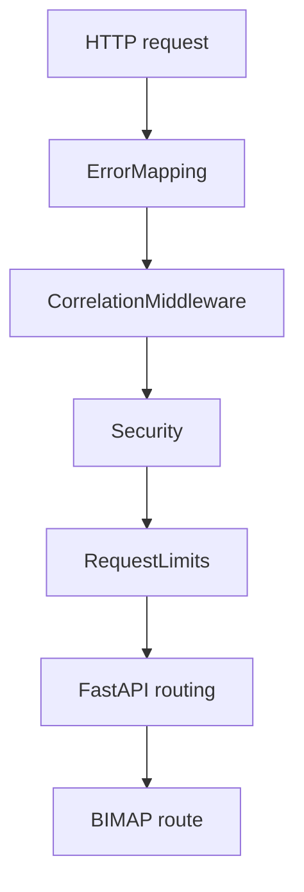
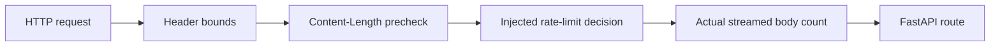
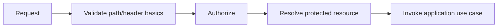
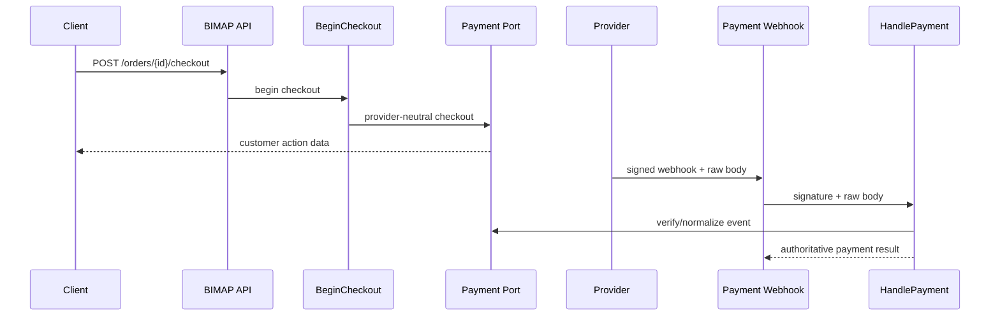
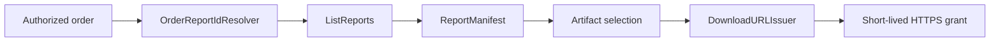

# BIMAP API Layer

> **Package:** `bimap.api`  
> **Architectural role:** HTTP admission, presentation, transport-security, and request-boundary layer for the R3D BIM Audit Platform (BIMAP)  
> **Runtime position:** Outer Level-6 interface above BIMAP application commands/queries/services and below the composition root (`bootstrap.py`) and HTTP server

---

## 1. Purpose

The `api/` package exposes BIMAP's supported service capabilities over HTTP without moving business rules, infrastructure ownership, or SLAI runtime construction into the web layer. It translates HTTP requests into already-constructed application commands and queries, applies cross-cutting transport controls, and projects safe BIMAP responses back to clients.

The API layer exists to answer questions such as:

- Which BIMAP application use cases are currently reachable over HTTP?
- How are route handlers supplied with already-built commands, queries, services, and trusted deployment hooks?
- Where is the `/api/v1` namespace mounted without duplicating it across every route module?
- How are request and correlation identifiers generated and propagated safely?
- How are body/header/rate limits enforced before expensive processing begins?
- Which HTTP security headers and host/HTTPS controls apply to the deployment?
- How are domain/application/contract/audit/reporting/SLAI failures converted into safe HTTP responses?
- Which admission checks must be supplied by deployment composition rather than invented inside route code?
- Which operational health claims can the current implementation make without overstating system readiness?

The API package does **not** own BIM business rules, order-transition legality, product pricing or limits, payment-provider verification logic, object-storage layout, malware scanning, deterministic BIM analysis, SLAI agent construction, report generation, retention policy, database schemas, worker retry policy, or frontend state. Those responsibilities remain in their authoritative BIMAP layers.

---

## 2. Architectural principles

### 2.1 The API is an admission and presentation boundary

BIMAP's API receives HTTP input, applies transport/admission controls, delegates to application use cases, and returns safe external projections.



The central dependency rule is:

> **The API may invoke inward-facing application capabilities; lower BIMAP layers must never depend on HTTP/FastAPI modules.**

### 2.2 Bootstrap owns construction

`api/app.py` is an application factory, not the global composition root. `bootstrap.py` constructs concrete adapters and application handlers, builds the API dependency container, and passes it into `create_app()`.



`api/app.py` must never import `bootstrap.py`. This prevents a composition cycle and keeps API construction deterministic/testable.

### 2.3 One owner per concern

| Concern | Authoritative owner |
|---|---|
| HTTP application construction | `api/app.py` |
| API dependency container/request lookup | `api/dependencies.py` |
| Request/correlation IDs | `api/middleware/correlation.py` |
| Lower-error to safe HTTP mapping | `api/middleware/error_mapping.py` |
| Transport body/header/rate limits | `api/middleware/request_limits.py` |
| Host/HTTPS/security-response headers | `api/middleware/security.py` |
| API error vocabulary | `api/utils/api_errors.py` |
| Framework-neutral HTTP/ASGI mechanics | `api/utils/api_helpers.py` |
| FastAPI route parsing/authorization utilities | `api/routes/_shared.py` |
| HTTP route behavior | `api/routes/*.py` |
| Application use cases | `app/commands`, `app/queries`, `app/services` |
| Business meaning/invariants | `domain/` |
| Stable external DTO/schema semantics | `contracts/` |
| Deterministic audit behavior | `audit_engine/` |
| SLAI integration | `slai/` + `app/ports/slai.py` |
| Report construction | `reporting/` |
| Concrete provider/client construction | `bootstrap.py` / infrastructure adapters |

No API module should recreate a lower-layer concept simply because it needs to expose that concept over HTTP.

---

## 3. Package structure

```text
bimap/api/
├── __init__.py
├── README.md
├── app.py
├── dependencies.py
│
├── middleware/
│   ├── __init__.py
│   ├── correlation.py
│   ├── error_mapping.py
│   ├── request_limits.py
│   └── security.py
│
├── routes/
│   ├── __init__.py
│   ├── _shared.py
│   ├── admin.py
│   ├── checkout.py
│   ├── deletion.py
│   ├── downloads.py
│   ├── health.py
│   ├── orders.py
│   ├── products.py
│   ├── reports.py
│   ├── uploads.py
│   └── webhooks.py
│
└── utils/
    ├── __init__.py
    ├── api_errors.py
    └── api_helpers.py
```

The route modules are intentionally unversioned internally. `api/app.py` mounts their routers under the deployment API namespace, currently defaulting to `/api/v1`.

---

## 4. Internal dependency direction



The arrows mean **"is consumed by"**.

Important reverse dependencies are forbidden:

```text
api/utils/*              MUST NOT import middleware, routes, or app.py
api/middleware/*         MUST NOT import routes or construct application services
api/routes/*             MUST NOT import bootstrap.py or concrete infrastructure
api/dependencies.py      MUST NOT import bootstrap.py or construct adapters
api/app.py               MUST NOT import bootstrap.py
app/*                    MUST NOT import api/*
domain/*                 MUST NOT import api/*
contracts/*              MUST NOT import api/*
audit_engine/*           MUST NOT import api/*
reporting/*              MUST NOT import api/*
slai/*                   MUST NOT import api/*
```

---

## 5. Application factory (`app.py`)

`create_app()` is the sole FastAPI application factory for the BIMAP API package.

Its responsibilities are limited to:

1. validate the already-built API dependency container;
2. validate explicit API composition settings;
3. create the `FastAPI` instance;
4. attach the dependency container to `app.state.container`;
5. construct the current route groups from injected handlers/hooks;
6. mount route groups under the configured API prefix;
7. install framework exception translation;
8. install BIMAP middleware in the required runtime order;
9. expose route-group/settings metadata through application state for diagnostics.

It must not:

- read YAML/environment variables directly;
- create repositories or storage/payment/queue clients;
- initialize AgentFactory/SharedMemory/agents;
- build application services from ports;
- hard-code product or transport thresholds;
- infer customer authorization policy;
- invent CORS origins or proxy-trust behavior.

### 5.1 API settings

`APISettings` keeps HTTP composition explicit.

| Setting | Meaning |
|---|---|
| `request_limits` | Existing `RequestLimitPolicy`; body/header limits are deployment-owned |
| `security` | Existing `SecurityPolicy`; host/HTTPS/security-header policy is deployment-owned |
| `api_prefix` | Common router mount namespace; default `/api/v1` |
| `title` | OpenAPI/application title metadata |
| `correlation_header` | Inbound/outbound correlation header name |
| `request_id_header` | Server-owned request-ID response header name |
| `max_correlation_id_length` | Correlation identifier bound; cannot exceed canonical 128-character context bound |
| `reject_invalid_correlation` | Reject malformed inbound IDs instead of silently normalizing them |
| `openapi_url` | Optional OpenAPI schema endpoint |
| `docs_url` | Optional Swagger UI endpoint; requires OpenAPI enabled |
| `redoc_url` | Optional ReDoc endpoint; requires OpenAPI enabled |

OpenAPI and interactive documentation are disabled by default. A deployment must explicitly expose them.

### 5.2 Route mounting

Individual route classes declare paths relative to their own router prefixes. `create_app()` supplies the shared external prefix:

```text
RouteProducts: /products
RouteOrders:   /orders/...
RouteHealth:   /health/...

                    ↓ create_app(api_prefix="/api/v1")

/api/v1/products
/api/v1/orders/...
/api/v1/health/...
```

This avoids repeating API-version literals across route modules and allows controlled version-prefix changes at the application boundary.

### 5.3 Internal admin surface

Administrative routes are not mounted by default. They are enabled only when an `APIAdminDependencies` bundle is supplied. That bundle contains its own authorization hook, allowing admin access policy to remain stricter and separate from customer-route authorization.

This prevents the existence of `RouteAdmin` from automatically making an internal operational surface part of every public deployment.

---

## 6. Dependency container (`dependencies.py`)

`dependencies.py` formalizes the boundary between the composition root and FastAPI.



### 6.1 `APIUseCases`

`APIUseCases` contains only handlers consumed by the currently registered customer/provider route surface:

```text
CreateOrder
CancelOrder
GetOrder
ListOrders
GetProducts
CreateUploadSlot
ValidateUploads
BeginCheckout
HandlePayment
ListReports
RequestDeletion
```

The API container deliberately does not require unrelated application handlers merely because they exist. For example, audit enqueue execution and report release are not injected into this HTTP surface when no current route safely exposes those operations.

### 6.2 `APIRouteHooks`

Several security/ownership capabilities cannot be inferred from the current domain/repository ports and therefore remain trusted injected hooks:

| Hook | Responsibility |
|---|---|
| `authorizer` | Authentication/tenant/resource authorization for customer-facing routes |
| `upload_manifest_validator` | Trusted staged-upload completeness/admission check before lifecycle validation |
| `report_id_resolver` | Resolve already-authorized report IDs for one order without inventing a global repository scan |
| `download_url_issuer` | Issue a short-lived download capability after manifest/artifact authorization |
| `deletion_admission_gate` | Apply deployment/legal/accounting deletion admission requirements |
| `deletion_object_resolver` | Resolve trusted storage object IDs; client input never supplies these IDs |
| `payment_signature_header` | Provider-specific webhook signature header name, injected without hard-coding a provider |

All callable hooks are mandatory for the route groups that consume them; no permissive default is provided.

### 6.3 `APIHealthDependencies`

The health bundle supplies:

- the existing `SLAIHealthCheck`;
- injected SLAI factory/runtime object;
- injected SharedMemory/runtime object;
- the explicitly required SLAI agent names;
- optional pre-resolved agent objects;
- whether detailed diagnostics may be exposed.

The API does not redefine the runtime type contract of AgentFactory/SharedMemory. `SLAIHealthCheck` remains the owner of health validation.

### 6.4 `APIAdminDependencies`

The optional admin bundle contains:

- `ReviewService` for the governance operations the current admin route can actually support;
- a dedicated admin authorization hook.

Global admin order/job/review scans are not fabricated when the current repository/query layer does not define those read models.

### 6.5 Request-scoped retrieval

`install_api_dependencies()` stores one immutable container on:

```text
FastAPI.state.container
```

`get_api_dependencies(request)` resolves it through:

```text
request.app.state.container
```

Replacing an installed container with another object is rejected. A running application must not silently switch repositories, payment handlers, authorization hooks, or SLAI runtime objects after route construction.

---

## 7. Middleware pipeline

The runtime order is:



Response flow unwinds in reverse.

This ordering is intentional:

- `ErrorMapping` is outermost so middleware and route failures can become safe problem responses;
- correlation state is established before security/limit/downstream work where possible;
- transport security rejects invalid host/scheme metadata before route logic;
- request limits reject oversized/over-rate traffic before application work;
- route/application code receives only traffic that crossed the generic admission controls.

Starlette middleware registration is performed inner-first so the resulting runtime stack has the order above.

---

## 8. Correlation and request identity

`CorrelationMiddleware` maintains two distinct identifiers:

### `request_id`

- generated by BIMAP for every HTTP request;
- never selected by the client;
- identifies one concrete API request/response cycle;
- useful for logs and operational tracing.

### `correlation_id`

- may be supplied by a client/upstream system;
- must satisfy strict ASCII/syntax/length validation;
- may connect multiple HTTP/service operations into one trace;
- is observability metadata only.

Neither identifier is:

- authentication;
- authorization;
- an idempotency key;
- an order ID;
- an audit job ID;
- a payment event ID.

Duplicate or malformed correlation headers are not treated as trustworthy metadata.

---

## 9. HTTP security boundary

`Security` and `SecurityPolicy` own generic transport hardening only.

Supported concerns include:

- exact Host-header validation;
- optional exact-host allowlisting;
- optional HTTPS requirement based on trusted ASGI scheme;
- `X-Content-Type-Options: nosniff` baseline;
- optional Referrer-Policy;
- optional X-Frame-Options;
- optional Content-Security-Policy;
- optional Permissions-Policy;
- optional HSTS configuration.

The security middleware deliberately does **not** own:

- authentication or tenant authorization;
- CORS policy;
- CSRF policy for a future cookie-authentication design;
- webhook provider-signature verification;
- upload malware scanning;
- BIM evidence privacy/governance;
- SLAI Safety/Privacy decisions.

### 9.1 Proxy trust

The middleware does not implicitly trust `X-Forwarded-Host`, `X-Forwarded-Proto`, or similar headers. A production reverse proxy/ASGI server must establish trustworthy client/scheme metadata before BIMAP receives the request.

### 9.2 CORS

No permissive CORS middleware is installed by default. Allowed browser origins are deployment-specific and must not be guessed from repository structure or frontend code.

---

## 10. Request and rate limits

`RequestLimits` enforces transport-level bounds, not commercial product rules.

`RequestLimitPolicy` can configure:

- maximum request body bytes;
- maximum header count;
- maximum raw header bytes.

An optional injected `RateLimiter` can enforce distributed/client-aware rate policy.



The body limit is enforced against actual streamed bytes, not only `Content-Length`, so omitting or falsifying the header cannot bypass the configured bound.

### 10.1 Separation from product limits

Transport limits must not duplicate `domain/products/limits.py`.

Examples:

```text
RequestLimitPolicy.max_body_bytes
    = HTTP transport admission bound

ProductLimits
    = configured BIMAP product/commercial scope
```

A deployment may choose compatible values, but the API middleware does not become the authoritative product-limit model.

### 10.2 Rate-limit persistence

The API defines an asynchronous rate-limit decision boundary, not an in-memory global counter. Production rate-limiting state must be implemented by a deployment-appropriate adapter if limits must remain correct across multiple workers/processes/hosts.

---

## 11. Error model and HTTP mapping

`api/utils/api_errors.py` defines the stable API-level error vocabulary. `ErrorMapping` translates lower BIMAP failures by class/code semantics rather than exception-message parsing.

General mapping policy:

| Failure class | HTTP behavior |
|---|---:|
| Invalid API/application/domain input | 400 |
| Explicit missing resource | 404 |
| State/concurrency conflict | 409 |
| Request too large | 413 |
| Unsupported media type | 415 |
| Engine/structured request unprocessable | 422 |
| Rate limit | 429 |
| Request headers too large | 431 |
| Dependency unavailable | 503 |
| Dependency timeout | 504 |
| Internal integrity/configuration/serialization failures | 500 |

### 11.1 Public versus technical error data

API errors separate:

- technical operator message;
- safe client message;
- stable machine-readable error code;
- HTTP status;
- bounded/redacted diagnostic context;
- optional safe response headers;
- nested cause object retained only for chaining.

Lower-layer exception text, raw payloads, signed URLs, tokens, cookies, storage keys, filenames, and provider details are not copied into client responses.

### 11.2 Problem responses

Mapped errors use `application/problem+json` with BIMAP's stable `code` discriminator and correlation ID when available. BIMAP uses `about:blank` until a public stable problem-type URI registry exists.

### 11.3 FastAPI-owned validation/routing outcomes

FastAPI request-validation failures are re-routed through the BIMAP API error boundary as safe 422 responses without exposing Pydantic input payloads.

Routing statuses that already have a BIMAP API error type are translated into that error vocabulary. HTTP 405 remains a framework routing/protocol response with no copied detail body and only safe protocol metadata such as `Allow`.

---

## 12. FastAPI route boundary helpers

`routes/_shared.py` is deliberately narrower than `utils/api_helpers.py`.

### `api/utils/api_helpers.py`

Owns framework-neutral HTTP/ASGI mechanics such as:

- structured method-start diagnostics;
- ASGI request/response types;
- header syntax/access/mutation;
- request/correlation state;
- Content-Length parsing;
- canonical JSON bytes;
- safe problem responses.

### `api/routes/_shared.py`

Owns FastAPI route-specific behavior such as:

- request authorization hook invocation;
- strict JSON-object parsing;
- duplicate JSON-member rejection;
- exact request field-set validation;
- idempotency-header extraction;
- order projection through `OrderContract`;
- report-ID resolver invocation;
- route JSON responses.

This split prevents framework-specific request handling from leaking into middleware utilities while avoiding duplicated logic across route modules.

---

## 13. Current HTTP route surface

All paths below are relative to the default `/api/v1` prefix.

### 13.1 Health

| Method | Path | Responsibility |
|---|---|---|
| `GET` | `/health/live` | Side-effect-free SLAI integration liveness |
| `GET` | `/health/ready` | Current SLAI runtime/required-agent readiness |

### 13.2 Products

| Method | Path | Responsibility |
|---|---|---|
| `GET` | `/products` | Return configured product/tier/limit views from injected `GetProducts` |

The route does not read YAML or hard-code prices/limits.

### 13.3 Orders

| Method | Path | Responsibility |
|---|---|---|
| `POST` | `/orders` | Create one configured BIMAP order |
| `GET` | `/orders/{order_id}` | Read one authorized order projection |
| `POST` | `/orders/{order_id}/cancel` | Apply canonical cancellation through `CancelOrder` |

There is no fabricated public global-order listing endpoint because the current repository/query boundary does not define customer ownership/pagination/filter semantics.

### 13.4 Upload lifecycle

| Method | Path | Responsibility |
|---|---|---|
| `POST` | `/orders/{order_id}/uploads` | Enter the supported upload-staging lifecycle through `CreateUploadSlot` |
| `POST` | `/orders/{order_id}/validate` | Commit upload validation only after trusted manifest admission |

The API does not pretend the current `Storage` port exposes a provider-neutral presigned upload-slot operation when it does not.

### 13.5 Checkout

| Method | Path | Responsibility |
|---|---|---|
| `POST` | `/orders/{order_id}/checkout` | Begin provider-neutral checkout through `BeginCheckout` |

Browser checkout completion is not authoritative proof of payment.

### 13.6 Payment webhook

| Method | Path | Responsibility |
|---|---|---|
| `POST` | `/webhooks/payment` | Preserve raw body and pass provider signature/body to `HandlePayment` |

The provider-specific signature-header name is injected. The route does not parse provider event schemas itself.

Payment handling and audit enqueueing remain separate. A successful payment webhook does not fabricate or submit an `AuditJob` without the authoritative application orchestration required to do so.

### 13.7 Reports

| Method | Path | Responsibility |
|---|---|---|
| `GET` | `/orders/{order_id}/reports` | Resolve explicit authorized report IDs and return persisted manifests |

The API does not invent `Repository.list_reports()` or silently infer ownership. `OrderReportIdResolver` supplies the explicit authorized ID set.

Report release is not exposed as arbitrary HTTP input because the existing `ReleaseReport` use case requires authoritative findings/evidence/governance/report/storage identities that should not be constructed from untrusted client payloads.

### 13.8 Downloads

| Method | Path | Responsibility |
|---|---|---|
| `POST` | `/orders/{order_id}/download/{artifact_id}` | Issue an authorized short-lived download grant |

The route resolves report/artifact identity first, then calls the injected `DownloadURLIssuer`. It does not construct object-store bucket paths or signed URLs itself.

### 13.9 Retention-governed deletion

| Method | Path | Responsibility |
|---|---|---|
| `POST` | `/orders/{order_id}/delete` | Execute the currently supported due-retention deletion operation |

The current domain/application model does not contain a durable pending deletion-request aggregate. The route therefore does not claim to enqueue a future deletion request or return a fabricated `202 Accepted` workflow.

Client input never supplies storage object IDs. Trusted composition resolves them after authorization.

### 13.10 Internal admin routes

When `APIAdminDependencies` is configured, the following internal surface is mounted:

| Method | Path | Responsibility |
|---|---|---|
| `GET` | `/admin/orders/{order_id}` | Authorized order point-read |
| `GET` | `/admin/reports/{report_id}` | Authorized report-manifest point-read |
| `GET` | `/admin/reviews/{review_id}` | Governance review point-read |
| `POST` | `/admin/reviews/{review_id}/decisions` | Append one governance decision |

No global admin dashboard search API is fabricated where the current repository/query ports do not provide defined query semantics.

---

## 14. Authorization and trusted admission hooks

Authorization is an API-boundary dependency because the current BIMAP order aggregate does not itself define account/customer ownership. Route modules therefore do not guess ownership from order IDs or accept unverified client claims.

The `RouteAuthorizer` hook receives:

```text
Request
operation name
optional resource ID
```

It returns an optional normalized actor identifier or raises an explicit API authorization error.

Protected route behavior follows this order where relevant:



Authorization before protected existence lookup reduces the risk of turning resource endpoints into identifier-enumeration oracles.

Trusted admission hooks are not substitutes for application/domain invariants. They supply deployment information that the canonical model does not yet represent, after which application services still enforce their own rules.

---

## 15. Idempotency

Mutating HTTP routes that correspond to application operations with explicit idempotency semantics read a required `Idempotency-Key` header through shared route helpers.

The API does not reinterpret that value as a correlation ID or generate a replacement silently.

```text
X-Request-ID       -> one HTTP request instance
X-Correlation-ID   -> observability trace relationship
Idempotency-Key    -> stable semantic retry identity for a mutating use case
```

Distributed exactly-once behavior still depends on the application/persistence/queue/provider guarantees defined by lower layers. HTTP middleware alone cannot guarantee exactly-once effects across databases, brokers, object stores, and external payment systems.

---

## 16. Request parsing and serialization discipline

BIMAP route input handling is intentionally strict.

### JSON requests

Route helpers:

- require UTF-8 JSON-compatible media types where JSON is required;
- reject invalid JSON;
- reject duplicate JSON object member names;
- require a JSON object rather than silently accepting arbitrary arrays/scalars;
- reject unsupported object fields instead of ignoring them;
- keep optional/required fields explicit per endpoint.

Rejecting unknown fields prevents a caller from believing an unsupported option was accepted.

### Responses

Application/domain values are projected through existing contracts/view models where available. The API should not serialize arbitrary internal object graphs, SLAI traces, provider objects, or storage metadata directly.

Sensitive state-changing/resource responses use `Cache-Control: no-store` where the current route behavior requires it.

---

## 17. Health semantics

The current health route is deliberately scoped to the health abstraction that BIMAP actually has: `SLAIHealthCheck`.

### Liveness

Answers whether required SLAI integration modules/surfaces can be discovered and inspected without a fatal integration failure.

### Readiness

Answers whether the injected SLAI runtime components and explicitly required agent set are ready to accept governed BIMAP work.

The health endpoint does **not** currently claim comprehensive health for:

- database persistence;
- object storage;
- payment provider;
- malware scanner;
- queue/broker;
- notifications;
- external rendering services.

Those systems do not yet share one BIMAP health-port abstraction. The API must not fabricate green status for capabilities it did not inspect.

Detailed SLAI component diagnostics are disabled by default and may be explicitly enabled for an appropriately protected operational deployment.

---

## 18. File security and evidence admission

The generic API security middleware is not a file-security scanner.

The secure evidence path remains conceptually:

```text
HTTP upload/staging request
    -> authorization/admission
    -> application UploadService
    -> storage boundary
    -> malware scanning / upload validation
    -> canonical validated evidence
    -> audit_engine
```

Raw customer uploads must not be forwarded directly from FastAPI middleware into the audit engine or SLAI runtime.

`UploadManifestValidator` verifies deployment-specific completeness/admission before `ValidateUploads` commits the lifecycle transition; it does not replace malware scanning or canonical application validation.

---

## 19. Payment boundary

The API keeps browser checkout behavior separate from provider payment truth.



The API route does not hard-code Stripe, Adyen, Mollie, or another provider signature header/event schema. Provider-specific configuration is injected.

---

## 20. Reports, downloads, and storage separation

Report metadata and downloadable storage capabilities remain separate concepts.



`ReportManifest` identifies artifacts and reproducibility metadata. It is not treated as an object-storage client or bucket-key registry.

The download issuer is the deployment seam for generating a short-lived capability. Signed URLs are not logged.

---

## 21. Deletion separation

Deletion has three separate boundaries:

1. route/resource authorization;
2. deployment-specific deletion admission (`DeletionAdmissionGate`);
3. trusted object-ID resolution (`DeletionObjectResolver`);
4. application retention/deletion execution (`RequestDeletion`).

This prevents a request body from selecting arbitrary storage objects for deletion and prevents the API from inventing legal-hold/accounting semantics that the current application model does not represent.

---

## 22. Observability and logging

API public operations and significant helpers emit method-start diagnostics using `announce_api_action()` or the corresponding package helper. `PrettyPrinter` provides concise operator-facing status; the structured logger records bounded operational metadata.

Permitted examples include:

- route/middleware/component name;
- request/correlation ID;
- order/report/finding identifiers where safe;
- HTTP status code;
- configured route/middleware counts;
- coarse readiness state;
- whether an optional feature is configured.

Logs must avoid:

- raw BIM/document contents;
- request bodies unless a separately governed scrubbed telemetry design exists;
- webhook signatures;
- authorization/cookie/token values;
- signed/presigned URLs;
- provider response bodies;
- storage keys/paths treated as sensitive;
- uploaded filenames where diagnostic redaction policy treats them as sensitive;
- nested exception messages from unknown providers;
- SLAI chain-of-thought or private reasoning traces.

Exception construction itself does not emit duplicate error logs. The architectural handling boundary owns final failure logging.

---

## 23. Security and privacy properties

The API follows fail-closed behavior at externally visible trust boundaries.

Examples:

- invalid/ambiguous Host metadata is rejected;
- malformed correlation metadata is rejected by default;
- authorization hooks have no permissive fallback;
- upload-manifest validation has no permissive fallback;
- report ownership/ID resolution is injected rather than inferred from a global scan;
- download capabilities are issued only after manifest/artifact resolution;
- deletion storage IDs are never accepted from the client;
- lower-layer error details are not exposed to clients;
- health does not claim readiness for uninspected dependencies;
- admin routes are opt-in and have a separate authorizer;
- OpenAPI/docs are opt-in;
- CORS policy is not guessed.

---

## 24. Frontend boundary

The BIMAP frontend communicates with this package over HTTPS. It must not import Python modules or SLAI runtime code directly.

```text
frontend/
    -> HTTPS
    -> /api/v1/...
    -> bimap/api
    -> bimap/app
```

The frontend may receive only external/customer-safe API representations. Internal SLAI runtime objects, private reasoning traces, storage bucket paths, credentials, raw evidence internals, and provider secrets are not frontend contracts.

---

## 25. Configuration and composition

Production configuration belongs above the API package. A composition root is expected to construct, as applicable:

```text
Repository implementation
Storage implementation
Malware implementation
Payment implementation
Queue implementation
Notifications implementation
Clock implementation
SLAI adapter/runtime
ProductCatalog / ProductLimits
Application services
Commands / queries
Trusted route hooks
SLAI health checker/runtime references
RequestLimitPolicy
SecurityPolicy
Optional distributed RateLimiter
APIDependencies
APISettings
FastAPI application via create_app()
```

Conceptual composition:

```python
api_dependencies = APIDependencies(
    use_cases=APIUseCases(...),
    route_hooks=APIRouteHooks(...),
    health=APIHealthDependencies(...),
    admin=APIAdminDependencies(...) if admin_surface_enabled else None,
)

api_settings = APISettings(
    request_limits=request_limit_policy,
    security=security_policy,
)

application = create_app(
    api_dependencies,
    settings=api_settings,
    rate_limiter=rate_limiter,
)
```

The omitted values must be supplied by the actual bootstrap/configuration implementation. The API package does not provide fake defaults for infrastructure/authentication/business policy.

---

## 26. Testing strategy

API tests should cover transport behavior and use-case delegation without retesting lower-layer implementation internals.

Recommended categories:

1. **Application-factory tests** — dependency/state installation, route mounting, admin opt-in, middleware order, API prefix validation.
2. **Dependency-container tests** — type validation, required hooks, immutable/fail-closed container replacement, request resolution.
3. **Route-contract tests** — methods/paths/statuses, strict JSON fields, idempotency header requirements, authorization-before-resource-resolution behavior.
4. **Middleware tests** — correlation propagation, duplicate IDs, Host/HTTPS rejection, response security headers, streamed body limit, header limits, rate-limit decision behavior.
5. **Error-mapping tests** — stable lower exception families map to correct safe statuses without message/context leakage.
6. **Security tests** — no token/signature/signed URL/raw body leakage in public problem responses or structured logs.
7. **Webhook tests** — exact raw body/signature pass-through to `HandlePayment`; no provider-specific parsing in the route.
8. **Upload tests** — manifest validator required; untrusted client cannot self-certify uploads.
9. **Report/download tests** — authorization before report resolution; missing/ambiguous artifacts handled safely; signed URL not logged.
10. **Deletion tests** — admission gate and object resolver required; client cannot choose storage IDs.
11. **Health tests** — liveness/readiness statuses reflect only `SLAIHealthCheck`; detailed diagnostics remain disabled unless explicitly configured.
12. **Framework exception tests** — FastAPI validation/404 outcomes become safe BIMAP responses and 405 does not expose framework detail payloads.

Production integration tests should additionally run behind the intended reverse proxy/ASGI server so scheme/host/proxy-trust behavior matches deployment reality.

---

## 27. Deliberate non-goals and current omissions

The current API intentionally does not fabricate the following capabilities:

- global customer order search/list/pagination without an ownership/read-model port;
- global report search/list/pagination without a defined query port;
- provider-neutral presigned upload-slot API when `Storage` does not expose one;
- arbitrary HTTP report release from untrusted findings/evidence/governance input;
- browser redirect as authoritative payment confirmation;
- automatic audit enqueueing directly inside the payment webhook route;
- client-selected object-store paths/keys or deletion object IDs;
- persistent pending-deletion workflow when no deletion-request aggregate exists;
- database/storage/payment/queue health claims without explicit health ports;
- permissive CORS defaults;
- implicit trust of forwarding headers;
- hard-coded transport body/header/rate thresholds;
- hard-coded product prices/limits;
- framework middleware authentication policy that duplicates a dedicated identity/authorization integration;
- direct API construction of SLAI AgentFactory/SharedMemory/agents.

These omissions preserve architectural truth. A capability should be introduced only when its domain/application/port semantics are explicitly defined.

---

## 28. Operational invariants

A production BIMAP API deployment should preserve the following invariants:

```text
bootstrap constructs; API consumes
routes translate; application decides
middleware protects transport; domain owns business truth
request ID != correlation ID != idempotency key
HTTP limits != product limits
security headers != authorization
upload admission != malware scanning
payment checkout != payment truth
report manifest != storage object key
health claim <= dependencies actually inspected
admin surface is explicit, not automatic
client errors never reveal lower-layer private diagnostics
```

These boundaries keep the BIMAP HTTP interface replaceable, testable, auditable, and consistent with the platform's inward-facing dependency architecture.
