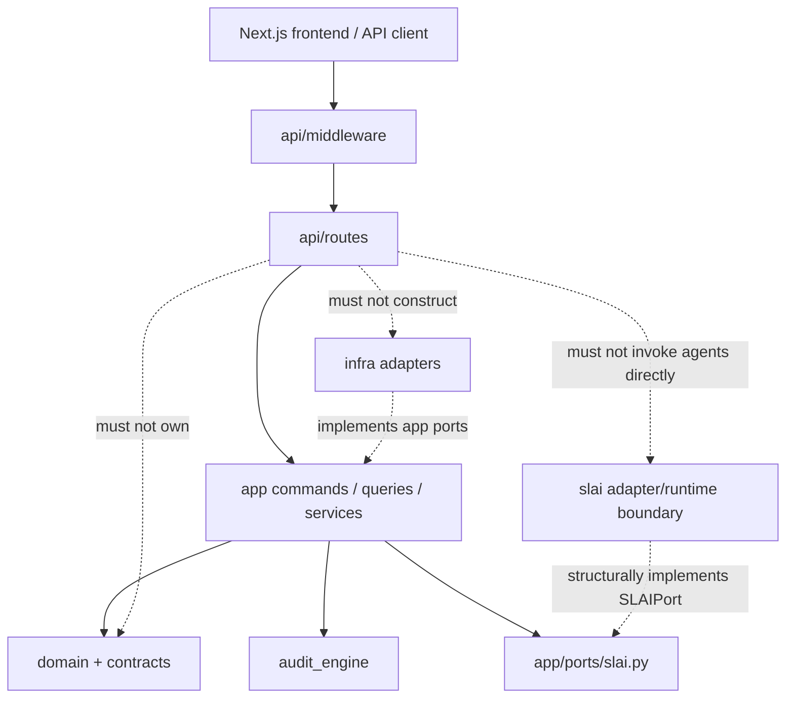
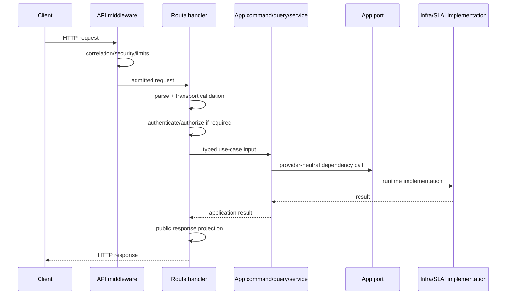

# BIMAP API Layer

> **Repository path:** `api/`  
> **Runtime package:** `applications.bimap.api`  
> **Architectural role:** HTTP admission, transport validation, authorization hand-off, response projection, and cross-cutting web policy for the R3D BIM Audit Platform  
> **Composition owner:** `bootstrap.py` / deployment composition; the API does not construct infrastructure, domain repositories, SLAI agents, or audit-engine internals

---

## 1. Purpose

The `api/` package is BIMAP's public HTTP boundary. It turns HTTP requests into calls to already-constructed application commands, queries, and services, and turns application results into safe HTTP responses.

The package is intentionally thin in business meaning. It may validate transport shape, authentication state, route authorization, media type, request size, idempotency headers, correlation identifiers, and response serialization, but it must not become a second implementation of BIMAP's domain rules or application workflows.

The current API covers:

- service liveness/readiness;
- customer signup, verification, login, logout, and session-backed authentication;
- account profile access/update;
- product discovery;
- order creation, retrieval, listing, and cancellation;
- upload staging and upload validation;
- audit submission, audit status, and persisted Audit Workspace retrieval;
- recurring entitlement admission;
- checkout and payment webhooks;
- report listing and download-link issuance;
- deletion requests;
- model conversion;
- structured model-data extraction; and
- optional administrative review/order/report access.

The central rule is:

> **The API owns HTTP semantics; the application layer owns use-case semantics.**

---

## 2. Architectural position



`api/app.py:create_app()` is the HTTP composition boundary immediately below BIMAP bootstrap. It receives an already-built `APIDependencies` container and mounts the route groups. It deliberately does not instantiate repositories, storage, queues, payment providers, SLAI agents, converters, extractors, product catalogs, or application services.

---

## 3. Package structure

```text
api/
├── README.md
├── __init__.py
├── app.py
├── dependencies.py
│
├── middleware/
│   ├── __init__.py
│   ├── correlation.py
│   ├── error_mapping.py
│   ├── request_limits.py
│   └── security.py
│
├── routes/
│   ├── __init__.py
│   ├── _shared.py
│   ├── account.py
│   ├── admin.py
│   ├── audits.py
│   ├── auth.py
│   ├── checkout.py
│   ├── conversions.py
│   ├── data_extractions.py
│   ├── deletion.py
│   ├── downloads.py
│   ├── entitlements.py
│   ├── health.py
│   ├── orders.py
│   ├── products.py
│   ├── reports.py
│   ├── uploads.py
│   └── webhooks.py
│
└── utils/
    ├── __init__.py
    ├── api_errors.py
    └── api_helpers.py
```

This tree reflects the current BIMAP route surface. Older documentation that omitted `account.py`, `audits.py`, `auth.py`, `conversions.py`, `data_extractions.py`, or `entitlements.py` is no longer representative of the application.

---

## 4. Core module responsibilities

| Module | Responsibility | Must not own |
|---|---|---|
| `app.py` | Create FastAPI app, validate API settings, construct route groups from injected dependencies, install exception handlers and middleware | repositories, domain policy, SLAI construction, audit rules |
| `dependencies.py` | Typed API dependency container and route-hook installation | provider implementations, business mutations |
| `middleware/correlation.py` | Request/correlation ID validation and propagation | business identifiers or audit identity |
| `middleware/error_mapping.py` | Final safe mapping of BIMAP/API failures to HTTP problem responses | application/domain exception semantics themselves |
| `middleware/request_limits.py` | Request/body/header limits and optional rate-limiter integration | plan/product quotas |
| `middleware/security.py` | HTTP security policy and response/request security enforcement | account authentication implementation |
| `routes/_shared.py` | Reusable route authorization and route-boundary helpers | product/domain policy |
| `routes/*` | HTTP parsing, authorization hand-off, command/query invocation, response mapping | lower-layer orchestration implementation |
| `utils/api_errors.py` | Stable API error vocabulary and public-safe error metadata | lower-layer error definitions |
| `utils/api_helpers.py` | Transport validation/serialization/header helpers | domain/business decisions |

---

## 5. Application factory and middleware order

`create_app()` installs BIMAP's middleware in the following effective outer-to-inner order:

```text
ErrorMapping
    ↓
CorrelationMiddleware
    ↓
Security
    ↓
RequestLimits
    ↓
FastAPI routing / route handler
```

This ordering is intentional:

1. `ErrorMapping` can observe failures from middleware and routes.
2. Correlation state is established before downstream security, limit, and use-case failures are emitted.
3. HTTP security runs before business handlers.
4. request-size/header/rate-limit admission happens before expensive application work.

The API default namespace is:

```text
/api/v1
```

The application also exposes two non-business service routes outside that prefix:

- `/` — service discovery only;
- `/favicon.ico` — empty response for browser favicon noise.

The root route is **not** a liveness/readiness substitute. Health belongs to the dedicated health route group.

OpenAPI and interactive documentation are disabled by default and must be explicitly enabled through `APISettings`.

---

## 6. Current route groups

All public business routes are mounted below the configured API prefix, normally `/api/v1`.

| Route module | Primary HTTP namespace | Current responsibility |
|---|---|---|
| `health.py` | `/health` | Liveness and readiness, including SLAI-facing health through injected dependencies |
| `products.py` | `/products` | Product catalog projection |
| `auth.py` | `/auth` | Signup, dual-channel signup verification, login, logout, resend verification codes |
| `account.py` | `/account` | Current account/profile surface, including profile/avatar-related hooks where configured |
| `orders.py` | `/orders` | Create, read, list, and cancel account-bound orders |
| `uploads.py` | `/orders/{order_id}/uploads...` | Upload slot creation, staging, validation/admission |
| `audits.py` | `/orders/{order_id}/audit...` | Start audit, read audit status, retrieve completed Audit Workspace |
| `entitlements.py` | `/orders/{order_id}/entitle` | Explicit recurring/bonus/unlimited usage admission |
| `checkout.py` | `/orders/{order_id}/checkout` | Checkout initiation |
| `reports.py` | `/orders/{order_id}/reports` | Report-manifest listing |
| `downloads.py` | `/orders/{order_id}/...` | Authorized report/download URL issuance |
| `deletion.py` | `/orders/{order_id}/...` | Governed deletion request admission |
| `webhooks.py` | `/webhooks/payment` | Payment-provider event verification/handling |
| `conversions.py` | `/conversions` | Conversion capabilities and authenticated model conversion |
| `data_extractions.py` | `/data-extractions` | Extraction capabilities and authenticated data-extraction package generation |
| `admin.py` | `/admin` | Optional admin review/order/report endpoints; mounted only when admin dependencies are configured |

### 6.1 Authentication endpoints

The current `RouteAuth` group registers:

```text
POST /auth/signup
POST /auth/verify-signup
POST /auth/login
POST /auth/logout
POST /auth/resend-signup-codes
```

Successful authentication uses the opaque `bimap_session` cookie. Cookie creation/deletion belongs to the API because cookie semantics are transport concerns; identity verification and session issuance belong to `AuthenticationService` and its application port.

The route does not hash passwords, generate verification codes, send SMS/e-mail directly, or own account lifecycle rules.

### 6.2 Audit endpoints

The current `RouteAudits` group registers:

```text
POST /orders/{order_id}/audit
GET  /orders/{order_id}/audit/status
GET  /orders/{order_id}/audit/workspace
```

`POST /audit` is not a direct call into `AuditEngine`. The route coordinates already-defined application boundaries: audit input preparation, upload validation, entitlement admission, immutable `AuditJob` creation/submission, and the relevant order/use-case checks.

`GET /audit/workspace` reads the persisted completed workspace through `GetAuditWorkspace` → `AuditResultStore`. This is the transport path intended for the frontend Audit Workspace after deterministic audit + SLAI processing has completed.

### 6.3 Conversion endpoints

`RouteConversions` exposes:

- a capability endpoint; and
- authenticated conversion execution.

The API does not infer support from file extensions on its own. `ModelConversionService` resolves the uploaded filename against the capabilities advertised by the configured `ModelConverter` infrastructure graph.

### 6.4 Data extraction endpoints

`RouteDataExtractions` exposes:

- `/data-extractions/capabilities`; and
- authenticated multipart extraction execution.

Authentication intentionally occurs before multipart parsing so an unauthenticated request cannot force large upload spooling first.

The route projects `email_available` from the application service. In the current implementation this is `False`; the existence of an `ArtifactMailer` infrastructure adapter must not be interpreted as an active API delivery path until the application service is wired to it.

---

## 7. HTTP-to-application flow

A normal request should follow this shape:



Transport validation should terminate at the route boundary. Once input has been converted into application/domain values, lower layers should not receive FastAPI `Request`, `Response`, `UploadFile`, HTTP status codes, cookies, or header semantics unless a dedicated port explicitly models them.

---

## 8. Authentication and authorization boundaries

Authentication and authorization are related but distinct.

### Authentication

`auth.py` resolves a session cookie through `AuthenticationService`. The service coordinates the canonical BIMAP `Account` with the abstract `Authentication` port.

The API may:

- read/write the session cookie;
- reject a missing/expired HTTP session;
- map routine login/signup failures to safe public messages.

It must not:

- store credential hashes;
- verify passwords itself;
- generate OTPs;
- access Twilio/SMTP/SLAI authentication classes directly.

### Authorization

Order/report/upload/audit routes use injected route authorization hooks from `APIRouteHooks` / `_shared.py`. Routes should authorize against the relevant resource identifier before revealing resource-specific state.

Admin routes are conditional and must not be mounted merely because normal customer routes exist.

---

## 9. Audit Workspace contract at the HTTP boundary

The current completed-audit path is:


The deterministic finding set remains authoritative. The SLAI result is supplemental and is validated so it cannot silently replace the deterministic `FindingContract` sequence. The persisted workspace contains the combined application result as JSON-safe data.

The API should therefore expose the persisted application record, not reconstruct an Audit Workspace from transient SLAI state inside the route layer.

---

## 10. Error model

`api/utils/api_errors.py` is the API error vocabulary. Lower-layer failures should be translated at the correct boundary rather than leaked directly.

Expected flow:

```text
DomainError / AppError / provider failure
        ↓
application boundary translation where required
        ↓
APIError with safe public semantics
        ↓
ErrorMapping middleware
        ↓
HTTP problem response
```

The API must not expose:

- raw stack traces;
- provider secrets;
- storage paths;
- customer source-file contents;
- agent internals;
- raw authentication-provider error strings.

FastAPI/Starlette validation/routing exceptions are also intercepted so default detail-bearing framework responses do not bypass BIMAP's error boundary.

---

## 11. Idempotency

State-changing routes should reuse the application's existing idempotency semantics rather than invent route-local transaction rules.

Examples include:

- audit start;
- upload validation/staging;
- entitlement consumption;
- checkout/payment handling;
- conversion/extraction operations where their command/service contract requires an idempotency key.

`RouteAudits` derives stage-specific keys from the request idempotency key for its internal coordinated steps. This prevents one HTTP operation from accidentally reusing the same raw key for semantically different mutations while preserving replayability.

---

## 12. Dependency injection

`APIDependencies` is installed on the FastAPI application by `install_api_dependencies()`. `api/app.py` then constructs route groups from the injected command/query/service objects and trusted hooks.

The intended ownership is:

```text
deployment_bimap.py / bootstrap.py
        ↓ constructs
application services + commands + queries + infrastructure adapters
        ↓ packages as
APIDependencies
        ↓ consumed by
api/app.py:create_app()
        ↓ constructs
route groups
```

A route module must not import a concrete infrastructure adapter merely because that adapter happens to be used in local development.

---

## 13. Security invariants

The API layer should preserve the following invariants:

1. **Authenticate before expensive body processing where possible.**
2. **Authorize resource access before returning resource-specific existence/details.**
3. **Use bounded request/header/correlation input.**
4. **Keep session tokens opaque to business logic.**
5. **Do not log credentials, OTPs, raw session tokens, or customer model bytes.**
6. **Use safe response projections instead of serializing arbitrary internal objects.**
7. **Do not allow client input to choose arbitrary SLAI agents, infrastructure providers, local paths, or executable backends.**
8. **Keep OpenAPI/docs disabled unless deployment policy explicitly exposes them.**

---

## 14. Current integration boundaries

The API may depend on application abstractions and selected contract/domain values needed for input/output typing. It must not collapse the architecture by taking ownership of lower-layer behavior.

Allowed direction:

```text
api
 ↓
app
 ↓
domain / contracts / audit_engine boundaries
```

Runtime implementations are injected from the outside:

```text
infra ──implements──> app ports <──implemented structurally by── slai adapter
```

Forbidden patterns include:

```text
api/routes/* -> infra.local.InMemoryRepository
api/routes/* -> src.agents.*
api/routes/* -> ifcopenshell / trimesh / Blender subprocess
api/routes/* -> payment provider SDK
api/routes/* -> direct SQL/storage client
```

---

## 15. Testing expectations

API tests should focus on transport behavior rather than re-testing domain internals.

At minimum, cover:

- app creation with valid/invalid `APISettings`;
- middleware order and correlation propagation;
- safe framework error mapping;
- authentication cookie behavior;
- unauthorized/forbidden route behavior;
- idempotency-header requirements;
- route payload validation and unsupported-field rejection;
- audit start/status/workspace routing;
- conversion/extraction capability projection;
- multipart limits and early authentication;
- admin route conditional mounting;
- no leakage of internal exception messages.

Use injected fakes/stubs at application-port boundaries. Do not require production infrastructure just to test HTTP mapping.

---

## 16. Extension checklist

When adding a new API feature:

1. Confirm the use case already exists in `app/` or create it there first.
2. Add/extend a provider-neutral app port if an external capability is required.
3. Keep the route responsible only for HTTP parsing, auth/authorization hand-off, use-case invocation, and response mapping.
4. Add the route group to `api/routes/__init__.py`.
5. Add the dependency to `APIDependencies`/its nested dependency group rather than constructing it in the route.
6. Mount the route group in `_construct_route_groups()`.
7. Map expected lower-layer failures to the existing API error vocabulary.
8. Add request-size/security/idempotency behavior where applicable.
9. Update this README's package tree and route table.

---

## 17. Current source-level notes

The API tree itself is materially ahead of older documentation. The most important documentation corrections are:

- customer account/authentication routes are now first-class;
- audit execution has explicit status and persisted workspace endpoints;
- conversion and data extraction are first-class authenticated services;
- entitlement admission is exposed explicitly;
- `create_app()` currently mounts all of these route groups and conditionally mounts admin routes;
- the API depends on injected application objects rather than constructing the new infrastructure itself.

These are architectural changes, not merely additional endpoints, and should be reflected in any root-level BIMAP architecture documentation as well.

---

## 18. Summary

`api/` is BIMAP's controlled web boundary. Its production-ready role is to make the application safely reachable over HTTP while keeping business policy, deterministic audit meaning, persistence, provider integrations, and SLAI internals outside the transport layer.

The current design should be preserved as:

> **HTTP request → middleware → route validation/auth → application command/query/service → injected port implementation → application result → safe HTTP projection.**
