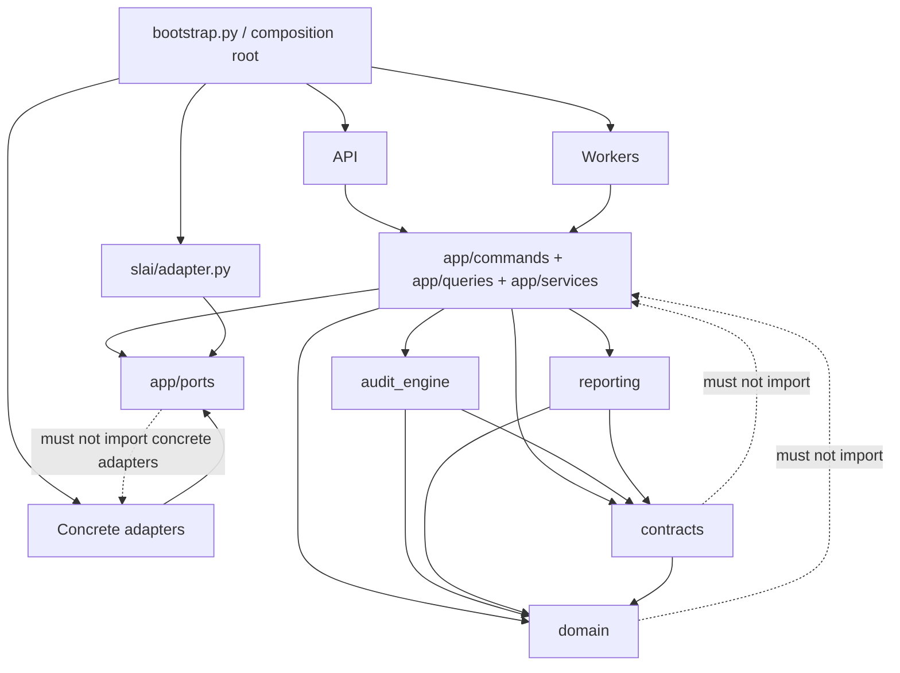
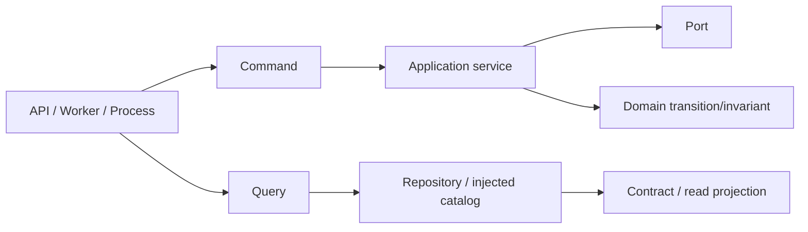
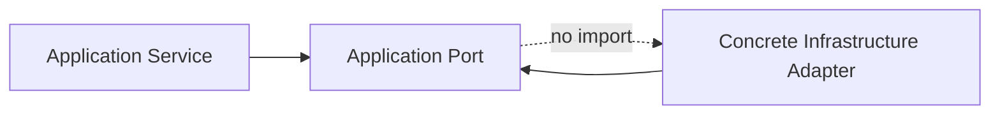
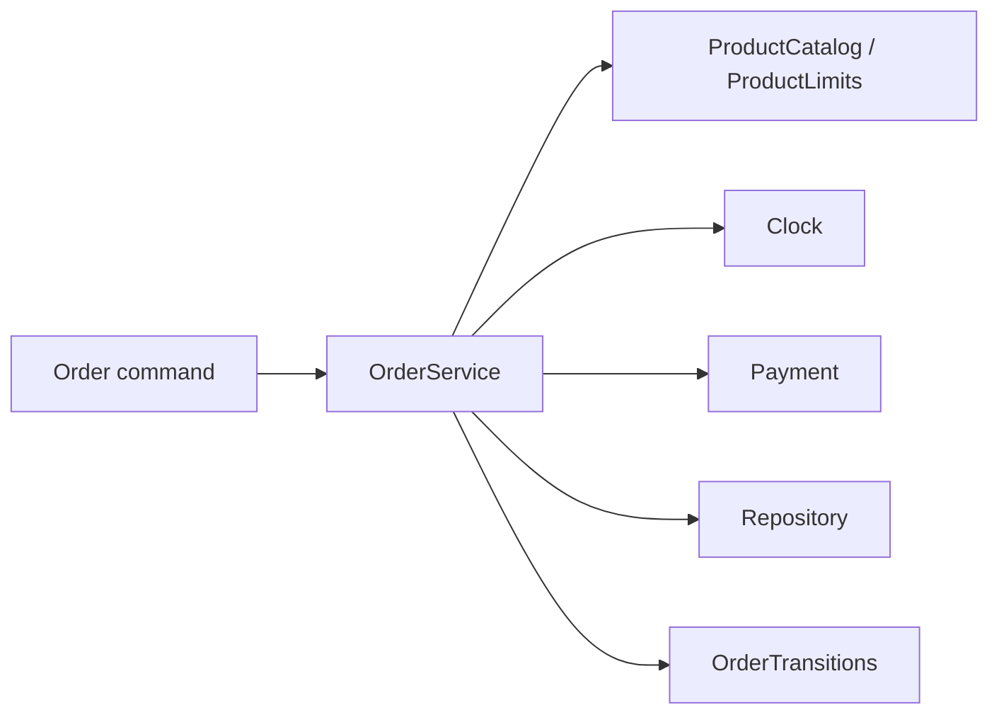
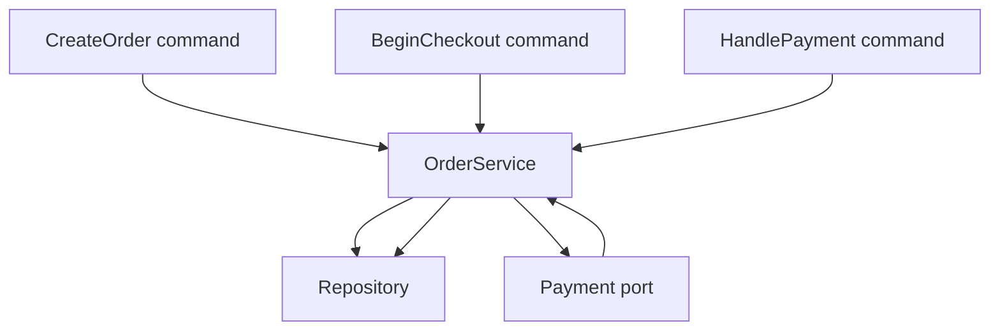
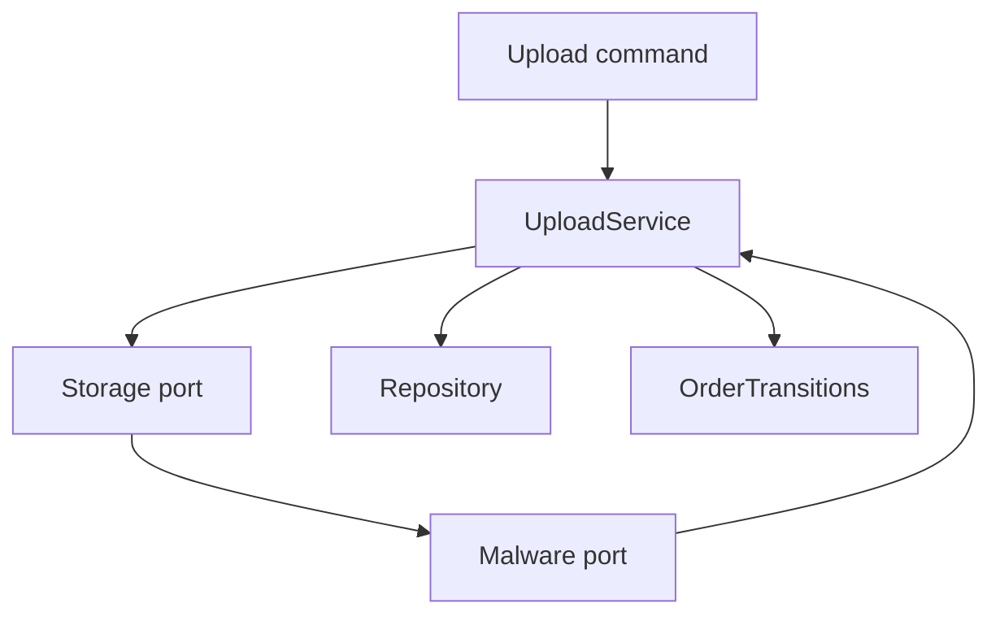
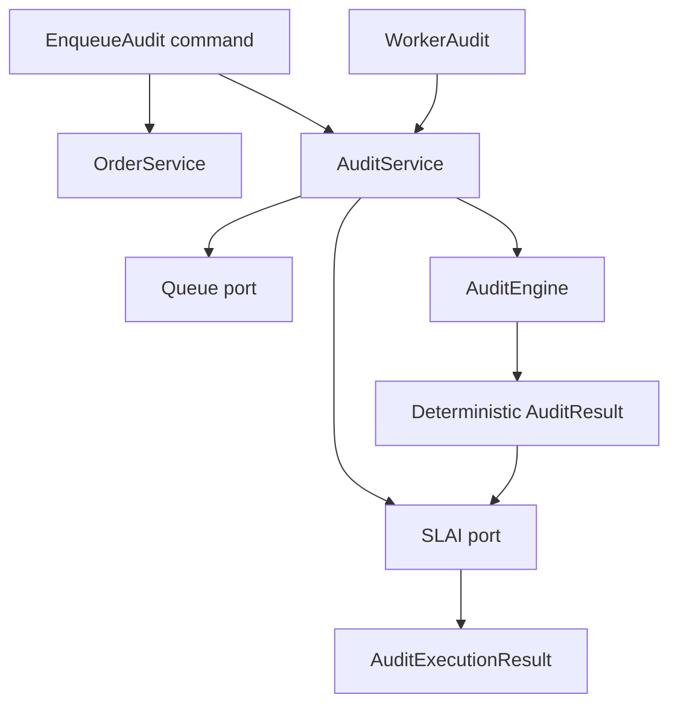
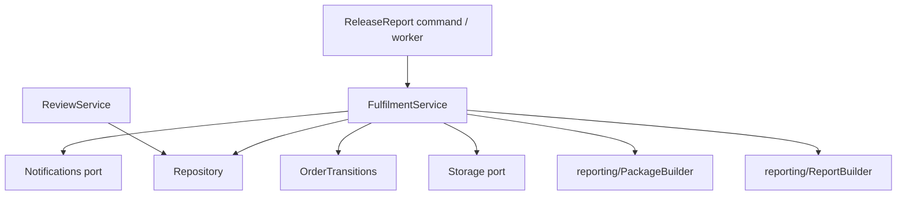

# BIMAP Application Layer

> **Package:** `bimap.app`  
> **Architectural role:** Use-case coordination, dependency inversion, and application-facing policy orchestration for the R3D BIM Audit Platform (BIMAP)  
> **Runtime position:** Commands, queries, and services occupy Level 5; application ports form the Level-4 dependency-inversion boundary below them and are implemented by outer concrete adapters

---

## 1. Purpose

The `app/` package coordinates BIMAP use cases across the canonical domain, external contracts, deterministic audit engine, reporting subsystem, and infrastructure-facing ports. It is the layer in which already-defined business concepts are composed into application operations such as order creation, payment handling, secure upload validation, audit submission and execution, governance review, report release, retention expiry, and customer-facing read queries.

The application layer exists to answer questions such as:

- Which use case coordinates a lifecycle transition with another application service?
- Which dependencies must be injected instead of imported as concrete SDK clients?
- How are order, upload, payment, audit, governance, reporting, retention, and deletion responsibilities separated without duplicating domain rules?
- Which application failures are validation, integrity, configuration, or dependency failures?
- Which operations are commands that may mutate state, and which are queries that remain read-only?
- How is deterministic audit execution coordinated with the SLAI application port without allowing SLAI to replace authoritative findings?
- How are report generation, publication, manifest persistence, delivery state, and notification separated?
- How are time, persistence, storage, payments, notifications, malware scanning, queue submission, and SLAI accessed through stable interfaces?
- Where should configuration and concrete adapters be injected?

The package does **not** define HTTP routes, database schemas, object-storage SDK clients, payment-provider SDK behavior, queue-consumer transport, worker retry/backoff policy, deterministic BIM rules, source-file parsing, report templates, or SLAI agent internals. Those concerns belong to higher infrastructure/API/worker layers or lower specialized BIMAP subsystems.

---

## 2. Architectural position

The canonical BIMAP hierarchy places application use cases at Level 5 and the application ports at Level 4.



The central dependency rule is:

> **Application use cases may coordinate lower BIMAP capabilities through contracts, domain objects, audit/reporting components, and application ports; lower layers must never depend on application commands, queries, or services.**

---

## 3. Internal application structure

```text
bimap/app/
├── __init__.py
├── README.md
│
├── commands/
│   ├── __init__.py
│   ├── begin_checkout.py
│   ├── cancel_order.py
│   ├── create_order.py
│   ├── create_upload_slot.py
│   ├── enqueue_audit.py
│   ├── handle_payment.py
│   ├── release_report.py
│   ├── request_deletion.py
│   └── validate_uploads.py
│
├── queries/
│   ├── __init__.py
│   ├── enqueue_audit.py              # empty legacy placeholder; not an active query
│   ├── get_audit_status.py
│   ├── get_order.py
│   ├── get_products.py
│   ├── list_orders.py
│   └── list_reports.py
│
├── services/
│   ├── __init__.py
│   ├── audit_service.py
│   ├── fulfilment_service.py
│   ├── order_service.py
│   ├── review_service.py
│   └── upload_service.py
│
├── ports/
│   ├── __init__.py
│   ├── clock.py
│   ├── malware.py
│   ├── notifications.py
│   ├── payment.py
│   ├── queue.py
│   ├── repositories.py
│   ├── slai.py
│   └── storage.py
│
└── utils/
    ├── __init__.py
    ├── app_errors.py
    └── app_helpers.py
```

`app/queries/enqueue_audit.py` is not an active application query. Audit submission is mutating behavior and is implemented by `app/commands/enqueue_audit.py`; a second query implementation should not be created for the same responsibility.

---

## 4. Architectural principles

### 4.1 Commands mutate; queries read

Application commands represent state-changing use cases. Queries are read-only projections over already-authorized application/domain state.



A query must not transition an order, submit a queue message, publish storage objects, send notifications, or mutate governance state. A command must not recreate domain transition rules or concrete infrastructure behavior simply because it coordinates a mutating use case.

### 4.2 Services coordinate authoritative owners

Application services compose lower-level capabilities but do not replace them.

| Concern | Authoritative owner consumed by application services |
|---|---|
| Order state vocabulary and structural transitions | `domain/orders/` |
| Product identity/catalog/limits | `domain/products/` |
| Evidence/finding/governance meaning | `domain/` |
| External job/order/report contracts | `contracts/` |
| Deterministic BIM analysis | `audit_engine/` |
| SLAI integration boundary | `app/ports/slai.py` + concrete `slai/adapter.py` |
| Report artifact construction | `reporting/` |
| Persistence | `app/ports/repositories.py` |
| File/object storage | `app/ports/storage.py` |
| Malware scanning | `app/ports/malware.py` |
| Payments | `app/ports/payment.py` |
| Queue submission | `app/ports/queue.py` |
| Notifications | `app/ports/notifications.py` |
| Current time | `app/ports/clock.py` |

Application code should call these authorities rather than reproducing their internal rules.

### 4.3 Ports are interfaces, never concrete clients

`app/ports/` is the dependency-inversion boundary. Port modules may define BIMAP-owned request/result value objects and abstract methods, but they do not open SDK connections, read environment variables, configure provider credentials, or instantiate infrastructure clients.



Concrete implementations are composed from `bootstrap.py` or a higher deployment/composition layer.

### 4.4 Fail closed at cross-layer integrity boundaries

Application code distinguishes invalid caller input from inconsistent system state. Identity mismatches, cross-order results, stale/incompatible revisions, contradictory manifests, or dependency results of the wrong type are integrity failures rather than silently corrected values.

### 4.5 Configuration is injected

Product catalogs, commercial tiers, product limits, retention durations, renderer implementations, storage object IDs, report IDs, and provider configuration are not loaded ad hoc by application use-case modules. They are supplied by composition or an explicit configuration owner.

---

## 5. Application utilities

### 5.1 `utils/app_errors.py`

`app_errors.py` defines the stable application and port failure vocabulary. The hierarchy includes general application validation/integrity/configuration errors and specialized port failures for clock, malware, payment, queue, repository, and storage operations.

Error objects support:

- stable machine-readable `code` values;
- retryability metadata where meaningful;
- component/operation/field classification;
- bounded and redacted diagnostic context;
- explicit operator-facing announcement;
- exception chaining without exposing provider messages in serialized diagnostics.

Exception construction itself should remain free of logging side effects. The handling boundary that owns operational reporting decides when to announce the error.

### 5.2 `utils/app_helpers.py`

`app_helpers.py` centralizes reusable application-boundary mechanics including:

- method-start logging and `PrettyPrinter` status emission;
- required/optional text validation;
- non-negative integer/duration validation;
- canonical UTC normalization and formatting;
- binary stream and bytes-like validation;
- canonical JSON delegation;
- safe lower-layer error identity extraction.

These helpers do not own business rules, retry loops, retention policy, payment policy, malware policy, or storage semantics.

---

## 6. Application ports

### 6.1 `ports/clock.py`

Defines the deterministic UTC wall-clock boundary. Application code receives a `Clock`; concrete system/fixed clocks are injected. The port owns common UTC validation and deadline arithmetic but not retention-duration policy or scheduling.

### 6.2 `ports/malware.py`

Defines provider-neutral malware scanning. A clean/malicious/indeterminate verdict is a normal scan result; scanner timeout/unavailability is an operational failure. The port does not replace MIME/signature/archive validation or upload authorization.

### 6.3 `ports/notifications.py`

Defines application-facing notification delivery through logical event/target identities. Provider channels and credentials belong to adapters.

### 6.4 `ports/payment.py`

Defines payment-provider-neutral checkout/event/status boundaries. Commercial product identity is owned by the product domain; provider behavior remains external.

### 6.5 `ports/queue.py`

Defines idempotent submission of the canonical `AuditJob` and a provider-neutral `QueueReceipt`. The current port is a **submission** boundary. It does not define broker receive leases, acknowledgements, consumer polling, dead-letter semantics, or destructive cancellation.

### 6.6 `ports/repositories.py`

Defines persistence for the canonical records currently supported by BIMAP: orders, evidence, findings, reviews, and report manifests. `Order.version` is used for optimistic concurrency where applicable. Repository interfaces do not invent database schemas or generic query APIs whose ordering/filtering semantics have not been specified.

### 6.7 `ports/slai.py`

Defines the stable application-facing SLAI façade. `AuditJob` remains the work contract and deterministic findings remain authoritative. The port exposes only the integration surface the application requires rather than AgentFactory, SharedMemory, individual agents, or SLAI-native orchestration internals.

### 6.8 `ports/storage.py`

Defines provider-neutral object persistence and integrity metadata. Object names/IDs, authorization policy, retention policy, and provider credentials are supplied by higher composition/use-case owners.

---

## 7. Application services

### 7.1 `services/order_service.py`

`OrderService` coordinates canonical order lifecycle, configured product/tier membership, configured product limits, current time, payment behavior, persistence, and idempotent order transitions. Structural state legality remains in `OrderTransitions`; payment providers and hard-coded commercial values are not reimplemented in the service.



### 7.2 `services/upload_service.py`

`UploadService` coordinates secure upload staging, malware scanning, fail-closed scan acceptance, upload-session assignment, persistence, and the supported upload lifecycle transitions. It does not invent extension/MIME allowlists, file-count thresholds, archive expansion policy, or provider-specific upload-slot semantics.

### 7.3 `services/audit_service.py`

`AuditService` coordinates:

- authoritative order/job binding;
- deterministic audit execution through `AuditEngine`;
- product-appropriate Family Audit, BIM QA, or Combined Audit dispatch;
- SLAI invocation through the application port;
- preservation of deterministic authoritative findings;
- optional queue submission through the queue port.

It does not persist an `AuditResult` through unrelated repository methods when no audit-result persistence port exists.

### 7.4 `services/review_service.py`

`ReviewService` coordinates the canonical `Review` aggregate, append-only governance decisions, persistence, and deterministic time. Review reason codes and thresholds remain explicit caller-owned inputs where the domain does not define a universal policy.

### 7.5 `services/fulfilment_service.py`

`FulfilmentService` coordinates governed report release across:

- `ReportBuilder`;
- deterministic package construction;
- object storage publication;
- immutable `ReportManifest` persistence;
- order packaging/delivery transitions;
- separate report-availability notification;
- explicit retention expiry and cleanup.

Publication and notification remain separate effects so a notification failure does not invalidate already-published report state.

---

## 8. Commands

Commands are narrow Level-5 use-case coordinators. They should validate their invocation, delegate to application services/ports, verify returned identity/state, and avoid rebuilding service logic.

| Command | Application responsibility |
|---|---|
| `create_order.py` | Coordinate creation of a configured BIMAP order |
| `create_upload_slot.py` | Coordinate the supported upload-start/session behavior without fabricating provider presigned-URL APIs |
| `validate_uploads.py` | Coordinate validated upload acceptance through the upload service |
| `begin_checkout.py` | Coordinate order checkout/payment-pending behavior |
| `handle_payment.py` | Coordinate verified payment handling and resulting order state |
| `enqueue_audit.py` | Establish canonical queued state and submit the immutable `AuditJob` idempotently |
| `cancel_order.py` | Coordinate a canonical cancellation through the order lifecycle owner |
| `release_report.py` | Coordinate report release through fulfilment without reimplementing reporting |
| `request_deletion.py` | Execute the currently supported retention-governed deletion use case |

`enqueue_audit.py` is deliberately a command because it mutates order/queue state. The empty file with the same name under `queries/` must not become a second implementation.

---

## 9. Queries

Queries expose read-only application views and should not become hidden mutation pathways.

### 9.1 `queries/get_order.py`

Loads one authoritative order through the repository and projects it through the existing `OrderContract`. Optional lookup and required lookup are separate semantics rather than converting absence into a persistence error.

### 9.2 `queries/list_orders.py`

The current repository port has no persistence-wide `list_orders()` contract. The query therefore resolves an explicit, already-authorized sequence of order IDs through existing point reads and reports missing IDs explicitly. Pagination/filter/order semantics should be introduced only through a future dedicated read/query port with defined behavior.

### 9.3 `queries/get_products.py`

Reads from an injected `ProductCatalog` and configured `ProductLimits`. It does not open `products.yaml`, hard-code prices, invent limit values, or merge product/tier limits using undocumented precedence.

### 9.4 `queries/list_reports.py`

The current repository port exposes report-manifest point reads, not a global report-list API. The query resolves explicit report IDs and may enforce expected order identity without fabricating persistence filtering semantics.

### 9.5 `queries/get_audit_status.py`

Projects authoritative order lifecycle state into an audit-status read model, optionally binding it to a known `AuditJob`. The query does not invent percentage completion, queue position, ETA, worker progress, or SLAI state that the current contracts do not represent.

---

## 10. Principal application flows

### 10.1 Order and payment flow



### 10.2 Secure upload flow



Only an explicitly clean malware verdict is sufficient for accepted upload state in the current upload service. Infrastructure scanner failures remain operational failures rather than being rewritten as malicious detections.

### 10.3 Audit flow



Deterministic findings remain authoritative when passed through the SLAI boundary.

### 10.4 Governance and fulfilment flow



---

## 11. Error and observability policy

Every public application operation should emit a method-start diagnostic through `announce_app_action()` or an equivalent package-specific helper. Operator-facing status uses `PrettyPrinter`; structured diagnostic details use the shared logger.

Logging must avoid:

- raw upload bytes;
- customer file contents;
- provider request/response payloads;
- credentials/tokens/cookies;
- signed/presigned URLs;
- storage paths/keys where treated as sensitive;
- payment references and secrets;
- unbounded arbitrary metadata.

Application errors carry bounded/redacted context and stable codes. Retryability is descriptive metadata. Commands and services do not automatically retry unless an explicit idempotent retry owner is defined at a higher orchestration boundary.

---

## 12. Idempotency and concurrency

BIMAP separates structural idempotency from distributed-transaction claims.

- order lifecycle operations use stable idempotency keys where the command/service exposes them;
- queue submission preserves a stable `AuditJob`/idempotency identity;
- report publication uses caller-supplied stable report/object IDs where supported;
- repository order writes may use `expected_version` optimistic concurrency;
- no command claims atomicity across repository + broker, repository + payment provider, or repository + object store unless a future explicit transactional mechanism exists.

A retry-capable outer layer must reuse stable identities rather than generate new semantic work for the same operation.

---

## 13. Import rules

Allowed high-level dependency direction:

```text
api/ workers/ bootstrap/
        ↓
app/commands app/queries app/services
        ↓
app/ports + audit_engine + reporting
        ↓
contracts
        ↓
domain
```

Forbidden reverse dependencies include:

```text
domain/*              MUST NOT import app/*
contracts/*           MUST NOT import app/*
audit_engine/*        MUST NOT import app/services or app/commands
reporting/*           MUST NOT import app/services or app/commands
app/ports/*           MUST NOT import concrete infrastructure adapters
app/utils/*           MUST NOT import commands, queries, services, or concrete ports
app/queries/*         MUST NOT perform lifecycle mutation
app/services/*        MUST NOT import workers/* or api/*
app/commands/*        MUST NOT import workers/* or bootstrap.py
```

---

## 14. Composition

Concrete composition belongs above the application layer.

A production composition root is expected to provide, as applicable:

```text
Repository implementation
Storage implementation
Malware scanner implementation
Payment implementation
Queue implementation
Notifications implementation
Clock implementation
SLAI adapter
AuditEngine
ProductCatalog / ProductLimits
ReportBuilder / PackageBuilder
Application services
Commands / queries
```

Application modules should not read environment variables or configuration files merely to locate these dependencies.

---

## 15. Testing strategy

Application tests should prioritize deterministic behavior at use-case boundaries.

Recommended categories are:

1. **Validation tests** — unsupported types, missing IDs, malformed metadata, invalid timestamps, and contradictory result identity.
2. **Port contract tests** — concrete adapter behavior conforms to BIMAP-owned port models and error translation.
3. **Service orchestration tests** — the correct domain/port owners are called without duplicated rules.
4. **Idempotency tests** — repeated invocation with the same stable identity does not manufacture duplicate lifecycle semantics.
5. **Failure-path tests** — timeout/unavailability/integrity failures remain distinguishable and content-safe.
6. **Read-model tests** — queries remain side-effect free and do not invent unavailable persistence/query semantics.
7. **Cross-layer integrity tests** — audit job/order, report/order, storage/scan, and SLAI/deterministic-result identities remain bound correctly.

Tests should inject fixed clocks and in-memory/fake port adapters rather than relying on live providers.

---

## 16. Non-responsibilities

The `app/` package must not become the owner of:

- Revit/RFA parsing;
- deterministic BIM rule definitions;
- SLAI AgentFactory or agent internals;
- customer report templates/rendering algorithms;
- database/ORM implementation;
- object-storage SDK behavior;
- payment-provider SDK behavior;
- broker-consumer receive/ack/dead-letter behavior;
- HTTP request/response serialization;
- infrastructure authentication/authorization;
- final commercial pricing/limit values unless supplied through validated configuration;
- undocumented retention periods;
- generic cross-provider retry policy.

Its role is coordination through explicit BIMAP-owned boundaries.

---

## 17. Summary

`bimap.app` is the central use-case coordination layer of BIMAP. Commands express mutations, queries express reads, services compose authoritative lower-layer capabilities, ports invert external dependencies, and shared utilities provide one application error/validation/diagnostic vocabulary. The package remains production-safe when it coordinates rather than duplicates: domain modules own business meaning, the audit engine owns deterministic analysis, reporting owns deliverable construction, SLAI owns supplemental intelligence behind its port, and concrete infrastructure remains outside the application boundary.
