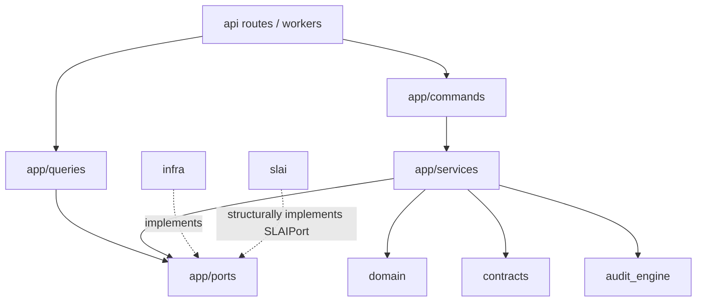
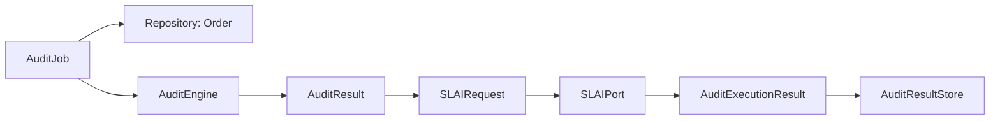

# BIMAP Application Layer

> **Repository path:** `app/`  
> **Runtime package:** `applications.bimap.app`  
> **Architectural role:** use-case coordination, provider-neutral ports, application invariants, and orchestration between BIMAP domain/audit logic and runtime adapters

---

## 1. Purpose

The `app/` package is BIMAP's application/use-case layer. It coordinates work that spans domain aggregates, the deterministic Audit Engine, persistence ports, storage/queue/payment/security boundaries, model conversion/data extraction, and the SLAI anti-corruption layer.

The application layer answers questions such as:

- Which steps constitute a BIMAP order/audit/upload workflow?
- When may an account consume an audit/conversion/extraction entitlement?
- Which provider-neutral port is needed to execute a use case?
- How are retries and idempotency handled at the use-case boundary?
- How is a deterministic `AuditResult` passed to SLAI without allowing SLAI to rewrite authoritative findings?
- How is the completed deterministic + SLAI result persisted as an Audit Workspace?
- How are conversion/extraction capabilities admitted safely without coupling the application to IfcOpenShell, Blender, Trimesh, Revit, DWG, SMTP, Twilio, or other concrete providers?

The application layer should contain coordination and application-level validation, not HTTP behavior and not provider implementations.

---

## 2. Architectural position



The application layer is the stable inward-facing boundary that higher layers call. Concrete adapters depend on its ports, not the reverse.

---

## 3. Package structure

```text
app/
├── README.md
├── __init__.py
│
├── commands/
│   ├── __init__.py
│   ├── begin_checkout.py
│   ├── cancel_order.py
│   ├── convert_model.py
│   ├── create_order.py
│   ├── create_upload_slot.py
│   ├── enqueue_audit.py
│   ├── extract_model_data.py
│   ├── grant_entitlement.py
│   ├── handle_payment.py
│   ├── release_report.py
│   ├── request_deletion.py
│   ├── stage_upload.py
│   └── validate_uploads.py
│
├── ports/
│   ├── __init__.py
│   ├── accounts.py
│   ├── artifact_mailer.py
│   ├── audit_results.py
│   ├── authentication.py
│   ├── clock.py
│   ├── data_extraction.py
│   ├── malware.py
│   ├── model_conversion.py
│   ├── notifications.py
│   ├── payment.py
│   ├── queue.py
│   ├── repositories.py
│   ├── slai.py
│   └── storage.py
│
├── queries/
│   ├── __init__.py
│   ├── get_audit_status.py
│   ├── get_audit_workspace.py
│   ├── get_order.py
│   ├── get_products.py
│   ├── list_orders.py
│   └── list_reports.py
│
├── services/
│   ├── __init__.py
│   ├── account_service.py
│   ├── audit_input_service.py
│   ├── audit_service.py
│   ├── authentication_service.py
│   ├── data_extraction_service.py
│   ├── entitlement_service.py
│   ├── fulfilment_service.py
│   ├── model_conversion_service.py
│   ├── order_service.py
│   ├── review_service.py
│   └── upload_service.py
│
└── utils/
    ├── __init__.py
    ├── app_errors.py
    └── app_helpers.py
```

The current application layer is substantially broader than the older order/upload/audit-only documentation. Account identity, authentication, recurring entitlements, conversion, data extraction, Audit Workspace persistence, and a formal SLAI application port are now first-class application concerns.

---

## 4. Commands

Commands express state-changing application intentions. They should remain small use-case handlers that delegate reusable coordination to services/ports rather than duplicating domain rules.

| Command | Responsibility |
|---|---|
| `begin_checkout.py` | Start checkout for an eligible order through payment/application policy |
| `cancel_order.py` | Coordinate canonical order cancellation |
| `convert_model.py` | Execute one authenticated/quota-governed model conversion through `ModelConversionService` |
| `create_order.py` | Create a new canonical order |
| `create_upload_slot.py` | Create the upload/storage admission contract for an order |
| `enqueue_audit.py` | Submit an immutable `AuditJob` through the configured queue/application audit service |
| `extract_model_data.py` | Execute one authenticated/quota-governed structured model extraction |
| `grant_entitlement.py` | Consume/resolve the account's entitlement for the requested usage operation |
| `handle_payment.py` | Verify/process payment events through the payment boundary |
| `release_report.py` | Coordinate report release state |
| `request_deletion.py` | Coordinate governed deletion intent |
| `stage_upload.py` | Stage uploaded content through the storage/application boundary |
| `validate_uploads.py` | Validate stored upload manifests/content before later processing |

Commands should not contain concrete provider SDK calls.

---

## 5. Queries

Queries are read-only application projections.

| Query | Responsibility |
|---|---|
| `get_audit_status.py` | Resolve current audit/order status for the API/frontend |
| `get_audit_workspace.py` | Resolve the latest completed `AuditResultRecord` for an order through `AuditResultStore` |
| `get_order.py` | Read one order |
| `get_products.py` | Project the product catalog |
| `list_orders.py` | List account/authorized orders |
| `list_reports.py` | List report manifests |

### Audit Workspace query

`GetAuditWorkspace` is the authoritative application read path for the persisted completed Audit Workspace:

```text
GetAuditWorkspace
    ↓
AuditResultStore.get_by_order(order_id)
    ↓
AuditResultRecord | None
```

It does not call SLAI again, rebuild deterministic results, or infer workspace state from the frontend.

---

## 6. Services

Services coordinate reusable application workflows that are too broad for a single command/query.

### 6.1 `AccountService`

Owns application-level account/profile operations over the canonical `Account` aggregate and `Accounts` persistence port. The domain remains authoritative for identity/profile invariants; the service coordinates persistence and application projections.

### 6.2 `AuthenticationService`

Coordinates signup, dual-channel verification, login, logout, resend verification, session/account resolution, and account activation state.

The service deliberately does **not**:

- hash passwords;
- generate OTPs itself;
- send e-mail/SMS itself;
- set HTTP cookies;
- depend on concrete SLAI authentication classes.

Registration spans account persistence and authentication identity creation, so the service uses a compensating saga rather than pretending the two dependencies are one atomic transaction.

### 6.3 `EntitlementService`

Owns commercial usage admission for:

- audits;
- model conversion; and
- data extraction.

For finite quotas, consumption precedence is:

```text
recurring plan quota
    ↓ if exhausted
redeemed bonus credit
    ↓ if unavailable
quota exhausted
```

For unlimited quotas, admission is recorded as unlimited usage.

The service uses separate `source_id` and `idempotency_key` identities and requires persistence to enforce atomic consumption. It intentionally does not invent whether weekly/monthly renewal means calendar, ISO-week, or subscription-anniversary boundaries; that policy is supplied by an injected renewal-window resolver.

### 6.4 `AuditInputService`

Resolves/stages the already-uploaded model references needed to form audit-engine evidence inputs and a stable input manifest. It is the bridge between uploaded source references and deterministic audit execution input—not a rule engine.

### 6.5 `AuditService`

Coordinates:

1. immutable `AuditJob` validation against the authoritative `Order`;
2. deterministic product-specific execution via `AuditEngine`;
3. evidence-reference consistency;
4. creation of `SLAIRequest` from `AuditResult.to_dict()`;
5. SLAI invocation through the formal `SLAIPort`;
6. validation that SLAI did not alter authoritative deterministic findings; and
7. persistence of the completed combined result as an `AuditResultRecord` through `AuditResultStore`.

The fundamental invariant is:

> **The deterministic Audit Engine remains authoritative. SLAI supplements the result; it does not replace deterministic finding identity or evidence linkage.**

Current execution shape:



### 6.6 `ModelConversionService`

Coordinates authenticated/quota-governed model conversion through the provider-neutral `ModelConverter` port.

It owns application-level steps such as:

- source stream staging;
- source size bounding;
- SHA-256 hashing;
- source-format resolution from the uploaded filename against **advertised converter capabilities**;
- malware-gate enforcement;
- entitlement consumption; and
- conversion result validation.

It does not import IfcOpenShell, Trimesh, Blender, Revit, DWG toolchains, or other concrete converters.

### 6.7 `DataExtractionService`

Coordinates source admission, staging, hashing, malware scanning, entitlement consumption, structured extraction, deterministic package generation, and summary PDF rendering.

The generated package contains a human-readable PDF summary and machine-readable data artifacts according to the port/service contract.

Current implementation note: `email_available` is `False`. Although an attachment-capable `ArtifactMailer` port and `EmailArtifactMailer` adapter exist, the current `DataExtractionService` does not inject/use that mailer. The API must therefore continue to advertise e-mail delivery as unavailable until the service wiring is completed deliberately.

### 6.8 `FulfilmentService`

Coordinates post-audit/report fulfilment concerns without moving report/domain semantics into the API.

### 6.9 `OrderService`

Coordinates legal order lifecycle operations using the canonical order aggregate and transition authority.

### 6.10 `ReviewService`

Coordinates governance/review use cases over domain review models and repository boundaries.

### 6.11 `UploadService`

Coordinates storage, upload metadata, safety scanning, and validation of uploaded objects behind provider-neutral ports.

---

## 7. Application ports

Ports define the capabilities the application requires from runtime infrastructure. Concrete implementations live outside this package.

| Port | What it abstracts | Current concrete example(s) |
|---|---|---|
| `accounts.py` | Canonical account persistence/lookups | `infra.local.InMemoryAccounts` |
| `authentication.py` | Identity creation, verification, credential checks, sessions | `infra.local.LocalSLAIAuthentication` |
| `artifact_mailer.py` | Binary artifact e-mail delivery | `infra.email_artifact_mailer.EmailArtifactMailer` |
| `audit_results.py` | Completed Audit Workspace persistence/readback | `infra.local.InMemoryAuditResultStore` |
| `clock.py` | Time source | `infra.local.SystemClock` |
| `data_extraction.py` | Model inspection/extraction + PDF renderer contracts | `infra.extraction.*`, ReportLab renderer |
| `malware.py` | Uploaded/source stream safety gate | `infra.local.DevelopmentMalware` for local development |
| `model_conversion.py` | Model inspection/conversion capabilities | `infra.conversion.*` |
| `notifications.py` | Logical notification boundary | deployment-specific implementation |
| `payment.py` | Checkout + provider event verification | `infra.local.DisabledPayment` in local mode |
| `queue.py` | Immutable `AuditJob` enqueueing | `infra.local.InProcessQueue` |
| `repositories.py` | Orders/evidence/findings/reviews/report manifests | `infra.local.InMemoryRepository` |
| `slai.py` | Narrow application-facing SLAI processing + health | `slai.adapter.SLAIAdapter` structurally |
| `storage.py` | Binary object persistence/integrity | `infra.local.InMemoryStorage` |

The application must depend on these abstractions, not on local implementations.

---

## 8. Formal SLAI application port

`app/ports/slai.py` is no longer a placeholder. It currently defines the stable application boundary for the SLAI integration.

Key types include:

- `SlaiResult` — structural completed-result view;
- `SlaiHealth` — structural liveness/readiness view;
- `SLAIRequest` — immutable, validated application-owned request;
- `SLAIPort` — runtime-checkable structural port;
- `invoke_slai()` — safe invocation wrapper with error translation and result invariant checks.

`SLAIPort` intentionally exposes only high-level operations:

```text
process_audit_job(...)
check_liveness()
check_readiness(...)
close()
shutdown()
```

It does **not** expose:

- `AgentFactory`;
- `SharedMemory`;
- individual agent instances;
- SLAI-native governance classes;
- orchestration phases;
- raw agent outputs.

### SLAI invariant validation

`invoke_slai()` verifies that the returned mapped result:

- still belongs to the requested `job_id`;
- still belongs to the requested `order_id`;
- has coherent timestamps;
- exposes valid early-termination state;
- contains the exact authoritative deterministic finding tuple supplied in the request; and
- provides a serializable result surface.

This is the application-layer protection against SLAI becoming an alternative audit authority.

---

## 9. Audit Workspace persistence

`app/ports/audit_results.py` defines:

- `AuditResultRecord`; and
- `AuditResultStore`.

A record contains:

```text
order_id
job_id
product_code
completed_at
payload   # JSON-safe completed application result
```

`AuditResultStore` persists/resolves the latest completed workspace per order while validating that persistence does not mutate record identity.

The current application flow is therefore:

```text
AuditService.run_audit(...)
    ↓
AuditExecutionResult
    ↓ validate deterministic + SLAI identity/findings
AuditResultRecord
    ↓
AuditResultStore.save(...)
    ↓
GetAuditWorkspace
    ↓
API / frontend
```

This is a material architectural change from older documentation that treated the combined result as transient only.

---

## 10. Account and entitlement model integration

The application consumes canonical semantics from `domain/accounts/` rather than duplicating them.

### Canonical plan assignment

`Account.plan_code` is the account-level source of truth for the customer's plan assignment.

### Usage types

Current usage kinds are:

```text
audit
conversion
data_extraction
```

### Entitlement persistence requirements

Finite quota enforcement is concurrency-sensitive. Implementations must not use an unsafe read-count-then-insert pattern. The application service expects atomic persistence operations that bind:

- account;
- usage kind;
- source operation identity;
- idempotency key;
- renewal window; and
- consumption source.

Development/local storage may implement this under a process lock; production requires a durable atomic equivalent.

---

## 11. Conversion and extraction capability model

The application does not hardcode "IFC is always supported" or use fallback source formats.

Instead:

```text
configured adapter(s)
    ↓ advertise
capabilities
    ↓ consumed by
ModelConversionService / DataExtractionService
    ↓ resolve
uploaded filename extension -> exactly one source format
```

If no configured capability claims the source extension, the request is unsupported. If multiple capabilities claim the same extension/source in an ambiguous way, that is an integrity/configuration error.

This keeps provider availability a deployment property rather than an invented application assumption.

---

## 12. Error model

`app/utils/app_errors.py` is the application-layer error vocabulary. Application services should translate lower-layer/provider/domain exceptions at the boundary where semantic context is available.

Typical categories include:

- validation/input errors;
- configuration errors;
- integrity errors;
- serialization errors;
- repository conflicts;
- port operation/unavailability/timeout errors;
- storage/queue/payment-related application abstractions.

The application layer must not return FastAPI responses or HTTP status codes. API mapping belongs to `api/`.

---

## 13. Helpers and serialization

`app/utils/app_helpers.py` centralizes application-level normalization, UTC datetime handling, JSON-safe primitive conversion, binary-stream checks, and logging/action helpers.

Cross-layer persisted or API-facing payloads should be converted to deterministic JSON-safe primitives at explicit boundaries rather than relying on incidental Python object serialization.

---

## 14. Idempotency and concurrency

Idempotency is a first-class application concern for externally retryable mutations.

Important examples:

- entitlement consumption;
- queue submission;
- checkout/payment handling;
- upload stages;
- repeated completed-audit persistence;
- conversion/extraction use-case invocation where keys are part of the command contract.

A valid design must distinguish:

- replaying the same business operation; from
- rebinding one idempotency key to a different business operation.

Optimistic concurrency is used where aggregate persistence exposes versions, particularly orders and accounts.

---

## 15. Dependency rules

### Allowed

```text
app/commands  -> app/services / app/ports / domain/contracts
app/queries   -> app/ports / domain/contracts
app/services  -> app/ports / domain / contracts / audit_engine public surface
app/ports     -> stable data contracts/helpers only
```

### Implementations point inward

```text
infra/* -> app/ports/*
slai/adapter.py -> structurally satisfies app/ports/slai.py
```

### Forbidden

```text
app/services/* -> FastAPI Request/Response
app/services/* -> infra.local.InMemory*
app/services/* -> SMTP/Twilio/Stripe/etc SDK
app/services/* -> src.agents.*
app/services/* -> Blender subprocess / IfcOpenShell / Trimesh
```

The one deliberate external integration exception is handled outside the app package through the SLAI port/adapter boundary.

---

## 16. Testing expectations

Application tests should verify use-case invariants with fake/in-memory port implementations.

Priority cases include:

- order lifecycle preconditions;
- authentication registration compensation and verification flow;
- account uniqueness/concurrency behavior through the port contract;
- entitlement replay and atomic capacity behavior;
- audit job/order/product/evidence binding;
- deterministic result before SLAI;
- exact preservation of deterministic findings across `invoke_slai()`;
- Audit Workspace persistence/readback;
- unsupported/ambiguous conversion or extraction capability resolution;
- malware-gate denial;
- source-size bounds and hash integrity;
- provider failures translated into application errors;
- no HTTP-specific behavior in services.

---

## 17. Current implementation notes and documentation corrections

The current code contains several changes that older documentation must not miss:

1. `AuditResultStore` and `GetAuditWorkspace` now make completed Audit Workspace persistence explicit.
2. `AuditService` currently persists the combined deterministic + SLAI execution result.
3. `SLAIPort` is formally defined; it is not merely an intended future abstraction.
4. `AccountService` and `AuthenticationService` make customer identity/profile/session orchestration first-class application responsibilities.
5. `EntitlementService` governs audits, conversion, and data extraction.
6. `ModelConversionService` and `DataExtractionService` are application-owned, provider-neutral workflows.
7. `ArtifactMailer` exists as a port, but data-extraction e-mail is not yet wired into `DataExtractionService`.

One source-level documentation inconsistency remains in the current repository: the module header of `audit_service.py` still contains text claiming that no `AuditResult` persistence port exists, while the implementation now injects and uses `AuditResultStore`. The implementation and port are authoritative; that stale source comment should be corrected separately.

---

## 18. Extension checklist

Before adding an application feature:

1. Identify the canonical domain owner of the business rule.
2. Add a port only if an external/provider capability is truly required.
3. Put reusable multi-step coordination in a service.
4. Keep a command/query thin and intention-focused.
5. Define idempotency/concurrency behavior explicitly for mutations.
6. Translate lower-layer failures into the application error vocabulary.
7. Keep transport/provider details outside `app/`.
8. Add the new module to the relevant `__init__.py` export surface.
9. Update this README's tree, tables, and flow diagrams.

---

## 19. Summary

The current `app/` package is BIMAP's operational core: it coordinates customer accounts, authentication, orders, entitlements, uploads, deterministic audits, SLAI supplementation, persisted Audit Workspaces, model conversion, structured data extraction, fulfilment, and governance through stable provider-neutral ports.

Its intended shape is:

> **Use case → domain/audit semantics → application port → externally supplied implementation.**

Keeping this boundary strict is what allows BIMAP to add infrastructure and SLAI intelligence without letting those integrations take ownership of audit truth or business policy.
