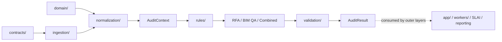
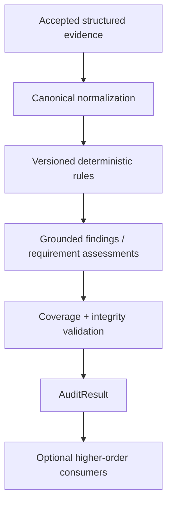
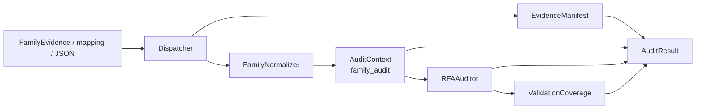
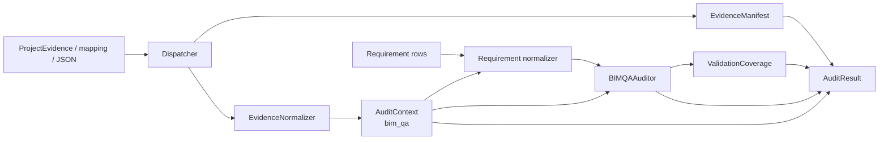
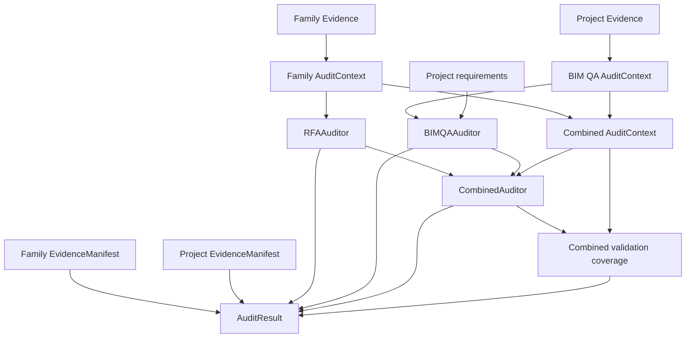
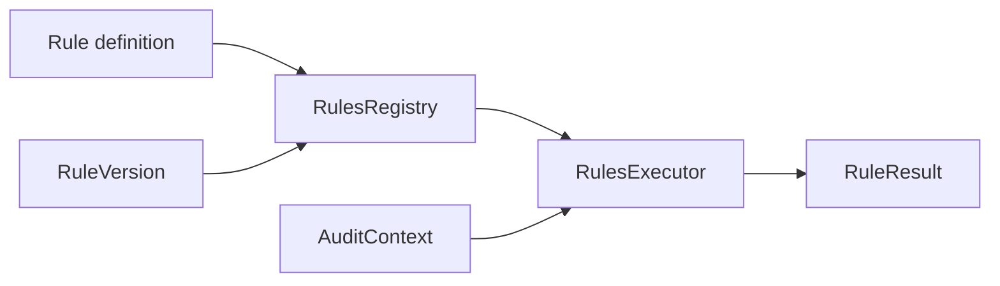
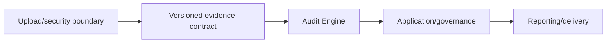

# BIMAP Audit Engine

> **Package:** `bimap.audit_engine`  
> **Architectural role:** deterministic BIM evidence ingestion, normalization, rule execution, requirement assessment validation, finding grounding, cross-scope correlation, and audit-result composition  
> **Runtime position:** Level 4 of the BIMAP dependency hierarchy

---

## 1. Purpose

The Audit Engine is BIMAP's deterministic analytical core. It converts already accepted, structured BIM evidence packages into reproducible audit results while preserving evidence identity, provenance, rule-version identity, requirement state, finding grounding, and validation coverage.

The package answers four questions:

1. **What evidence was accepted for analysis?**
2. **What deterministic checks were executed against that evidence?**
3. **What findings or requirement assessments are grounded by the available evidence?**
4. **How complete is the analytical coverage without converting incompleteness into a false quality score?**

The Audit Engine does **not** own payment, upload security, object storage, application workflows, SLAI orchestration, governance/release decisions, customer-facing report rendering, or delivery packaging.



The dependency direction is inward. Audit-engine modules may depend on stable contracts and domain concepts. They do not import concrete SLAI, reporting, API, worker, persistence, payment, or storage implementations.

---

## 2. Architectural principles

### 2.1 Deterministic analysis before higher-order interpretation

Deterministic evidence ingestion, normalization, rules, requirement validation, evidence grounding, and coverage calculation occur before any optional higher-order interpretation. The Audit Engine therefore remains independently testable and reproducible without SLAI.



### 2.2 Evidence is authoritative

Rules and findings operate on canonical `EvidenceItem` values. Evidence identity and provenance are preserved throughout the pipeline. The engine does not silently replace unknown or missing information with inferred certainty.

### 2.3 Unknown is not failure by default

An accepted evidence package may be structurally valid yet analytically insufficient for a particular check. The engine distinguishes:

- invalid input structure;
- inconsistent provenance;
- missing evidence references;
- unsupported input type;
- valid evidence that is insufficient to resolve a rule or requirement.

Insufficient evidence remains an analytical state to be handled by rule, requirement, or coverage logic. It is not automatically converted into an ingestion error.

### 2.4 One owner per concept

| Concept | Authoritative owner |
|---|---|
| External/versioned evidence shape | `contracts/evidence.py` |
| Family Evidence package shape | `contracts/family_evidence.py` |
| Project Evidence package shape | `contracts/project_evidence.py` |
| Requirement interchange semantics | `contracts/requirement.py` |
| Finding interchange semantics | `contracts/finding.py` |
| Canonical internal evidence | `domain/evidence/` |
| Product identity | `domain/products/models.py` |
| Analytical ingestion manifest | `audit_engine/ingestion/manifest.py` |
| Normalized audit working set | `audit_engine/context.py` |
| Rule contract/execution | `audit_engine/rules/` |
| BIM QA Requirement-Evidence Matrix | `audit_engine/bim_qa/requirement_matrix.py` |
| Cross-scope evidence graph | `audit_engine/combined/evidence_graph.py` |
| Cross-cutting evidence/finding coverage | `audit_engine/validation/` |
| Complete engine-run composition | `audit_engine/result.py` |
| Customer-facing artifacts | `reporting/` |
| SLAI integration/policy | `slai/` |

The engine composes these owners; it does not duplicate their schemas.

### 2.5 No hidden product policy

`AuditEngine` does not create an empty `RulesRegistry`, choose rule versions, invent finding mappers, select a Combined Audit algorithm version, or enable correlation policy implicitly. Product-specific auditors are injected explicitly so that their rule registries, versions, mappers, and correlators remain controlled by the composition/application layer.

---

## 3. Package structure

```text
audit_engine/
├── __init__.py
├── README.md
├── context.py
├── engine.py
├── result.py
│
├── ingestion/
│   ├── __init__.py
│   ├── dispatcher.py
│   ├── manifest.py
│   └── project_evidence.py
│
├── normalization/
│   ├── __init__.py
│   ├── evidence_normalizer.py
│   ├── family_normalizer.py
│   └── schema_export.py
│
├── rules/
│   ├── __init__.py
│   ├── base.py
│   ├── executor.py
│   ├── registry.py
│   └── versions.py
│
├── rfa/
│   ├── __init__.py
│   └── auditor.py
│
├── bim_qa/
│   ├── __init__.py
│   ├── auditor.py
│   └── requirement_matrix.py
│
├── combined/
│   ├── __init__.py
│   ├── auditor.py
│   ├── evidence_graph.py
│   └── versions.py
│
├── validation/
│   ├── __init__.py
│   ├── coverage.py
│   ├── evidence.py
│   └── findings.py
│
└── utils/
    ├── __init__.py
    ├── engine_errors.py
    └── engine_helpers.py
```

---

## 4. Module responsibilities

| Module | Responsibility | Must not do |
|---|---|---|
| `context.py` | Hold immutable normalized evidence, semantic evidence groups, project identity, family references, and bounded JSON metadata | Open files, execute rules, call SLAI, render reports |
| `engine.py` | Coordinate ingestion → normalization → product audit → validation → final result | Invent rule policy, merge external schemas, perform persistence/reporting |
| `result.py` | Bind exact context, ingestion manifests, product-stage outputs, and coverage into one cross-stage-validated result | Recalculate findings or create a second report schema |
| `ingestion/dispatcher.py` | Route Family/Project Evidence by canonical type/structure | Infer from filenames/extensions or perform upload security |
| `ingestion/manifest.py` | Derive analytical source/evidence provenance inventory | Verify raw uploaded file bytes or malware status |
| `ingestion/project_evidence.py` | Parse/import Project Evidence into its authoritative contract | Normalize into a second project schema |
| `normalization/evidence_normalizer.py` | Convert accepted evidence contracts to canonical `EvidenceItem` values | Create findings or rule outcomes |
| `normalization/family_normalizer.py` | Normalize Family Evidence and preserve section-to-evidence grouping | Execute family rules |
| `normalization/schema_export.py` | Normalize structured requirement rows to `RequirementContract` and verify optional evidence references | Generate external JSON Schema or invent a requirement domain model |
| `rules/base.py` | Define deterministic rule/result semantics | Product orchestration |
| `rules/registry.py` | Register, resolve, freeze, and inspect rules | Select product policy implicitly |
| `rules/executor.py` | Execute selected/versioned rules against `AuditContext` | Generate customer reports |
| `rules/versions.py` | Normalize and represent rule versions | Product-version policy outside rule identity |
| `rfa/auditor.py` | Coordinate Family Audit rule execution and optional finding mapping | Reparse evidence or execute BIM QA |
| `bim_qa/requirement_matrix.py` | Validate/index authoritative requirement assessments and evidence references | Guess assessment status from generic evidence |
| `bim_qa/auditor.py` | Coordinate BIM QA matrix validation, project rules, and optional finding mapping | Fabricate requirement-to-rule mappings |
| `combined/evidence_graph.py` | Build evidence-to-finding cross-scope graph | Rerun source audits |
| `combined/auditor.py` | Correlate completed Family/BIM QA findings under an explicit Combined Audit version | Hide or duplicate source execution |
| `validation/evidence.py` | Validate canonical evidence/reference/source integrity | Infer missing evidence content |
| `validation/findings.py` | Validate finding grounding and optional rule-result alignment | Create findings |
| `validation/coverage.py` | Compute non-scoring evidence/finding/requirement coverage | Convert coverage into a BIM quality score |
| `utils/engine_errors.py` | Stable audit-engine exception surface | Log exception construction side effects |
| `utils/engine_helpers.py` | Shared deterministic validation, JSON-safe conversion, method-start logging/printing | Own business/rule policy |

---

## 5. Canonical data flow

### 5.1 Family Audit



The Family Audit path preserves canonical family section groups while storing only evidence IDs in the group index. The underlying evidence objects occur once in `AuditContext.evidence_items`.

### 5.2 BIM QA



Project evidence section groups are derived from the authoritative `ProjectEvidence` dataclass fields rather than copying its private section-name tuple into the engine. Every requirement evidence reference is checked against the normalized project context before BIM QA rule execution.

### 5.3 Combined Audit



The source audits execute once. `CombinedAuditor` receives completed source findings and performs only cross-scope composition/correlation.

---

## 6. `AuditContext`

`AuditContext` is the canonical working set for deterministic engine logic. It contains:

- `product_code`;
- canonical `EvidenceItem` values;
- semantic evidence groups represented as evidence-ID tuples;
- optional `project_id`;
- optional `family_evidence_refs` carried from Project Evidence;
- extractor-specific `source_manifest` metadata when one package directly owns the context;
- JSON-safe caller metadata.

### 6.1 Context invariants

Context construction enforces:

- only canonical `EvidenceItem` instances;
- globally unique `evidence_id` values;
- one `source_file_id` → one `(hash_algorithm, source_hash, source_type)` identity;
- every evidence-group reference resolves to the context;
- normalized `ProductCode` identity;
- normalized non-empty project/family-reference identifiers;
- JSON-safe manifest/metadata mappings.

### 6.2 Grouping without duplication

```text
AuditContext
├── evidence_items
│   ├── EV-001
│   ├── EV-002
│   └── EV-003
└── evidence_groups
    ├── parameters -> [EV-001, EV-002]
    └── materials  -> [EV-003]
```

Groups never contain duplicate copies of `EvidenceItem`. They are indexes over the canonical evidence collection.

### 6.3 Combined-context manifest rule

Family and Project Evidence each allow extractor-specific `source_manifest` mappings whose internal fields are intentionally not standardized. Combined Audit therefore does not flatten those two mappings into a fabricated shared schema. The combined `AuditContext.source_manifest` remains empty, while the exact package-level analytical manifests are preserved separately in `AuditResult.ingestion_manifests` and canonical provenance remains attached to each `EvidenceItem`.

---

## 7. Ingestion boundary

### 7.1 Dispatcher

`Dispatcher` accepts:

- a canonical Family Evidence contract;
- a canonical Project Evidence contract;
- a string-keyed mapping;
- serialized JSON as `str`, `bytes`, or `bytearray`.

It validates a caller-supplied declared type and rejects contradictions. For untyped structured input, the only current structural discriminator is the required top-level `project_id` of Project Evidence. The dispatcher does not inspect filenames, file extensions, paths, MIME types, or free-text hints.

### 7.2 Analytical manifest

`Manifest.validate()` derives:

- ingestion kind;
- package schema version;
- accepted evidence IDs;
- stable source identities;
- source hash algorithms/hashes/types;
- source-to-evidence membership;
- preserved extractor-specific `source_manifest` metadata.

This manifest validates analytical provenance consistency. Raw-byte security and trust checks remain outside the Audit Engine.

### 7.3 Accepted format is not analytical sufficiency

A structurally valid package with zero evidence is not rejected merely because it cannot resolve a later rule. Sufficiency is evaluated where the relevant rule/requirement semantics are known.

---

## 8. Normalization

### 8.1 Evidence normalization

`EvidenceNormalizer` converts accepted `EvidenceContract` values to canonical domain `EvidenceItem` values and enforces collection-level identity/provenance consistency.

### 8.2 Family normalization

`FamilyNormalizer` preserves the authoritative family section structure while converting all contained evidence once. Its `NormalizedFamilyEvidence` can construct a Family Audit `AuditContext` without introducing another external schema.

### 8.3 Project normalization inside top-level orchestration

The current repository has no separate `project_normalizer.py`. The top-level engine therefore does not fabricate one. It uses the existing `EvidenceNormalizer` over `ProjectEvidence.all_evidence()` and derives evidence groups from the authoritative Project Evidence dataclass structure. This keeps project conversion thin and avoids a parallel DTO/domain model.

### 8.4 Requirement normalization

`normalization/schema_export.py` retains its existing class name for compatibility, but its Audit Engine responsibility is structured requirement-row normalization. It converts accepted requirement mappings/JSON/contracts into `RequirementContract`, enforces stable requirement identity, and can verify `evidence_refs` against the current project evidence universe.

External JSON Schema generation remains exclusively owned by `contracts/schema_export.py`.

---

## 9. Rules and versioning

Deterministic rules are separated into four concerns:



The registry owns available rule identity/version resolution. The executor owns execution. Product auditors own which executor belongs to their product. The top-level `AuditEngine` only forwards optional `rule_ids` and explicit version selections.

A rule result is not automatically a customer finding. Finding creation requires the product's explicit mapper/policy, which prevents generic deterministic outcomes from being turned into unsupported customer claims.

---

## 10. Product coordinators

### 10.1 RFA / Family Audit

`RFAAuditor` requires a Family Audit `AuditContext`. It executes the configured rules and, when a finding mapper is configured, converts applicable deterministic results into `FindingContract` values. Without a mapper, it returns no fabricated findings.

### 10.2 BIM QA

`BIMQAAuditor` requires:

- BIM QA product scope;
- a non-empty project identity;
- authoritative `RequirementContract` rows;
- a configured deterministic rule executor.

The Requirement-Evidence Matrix validates requirement identities and evidence references before rule execution. Requirement state is never guessed from arbitrary rule output.

### 10.3 Combined Audit

`CombinedAuditor` consumes completed Family and BIM QA findings. It builds a cross-scope evidence graph and may use an explicitly configured correlator. If no correlator is configured, no cross-scope findings are invented.

Combined Audit also carries an explicit algorithm version through its own `combined/versions.py` model.

---

## 11. Requirement-Evidence Matrix

The matrix is a deterministic index over authoritative requirement assessments. Its core invariants include:

- unique `requirement_id` values;
- every `evidence_ref` resolves to the BIM QA context;
- explicit assessment states are preserved;
- `unknown` and `not_applicable` remain distinct;
- coverage is a completeness measure rather than a quality score.

The matrix computes counts such as applicable, resolved, unknown, not-applicable, referenced requirements, referenced evidence, and evidence-link count. `assessment_coverage` is `None` when no applicable denominator exists.

---

## 12. Validation and coverage

Validation occurs after product execution and does not recreate product semantics.

### 12.1 Evidence validation

`EvidenceValidation` checks canonical evidence identity, grouping, source indexes, and optional source-byte integrity where trusted bytes are explicitly supplied by an outer layer.

### 12.2 Finding validation

`FindingsValidation` ensures findings reference evidence present in `AuditContext`. When compatible `RuleResult` values are supplied, it can additionally verify deterministic finding/rule alignment.

### 12.3 Coverage

`ValidationCoverage` combines evidence, finding, and requirement reference coverage into a non-scoring result.

```text
coverage ≠ model quality
coverage ≠ BIM quality
coverage ≠ compliance score
```

Coverage describes how much of the accepted analytical space is represented/resolved. It must not be presented as an opaque product score.

### 12.4 Combined rule-result alignment

Family and BIM QA source auditors validate their own deterministic results. Combined cross-scope findings originate from the Combined correlator rather than one generic `RulesExecutor`. The top-level engine therefore does not fabricate a merged cross-product rule index for combined coverage, especially because family/project registries may legally contain the same rule identifier in different product contexts.

---

## 13. Top-level `AuditEngine`

`AuditEngine` exposes three product operations:

```python
family_result = engine.audit_family(...)
project_result = engine.audit_bim_qa(...)
combined_result = engine.audit_combined(...)
```

### 13.1 Dependency injection

The engine creates only policy-neutral infrastructure helpers by default:

- `Dispatcher`;
- `EvidenceNormalizer`;
- `FamilyNormalizer`;
- structured requirement normalizer;
- `ValidationCoverage`.

The following product-policy components remain explicit/injected:

- `RFAAuditor`;
- `BIMQAAuditor`;
- `CombinedAuditor`.

If a requested product auditor is absent, the engine raises `EngineConfigurationError` before ingesting customer evidence.

### 13.2 Cross-stage integrity checks

The engine verifies that ingestion and normalization preserve the exact accepted evidence identity/order and source count. `AuditResult` then performs a second composition-level check across manifests, context, product stages, requirements, findings, and coverage.

These checks are intentionally cross-stage. They do not duplicate contract-level field validation.

---

## 14. `AuditResult`

`AuditResult` is the immutable composite output of one complete top-level engine run.

It contains:

- the normalized product code;
- the exact `AuditContext` used for final validation/correlation;
- one or two analytical `EvidenceManifest` values;
- the `CoverageResult`;
- the applicable product stage result(s).

### 14.1 Stage matrix

| Product | Family stage | BIM QA stage | Combined stage | Ingestion manifests |
|---|---:|---:|---:|---:|
| Family Audit | required | absent | absent | Family Evidence |
| BIM QA | absent | required | absent | Project Evidence |
| Combined Audit | required | required | required | Family + Project Evidence |

### 14.2 Composition invariants

`AuditResult` validates:

- result product code equals context product code;
- ingestion manifest kind/order matches product scope;
- manifest evidence IDs exactly equal the final context evidence IDs;
- combined package evidence IDs do not collide;
- coverage evidence/source counts equal the final context;
- coverage findings equal the final product findings;
- BIM QA/Combined coverage requirements equal the evaluated Requirement-Evidence Matrix;
- Combined source findings exactly equal the findings produced by the retained source-audit stages;
- project identity is consistent across BIM QA, Combined Audit, and the final context.

### 14.3 Serialization boundary

`AuditResult.to_dict()` provides a JSON-safe analytical representation for internal consumers. It is not the customer-facing report contract. The reporting layer remains responsible for selecting deliverables, constructing report manifests, producing CSV/JSON/PDF artifacts, and packaging delivery bytes.

---

## 15. Error-handling policy

Audit-engine errors use the stable hierarchy in `utils/engine_errors.py`.

Relevant families include:

- `EngineConfigurationError` — missing/invalid engine composition;
- `EngineValidationError` — invalid analytical input/value;
- `EngineIntegrityError` — cross-record or cross-stage consistency failure;
- `EngineSerializationError` — deterministic JSON-safe conversion failure;
- `UnsupportedEngineInputError` — unsupported Python/input shape;
- ingestion-specific error classes;
- manifest-specific integrity/validation errors;
- Project Evidence ingestion errors.

Lower-layer contract/domain failures are translated at the boundary that consumes them. Error construction itself does not emit duplicate logs. The handler that actually owns the failure may call the error's `announce()` method once.

Diagnostic error context is bounded and redacted. Raw customer evidence content, document bodies, extracted values, credentials, file bytes, and sensitive payloads must not be included in exception context.

---

## 16. Logging and PrettyPrinter policy

Audit-engine operations use the shared `announce_engine_action()` helper at method entry.

```python
announce_engine_action(
    printer,
    logger,
    component="audit_engine",
    action="Running complete BIM QA audit",
    event="audit_engine_bim_qa_start",
)
```

Operational logging may include stable, content-free information such as:

- product code;
- project identifier;
- component/action name;
- evidence/source counts;
- requirement/finding/rule-result counts;
- rule/algorithm version identity;
- whether an optional policy component is configured.

Operational logs must not contain:

- raw uploaded documents;
- file bytes;
- extracted evidence values;
- requirement source text;
- observed/expected finding values;
- remediation text;
- customer report content;
- credentials, authorization headers, tokens, or signed URLs.

`PrettyPrinter` is an operator-facing status surface, not a replacement for structured logging.

---

## 17. Security and side-effect boundaries

The Audit Engine assumes external file acceptance/security has already occurred. It does not own:

- request-size enforcement;
- extension/MIME/magic-number validation;
- malware scanning;
- archive traversal protection;
- temporary-file lifecycle;
- object-store access control;
- signed URL issuance;
- payment authorization;
- retention/deletion scheduling.

Analytical provenance validation is intentionally separate from infrastructure upload security.



---

## 18. Testing strategy

Audit Engine testing should use synthetic, non-confidential evidence fixtures with deterministic identifiers/hashes.

### 18.1 Context tests

Verify:

- duplicate evidence IDs are rejected;
- conflicting source provenance is rejected;
- dangling group references are rejected;
- group order is deterministic;
- project/family reference normalization;
- JSON-safe metadata conversion.

### 18.2 Ingestion tests

Verify:

- Family/Project typed dispatch;
- mapping/JSON dispatch;
- declared-type mismatch rejection;
- project discriminator behavior;
- source-provenance conflict detection;
- empty evidence package acceptance;
- no filename/path interpretation.

### 18.3 Normalization tests

Verify:

- contract → domain evidence conversion;
- stable evidence order;
- section grouping;
- duplicate/provenance conflict behavior;
- requirement normalization and duplicate IDs;
- dangling requirement evidence-reference rejection.

### 18.4 Rule tests

Verify:

- registry freeze behavior;
- exact version resolution;
- selected rule execution;
- deterministic rule result ordering;
- unknown/insufficient evidence handling;
- rule failures do not silently become successful results.

### 18.5 Product-auditor tests

Verify:

- product-code/context constraints;
- Family Audit finding mapper optionality;
- BIM QA project identity requirement;
- Requirement-Evidence Matrix validation before rule execution;
- no fabricated requirement-to-rule mapping;
- Combined Auditor does not rerun source audits;
- optional correlator does not generate findings when absent.

### 18.6 Coverage tests

Verify:

- evidence/finding/reference counts;
- unknown and not-applicable semantics;
- missing evidence references;
- compatible rule-result alignment;
- empty denominators return `None` where mathematically appropriate;
- coverage is never exposed as a quality score.

### 18.7 Top-level engine tests

Verify:

- missing product auditor fails before ingestion;
- Family/BIM QA/Combined orchestration order;
- ingestion manifest ↔ normalized context alignment;
- Combined evidence-ID/provenance collision rejection;
- evidence-group collision rejection;
- source audits execute exactly once in Combined Audit;
- requirements are normalized once and reused;
- `AuditResult` rejects mismatched stage composition;
- `AuditResult.to_dict()` is JSON-safe.

---

## 19. Integration boundaries

### 19.1 Upstream inputs

Expected upstream producers include:

- structured Revit-family extraction;
- model-checker/BIM QA exports;
- IFC-derived evidence;
- schedules/registers/images represented through the versioned evidence contracts;
- structured requirement exports;
- application/composition configuration that selects rules, versions, mappers, and Combined Audit policy.

The Audit Engine receives accepted structured data, not arbitrary untrusted filesystem paths.

### 19.2 Downstream consumers

Expected downstream consumers include:

- application services/workers;
- governance/review logic;
- SLAI adapter/orchestration;
- reporting builders/serializers;
- persistence through application ports.

The Audit Engine does not import those consumers.

---

## 20. Current implementation constraints

The current implementation intentionally reflects what exists in the repository rather than projecting future functionality into Level 4:

1. **Product auditors require explicit composition.** `AuditEngine` does not construct rule registries/executors or select rule versions by itself.
2. **Finding mappers are optional in current RFA/BIM QA coordinators.** If no mapper is configured, deterministic rule results are preserved without fabricated `FindingContract` output.
3. **Combined correlation is optional and versioned.** No correlator means no invented cross-scope findings.
4. **There is no dedicated project normalizer module.** Project context construction uses the existing `EvidenceNormalizer` plus the authoritative `ProjectEvidence` contract structure.
5. **The requirement domain model remains unstabilized.** The engine uses the current versioned `RequirementContract`; `normalization/schema_export.py` does not fabricate a new domain model.
6. **Combined extractor manifests have no canonical merge schema.** Family and Project analytical manifests remain separate in `AuditResult`.
7. **Coverage is non-scoring.** It measures analytical/reference coverage and does not claim to be a BIM quality/compliance score.
8. **Governance is outside deterministic execution.** Review/release/acceptance decisions are not embedded in `AuditResult`.
9. **Reporting is separate.** Engine serialization is an internal analytical representation; customer artifacts remain a reporting responsibility.
10. **SLAI remains external.** Deterministic engine execution does not depend on SLAI availability.

---

## 21. Example composition

```python
from bimap.audit_engine import AuditEngine
from bimap.audit_engine.bim_qa import BIMQAAuditor
from bimap.audit_engine.combined import CombinedAuditor
from bimap.audit_engine.rfa import RFAAuditor
from bimap.audit_engine.rules import RulesExecutor

family_executor = RulesExecutor(family_registry)
project_executor = RulesExecutor(project_registry)

engine = AuditEngine(
    rfa_auditor=RFAAuditor(
        family_executor,
        finding_mapper=family_finding_mapper,
    ),
    bim_qa_auditor=BIMQAAuditor(
        project_executor,
        finding_mapper=project_finding_mapper,
    ),
    combined_auditor=CombinedAuditor(
        version=combined_version,
        correlator=combined_correlator,
    ),
)
```

Family Audit:

```python
result = engine.audit_family(
    family_evidence_payload,
    rule_ids=selected_family_rule_ids,
)
```

BIM QA:

```python
result = engine.audit_bim_qa(
    project_evidence_payload,
    requirement_rows,
    versions=project_rule_versions,
)
```

Combined Audit:

```python
result = engine.audit_combined(
    family_evidence_payload,
    project_evidence_payload,
    requirement_rows,
    family_rule_ids=selected_family_rule_ids,
    project_versions=project_rule_versions,
)
```

For each source auditor, `rule_ids` and `versions` are mutually exclusive selection modes. Use `rule_ids` for the current registered versions or `versions` for an exact version-pinned replay; do not pass both for the same source audit.

The returned `AuditResult` preserves the exact source-stage results for Combined Audit and the analytical ingestion manifests for all product modes.

---

## 22. Design summary

The Audit Engine follows ten core rules:

1. **Use authoritative contracts and domain evidence; do not recreate them.**
2. **Preserve evidence identity/provenance from ingestion through final result.**
3. **Normalize before deterministic rule execution.**
4. **Keep product policy explicit through injected auditors/rulesets/versions.**
5. **Treat requirement state and unknown evidence explicitly.**
6. **Do not convert coverage into an opaque quality score.**
7. **Run Family/BIM QA source audits once before Combined correlation.**
8. **Fail closed on identity, provenance, group, reference, and cross-stage inconsistencies.**
9. **Keep SLAI, governance, reporting, storage, and delivery outside Level 4.**
10. **Log identifiers/counts and operator status, never raw customer evidence content.**
