# BIMAP Contracts Layer

> **Package:** `bimap.contracts`  
> **Architectural role:** Versioned external interchange boundary for the R3D BIM Audit Platform (BIMAP)  
> **Runtime position:** Above the BIMAP domain model and below ingestion, application services, workers, reporting, API serialization, and SLAI integration

---

## 1. Purpose

The `contracts/` package defines the externally visible, versioned data representations exchanged across BIMAP process and integration boundaries. These contracts make evidence, findings, requirements, orders, audit jobs, and report manifests reproducible without exposing higher-level application objects or binding external integrations directly to BIMAP's internal domain implementation.

The contracts layer exists to answer questions such as:

- Which JSON fields constitute a valid external evidence object?
- How are Family Audit and BIM QA evidence packages represented without duplicating provenance logic?
- Which version identifies each externally visible contract independently?
- How are findings represented with separate severity and confidence dimensions?
- How is the Requirement-Evidence Matrix represented outside the audit engine?
- Which order state and product identifiers can cross service/process boundaries?
- What is the minimal immutable job envelope submitted to the worker/SLAI boundary?
- Which generated artifacts and version records form a delivered report package?
- How are canonical JSON Schemas generated and validated for external consumers?

The contracts package does **not** own HTTP routing, database tables, payment-provider behavior, queue retry policy, deterministic BIM rules, SLAI reasoning, report layout, or source-file parsing. Those responsibilities remain in their corresponding architectural layers.

The design follows BIMAP's evidence-first implementation model: customer-facing and inter-process representations preserve explicit source identity, source hashes, evidence references, versions, uncertainty, and traceability instead of transferring opaque application objects.

---

## 2. Architectural principles

### 2.1 Contracts are an external boundary, not a second domain model

The domain layer owns canonical business meaning and invariants. The contracts layer owns stable external representations and conversion at the boundary where those representations already have a corresponding domain model.

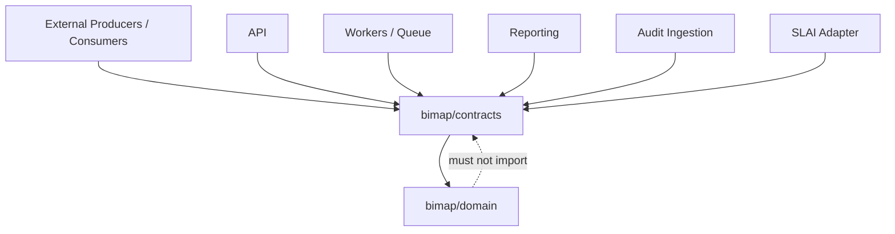

The central dependency rule is:

> **Contracts may translate to/from stable domain models; domain modules must never import contracts.**

This prevents external serialization concerns from leaking into the lowest business layer.

### 2.2 Dependency direction inside `contracts/`

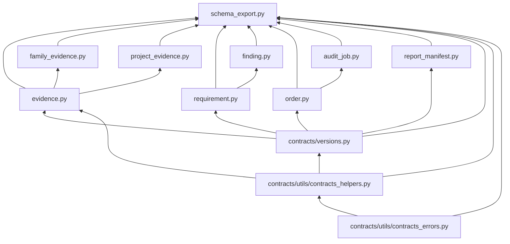

The arrows mean **"is consumed by"**. Lower contract modules must not import `schema_export.py`, and `versions.py` must not import concrete contract DTO modules.

### 2.3 One owner per concept

BIMAP intentionally keeps several concepts in only one authoritative location:

| Concept | Authoritative owner |
|---|---|
| Contract version identity | `contracts/versions.py` |
| Contract error vocabulary | `contracts/utils/contracts_errors.py` |
| Contract serialization/version helpers | `contracts/utils/contracts_helpers.py` |
| Evidence/provenance DTO | `contracts/evidence.py` |
| Family Evidence aggregate | `contracts/family_evidence.py` |
| Project Evidence aggregate | `contracts/project_evidence.py` |
| Assessment and automation vocabularies | `contracts/requirement.py` |
| Finding interchange representation | `contracts/finding.py` |
| Order interchange representation | `contracts/order.py` |
| Audit work envelope | `contracts/audit_job.py` |
| Report-package manifest | `contracts/report_manifest.py` |
| External JSON Schema generation | `contracts/schema_export.py` |

No sibling module should independently recreate these concepts.

---

## 3. Package structure

```text
bimap/contracts/
├── __init__.py
├── README.md
│
├── versions.py
├── evidence.py
├── family_evidence.py
├── project_evidence.py
├── requirement.py
├── finding.py
├── order.py
├── audit_job.py
├── report_manifest.py
├── schema_export.py
│
├── schema/
│   ├── README.md
│   └── generated/                 # generated; created by schema exporter
│       ├── evidence-v1.0.0.schema.json
│       ├── family_evidence-v1.0.0.schema.json
│       ├── project_evidence-v1.0.0.schema.json
│       ├── requirement-v1.0.0.schema.json
│       ├── finding-v1.0.0.schema.json
│       ├── order-v1.0.0.schema.json
│       ├── audit_job-v1.0.0.schema.json
│       └── report_manifest-v1.0.0.schema.json
│
└── utils/
    ├── __init__.py
    ├── contracts_errors.py
    └── contracts_helpers.py
```

The `schema/generated/` directory is an output location rather than a second hand-maintained schema source. The Python contract definitions, authoritative version registry, and `schema_export.py` remain source-controlled authorities; generated schema artifacts should be reproducible from them.

---

## 4. Module responsibilities

| Module | Primary responsibility | Allowed BIMAP dependencies | Must not own |
|---|---|---|---|
| `utils/contracts_errors.py` | Stable contract-layer exception hierarchy and safe diagnostic context | standard library, logging utilities | schema definitions, DTO logic, HTTP mapping |
| `utils/contracts_helpers.py` | Contract-key/version validation, strict field-set checks, deterministic JSON conversion | contract errors, domain helper primitives | contract registry, DTO definitions |
| `versions.py` | Immutable registry of current and explicitly supported external schema versions | contract utilities | DTO imports, ruleset versioning, application versioning |
| `evidence.py` | Shared external evidence and logical-location DTOs | versions, contract utilities, canonical evidence domain types | family/project aggregation |
| `family_evidence.py` | Versioned Family Evidence package divided into canonical family-analysis sections | evidence, versions, utilities | RFA rule execution |
| `project_evidence.py` | Versioned project-scoped evidence package for BIM QA/Combined Audit | evidence, versions, utilities, project evidence domain aggregate | requirement assessment logic |
| `requirement.py` | Requirement-Evidence Matrix row and shared assessment/automation vocabularies | versions, utilities | document parsing, requirement extraction |
| `finding.py` | Complete externally serializable finding representation | requirement vocabularies, severity/confidence domain values, versions, utilities | finding generation or rule execution |
| `order.py` | External order and nested lifecycle-event representation | canonical order/product domain types, versions, utilities | transition authorization, payment behavior |
| `audit_job.py` | Reference-oriented immutable audit work envelope | order contract, product identity, versions, utilities | queue retries, exactly-once transport, SLAI internals |
| `report_manifest.py` | Immutable report-package artifact and reproducibility manifest | versions, utilities | report rendering, storage publication |
| `schema_export.py` | Sole JSON Schema Draft 2020-12 generator/validator/exporter | all external contract definitions, versions, utilities, stable enums | domain/business logic or alternate contract versions |

---

## 5. Contract subsystem data flow

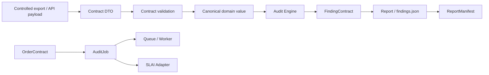

Not every external contract has a domain round-trip today. A conversion is implemented only where the underlying domain representation exists and can preserve the required semantics without fabricating missing fields.

---

## 6. Versioning policy

`versions.py` is the authoritative external-contract version registry.

Each contract is versioned independently:

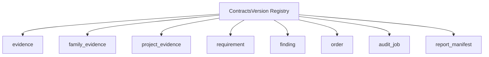

A change to one contract does **not** require unrelated contract versions to change. For example, a compatible or breaking modification to `finding` must not automatically bump `order` merely because both are released in the same BIMAP application version.

### 6.1 Version syntax

External contract versions use the numeric form:

```text
MAJOR.MINOR.PATCH
```

The registry explicitly records supported versions. BIMAP does **not** infer support solely because two versions share a major number.

### 6.2 Version concerns that remain separate

The following are deliberately not external contract versions:

- BIMAP application/release version (`bimap/version.py`);
- deterministic audit ruleset versions;
- Combined Audit evidence-graph/correlation versions;
- report-template versions;
- Revit exporter versions;
- SLAI versions.

Those values may be recorded in a `ReportManifest`, but they are not aliases for schema versions.

---

## 7. Evidence contract

`evidence.py` is the shared evidence boundary used by both family- and project-level evidence aggregates.

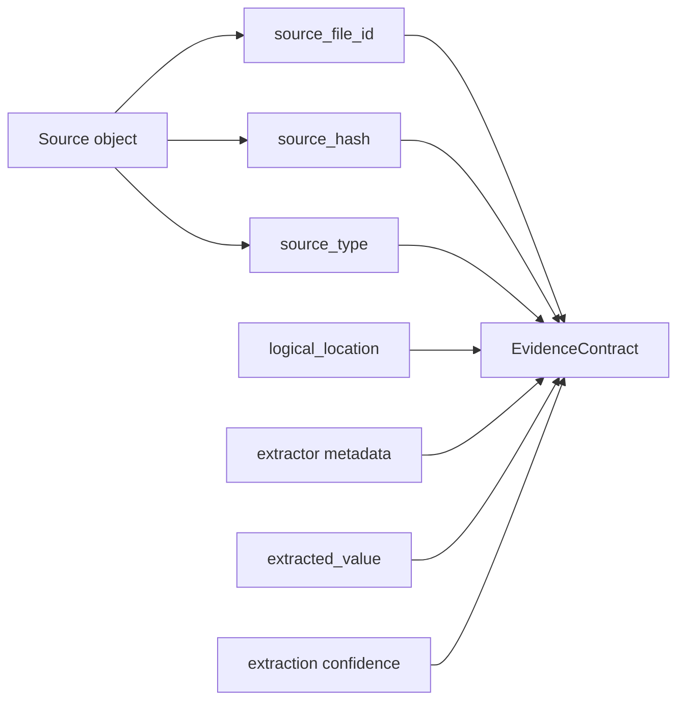

The contract preserves the evidence fields required for traceability, including stable evidence identity, source identity/hash/type, logical source location, extraction metadata, extracted value, and extraction confidence where applicable.

### 7.1 Evidence identity versus filename

`source_file_id` is the stable source identifier. Original filenames are descriptive metadata and must not become authoritative identity because customer-controlled filenames are neither unique nor stable.

### 7.2 Evidence values

`extracted_value` is deliberately represented as deterministic JSON-compatible data. Contract helpers reuse the domain serialization primitives rather than maintaining a second incompatible JSON-value conversion policy.

### 7.3 Hash validation

The runtime contract/domain model validates the relationship between the declared hash algorithm and digest. JSON Schema can validate structural characteristics, but algorithm-dependent digest-length validation remains a runtime invariant where necessary.

---

## 8. Family Evidence contract

`family_evidence.py` represents the stable package consumed by Family Audit ingestion/normalization.

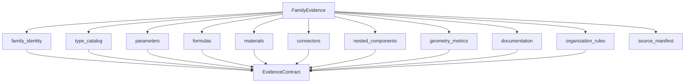

Every analyzable section reuses `EvidenceContract`; the aggregate does not redefine source hashes, provenance, logical locations, extractor metadata, or confidence.

The package-level source manifest remains deterministic JSON because the implementation roadmap supports multiple extraction mechanisms. Extractor-specific details should not force BIMAP to create parallel evidence models.

---

## 9. Project Evidence contract

`project_evidence.py` represents project-level evidence consumed by BIM QA and Combined Audit.

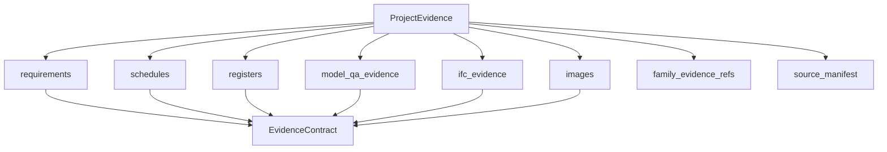

The external aggregate retains evidence-section meaning needed at the interchange boundary. Conversion to the current flat canonical `domain.evidence.ProjectEvidence` is one-way where section information would otherwise be lost; a reverse conversion must not invent a section assignment that the domain aggregate does not contain.

---

## 10. Requirement and finding contracts

### 10.1 Shared assessment vocabulary

`requirement.py` owns the external values shared by requirement and finding contracts:

```text
AutomationType
├── deterministic
├── inferred
└── manual-review-required

AssessmentStatus
├── pass
├── warn
├── fail
├── unknown
└── not_applicable
```

`finding.py` imports these types instead of creating duplicate enums.

### 10.2 Requirement-Evidence Matrix

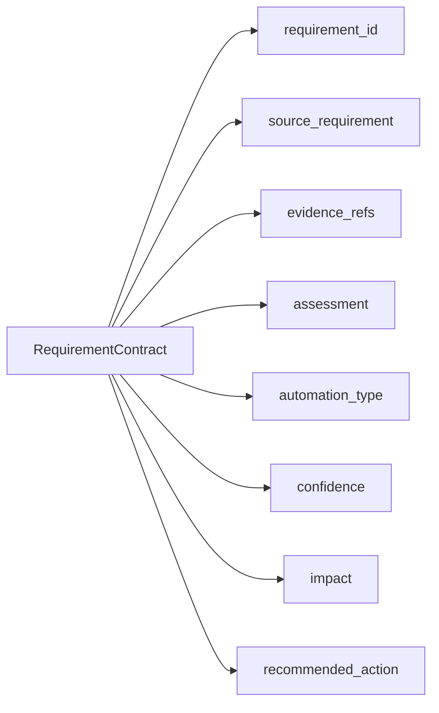

A `pass`, `warn`, or `fail` assessment requires evidence references in the runtime contract. `unknown` remains semantically distinct from `fail`; missing evidence must not automatically be converted into a failure unless a requirement explicitly makes evidence presence the evaluated condition.

### 10.3 Finding representation

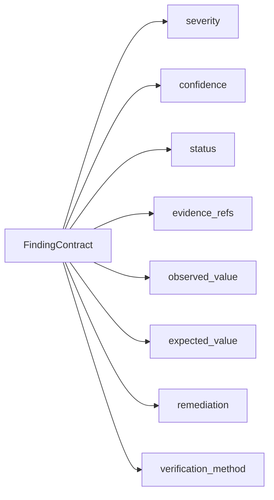

Severity and confidence remain independent:

- **severity** = potential impact if the finding is valid;
- **confidence** = certainty that the finding is correctly detected.

The contract must never derive one dimension from the other.

A deterministic finding requires supporting evidence references. Higher-order inferred or manual-review-required outputs remain explicitly labelled rather than being presented as deterministic facts.

---

## 11. Order contract

`order.py` serializes the canonical order aggregate and append-only lifecycle events. It does **not** duplicate transition legality.

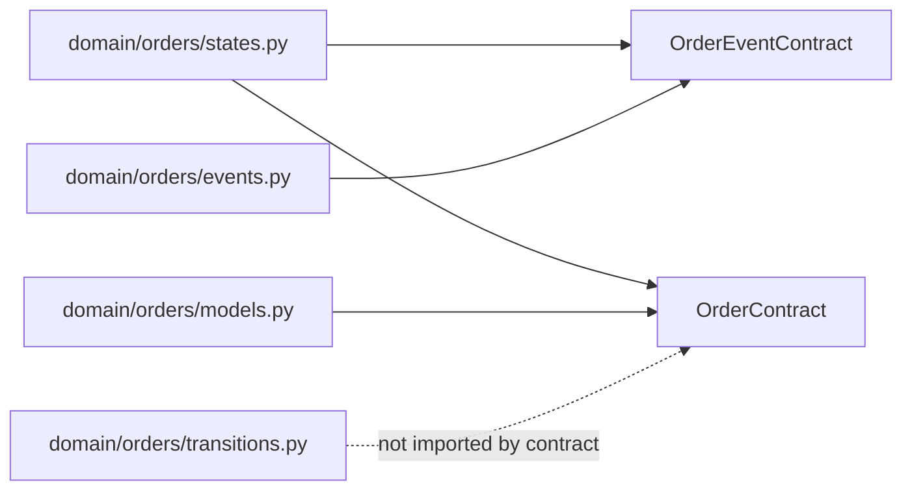

`domain/orders/transitions.py` remains the sole structural transition authority. Whether a transition is commercially authorized remains an application-layer concern.

### 11.1 Event identity and idempotency

The nested event contract preserves `event_id` and `idempotency_key`. This provides transport/persistence data needed for idempotent workflows, but a Python DTO cannot guarantee distributed exactly-once processing by itself. Persistence/queue infrastructure must enforce the corresponding atomic uniqueness guarantees.

---

## 12. Audit Job contract

`audit_job.py` defines the reference-oriented work unit passed to asynchronous processing and the SLAI integration boundary.

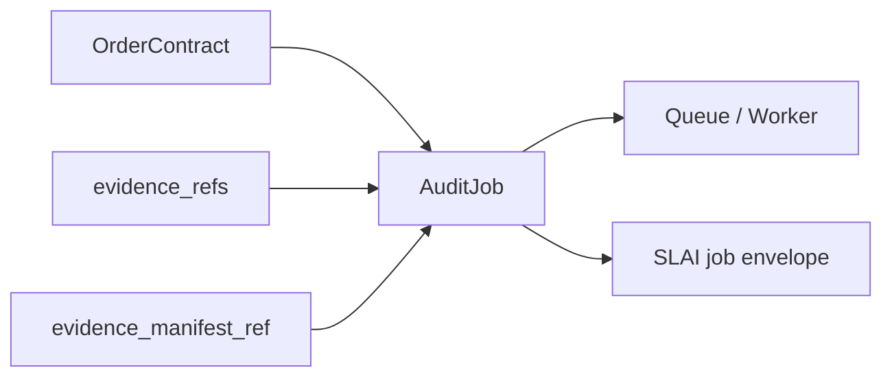

The job envelope intentionally contains references instead of raw customer files or a complete application object graph. It records the order revision observed when the job was created so stale/replayed work can be detected by higher layers.

Exactly-once submission, retry policy, cancellation, and queue persistence do not belong to the contract itself.

---

## 13. Report Manifest contract

`report_manifest.py` records the immutable artifact set and reproducibility metadata for a report package.

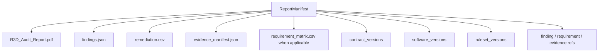

The manifest stores artifact identity, filename, SHA-256 digest, and size without duplicating the contents of the artifact itself. Product-specific policy determines which deliverables are mandatory for a particular order.

---

## 14. JSON Schema export

`schema_export.py` is the **only** active JSON Schema generator in BIMAP.

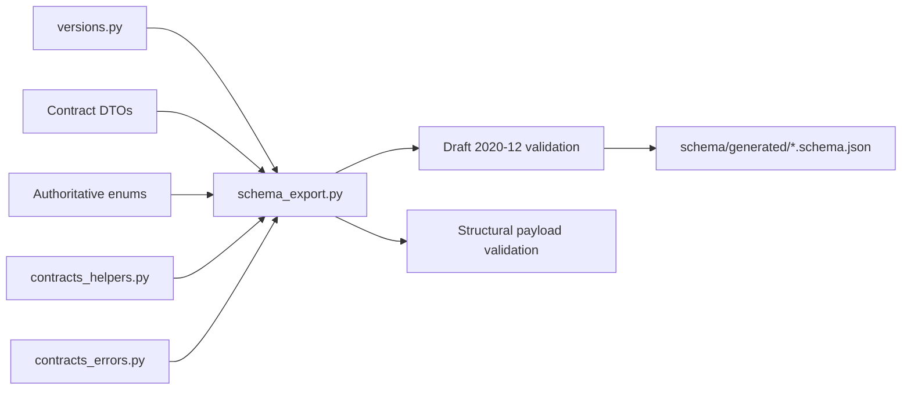

### 14.1 Schema dialect

Generated schemas use **JSON Schema Draft 2020-12**.

The exporter deliberately does not invent a public HTTP schema namespace. Generated documents are standalone files and use local `$defs` references for nested definitions.

### 14.2 Schema versus runtime validation

JSON Schema and Python runtime validation cooperate rather than replace each other.

| Constraint | JSON Schema | Contract/domain runtime |
|---|---:|---:|
| required fields | ✓ | ✓ |
| field primitive types | ✓ | ✓ |
| enum vocabulary | ✓ | ✓ |
| probability range `[0,1]` | ✓ | ✓ |
| timestamp string format | ✓ | ✓ |
| closed/unknown fields | ✓ | ✓ |
| deterministic finding requires evidence | ✓ | ✓ |
| pass/warn/fail requirement requires evidence | ✓ | ✓ |
| audit job must reference evidence/manifest | ✓ | ✓ |
| source hash length vs selected algorithm | partial | ✓ |
| duplicate evidence IDs across aggregate sections | not reliably expressible | ✓ |
| artifact ID/filename uniqueness across objects | not reliably expressible | ✓ |
| order-event/order aggregate consistency | not duplicated | ✓ |
| legal order-state transitions | no | domain transition authority |

This is intentional. JSON Schema describes the external structure; Python/domain validation remains authoritative for invariants that depend on relationships or application semantics.

### 14.3 Deterministic schema artifacts

The exporter provides:

- schema generation for one contract;
- generation of all current contract schemas;
- Draft 2020-12 schema-definition validation;
- structural payload validation;
- deterministic schema filenames;
- canonical SHA-256 schema digests;
- an inventory of schema versions/files/digests;
- atomic UTF-8 export;
- overwrite protection unless explicitly requested.

Default generated filenames follow:

```text
<contract>-v<schema_version>.schema.json
```

For example:

```text
finding-v1.0.0.schema.json
```

### 14.4 Generated files are not a second source of truth

Do not manually maintain divergent JSON Schema copies. If a contract changes:

1. update the appropriate contract DTO and runtime validation;
2. update the contract version when the external representation requires it;
3. update `schema_export.py` to reflect the external structural change;
4. regenerate schemas;
5. run schema/contract regression tests;
6. review the generated diff before release.

---

## 15. Contract helpers

`utils/contracts_helpers.py` centralizes operations that would otherwise be repeated across DTOs:

- canonical contract-key validation;
- `MAJOR.MINOR.PATCH` schema-version parsing;
- exact supported-version checks;
- strict required/optional field-set validation;
- payload schema-version checks;
- deterministic JSON primitive conversion;
- canonical compact/pretty JSON serialization;
- canonical UTF-8 JSON bytes;
- safe JSON deserialization.

Generic timestamp handling, hashing, immutable JSON-domain values, and related primitives remain implemented in `domain/utils/domain_helpers.py` and are reused rather than copied into contracts.

---

## 16. Error-handling policy

Contract failures use the structured hierarchy in `utils/contracts_errors.py`.

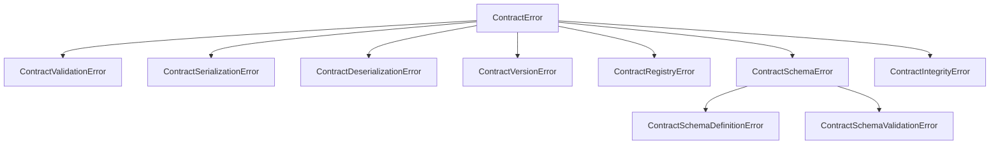

Higher architectural layers should map errors by exception class or stable machine-readable `code`, not by parsing exception messages.

### 16.1 Logging-safe context

Contract errors deliberately bound and redact diagnostic context. Raw customer evidence, authorization values, tokens, secrets, and complete payload contents must not be copied into exceptions or logs.

### 16.2 Log once at the handling boundary

Constructing an exception should not automatically emit repeated error logs. The layer that decides to handle, translate, retry, return, or terminate the operation should perform the principal operational error log.

---

## 17. Logging and PrettyPrinter policy

Contract modules use SLAI's shared `get_logger` and `PrettyPrinter` facilities.

Recommended method-start pattern:

```python
logger = get_logger("BIMAP Contracts <Area>")
printer = PrettyPrinter()


def _announce(action: str) -> None:
    printer.status("CONTRACTS", action, "info")
    logger.debug({"event": "contracts_method_start", "action": action})
```

The method-start diagnostic must remain content-free. Do not print or log:

- extracted customer evidence values;
- requirement text from confidential project documents;
- uploaded file contents;
- authentication/session tokens;
- payment information;
- raw SLAI prompts/results containing customer content.

Stable IDs, contract names, schema versions, counts, and non-sensitive status metadata are preferable diagnostic values.

---

## 18. Circular-import prevention

The contracts subsystem must preserve the following direction:

```text
contracts_errors.py
        ↓
contracts_helpers.py
        ↓
versions.py
        ↓
evidence.py / requirement.py / order.py / report_manifest.py
        ↓
family_evidence.py / project_evidence.py / finding.py / audit_job.py
        ↓
schema_export.py
```

The exact graph has sibling relationships, but the rule remains that lower modules do not import higher aggregators.

### 18.1 Forbidden examples

```text
versions.py              -> finding.py               ❌
evidence.py              -> family_evidence.py       ❌
requirement.py           -> finding.py               ❌
order.py                 -> audit_job.py              ❌
any contract DTO         -> schema_export.py          ❌
domain/*                 -> contracts/*              ❌
contracts_helpers.py     -> versions.py              ❌
contracts_errors.py      -> contracts_helpers.py      ❌
```

### 18.2 Package-root imports

Inside the contracts subsystem, prefer explicit module imports such as:

```python
from .versions import FINDING_SCHEMA_VERSION
from .utils.contracts_errors import ContractValidationError
```

Avoid importing from the package root (`from bimap.contracts import ...`) inside contract modules because `contracts/__init__.py` may aggregate multiple public exports and therefore create avoidable eager-import coupling.

---

## 19. Serialization policy

External contract serialization must be deterministic.

Canonical JSON generation uses:

- UTF-8;
- deterministic key ordering;
- no NaN/Infinity values;
- stable compact representation for hashing;
- an optional pretty representation for human-readable generated artifacts.

A schema digest is calculated from canonical compact JSON bytes, not from pretty-printed file whitespace. Consequently formatting changes alone do not alter the canonical schema fingerprint.

---

## 20. Security and privacy boundary

Contracts are data structures, not security controls. They improve structural integrity but do not replace infrastructure security.

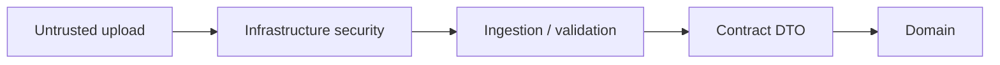

Before customer data reaches contract/domain processing, higher infrastructure layers remain responsible for controls such as:

- authorization and tenant isolation;
- file allowlists/signature checks;
- malware scanning;
- archive limits;
- storage isolation;
- resource limits;
- retention/deletion policy.

Contract error context and logs must avoid retaining raw customer project content by default.

---

## 21. Using the schema exporter

### Generate one schema in memory

```python
from bimap.contracts.schema_export import SchemaExporter

exporter = SchemaExporter()
schema = exporter.schema("finding")
```

### Validate an external payload structurally

```python
exporter.validate_payload("finding", payload)
```

This validates the JSON structure. Constructing `FindingContract` remains the runtime validation step for the complete Python contract semantics.

### Export all current schemas

```python
paths = exporter.export_all(overwrite=True)
```

By default, generated files are written below:

```text
bimap/contracts/schema/generated/
```

### Inspect schema inventory

```python
inventory = exporter.inventory()
```

The inventory contains contract version, deterministic filename, SHA-256 schema digest, and DTO type name. It contains no customer data.

---

## 22. Extending the contracts layer

When adding a new external contract:

1. confirm that a new external representation is actually needed;
2. define its canonical `ContractName` in `versions.py`;
3. declare an independent initial schema version;
4. add structured DTO/runtime validation in a dedicated module;
5. reuse existing evidence, assessment, status, product, and version types instead of recreating them;
6. add only necessary domain conversion methods;
7. add a JSON Schema builder in `schema_export.py`;
8. add the DTO to `CONTRACT_TYPES`;
9. update the README/module responsibility table;
10. add round-trip and negative tests;
11. regenerate schema artifacts and inspect their diff.

A new module should not be added solely to rename or wrap an existing concept.

---

## 23. Changing an existing contract

Before modifying an external field, determine whether the change is compatible with already persisted/transmitted payloads.

At minimum, review:

- field addition/removal;
- required versus optional status;
- enum-value changes;
- type/range changes;
- semantic reinterpretation of an existing field;
- default behavior;
- domain conversion behavior;
- JSON Schema changes;
- generated report compatibility;
- worker/queue compatibility;
- future Revit exporter compatibility.

Do not silently reinterpret an existing version. If the external meaning changes incompatibly, introduce a new schema version and retain explicit support only for versions BIMAP can actually parse and process correctly.

---

## 24. Testing expectations

Each production contract should have tests for:

- valid construction;
- invalid required fields;
- unsupported enum values;
- unsupported schema versions;
- canonical JSON round trip;
- deterministic serialization;
- domain conversion where implemented;
- duplicate identifier/integrity conditions where applicable;
- logging/error paths without customer-data leakage.

`schema_export.py` additionally requires tests for:

- every registered contract has a schema builder;
- every generated schema passes Draft 2020-12 meta-schema validation;
- representative valid payloads pass;
- representative invalid payloads fail;
- conditional evidence requirements behave correctly;
- exported filenames are deterministic;
- schema digests are deterministic;
- atomic export succeeds;
- overwrite protection works;
- no file-system write occurs merely by importing the module.

### 24.1 CI consistency gate

A useful CI gate is:

```text
contract code
    ↓
generate schemas into temporary directory
    ↓
validate every schema
    ↓
compare with committed generated schemas (if committed)
    ↓
fail on unexplained drift
```

This makes external contract changes visible during review.

---

## 25. Current implementation status

The contracts package currently contains substantive implementations for:

- contract error handling and deterministic helper primitives;
- independent external schema-version registration;
- shared evidence and logical-location contracts;
- Family Evidence aggregation;
- Project Evidence aggregation;
- Requirement-Evidence Matrix rows and shared assessment vocabularies;
- external finding representation;
- external order/event representation;
- audit job envelope;
- report artifact/report manifest representation.

`schema_export.py` completes the JSON Schema boundary by generating schemas directly from the currently defined contract vocabulary and authoritative enums without introducing a second schema-version registry.

Some related domain modules remain less mature than the external contract boundary. In particular, domain requirement and coverage models should not be assumed to provide semantics that they have not yet implemented. Contract-to-domain conversion should continue to be added only when the target domain model can preserve the contract meaning without loss or invention.

---

## 26. Relationship to the rest of BIMAP

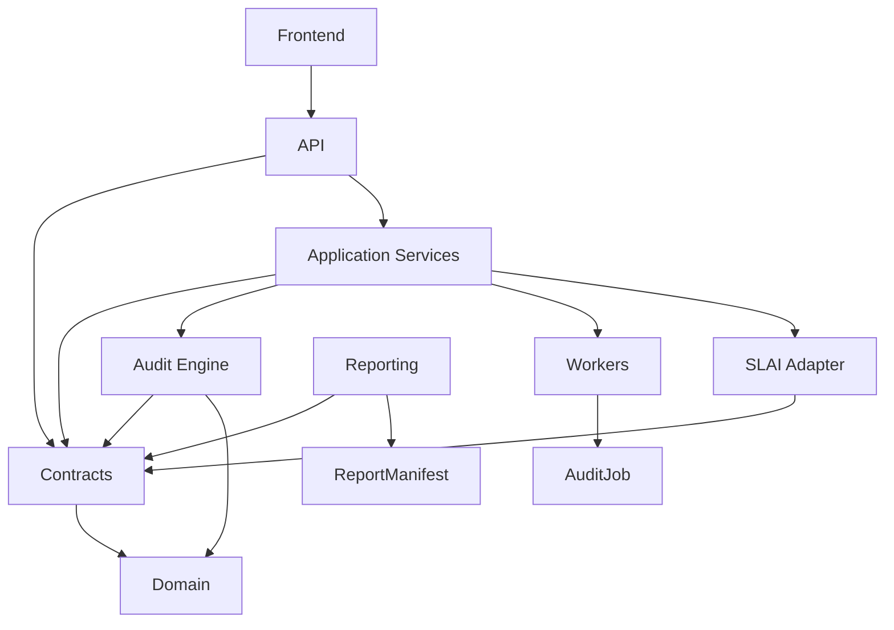

The contracts package is therefore a shared boundary, not an orchestration layer. It stabilizes data exchanged between components while leaving each higher layer responsible for its own behavior.

---

## 27. Maintenance checklist

Before merging a contracts-layer change, verify:

- [ ] The change belongs to the external contract layer rather than domain/application/infrastructure.
- [ ] No existing concept has been duplicated under a new name.
- [ ] Contract version policy remains centralized in `versions.py`.
- [ ] Error handling uses `contracts_errors.py` rather than ad-hoc exceptions where a structured contract error applies.
- [ ] Generic helper logic is reused from `contracts_helpers.py` / domain helpers.
- [ ] Method-start PrettyPrinter output contains no customer evidence.
- [ ] Logs contain identifiers/metadata rather than raw customer content.
- [ ] Lower modules do not import higher contract modules.
- [ ] Domain modules do not import contracts.
- [ ] JSON round trips are deterministic.
- [ ] JSON Schema reflects the external structure.
- [ ] Runtime-only invariants are not falsely claimed to be completely enforced by JSON Schema.
- [ ] New/changed schemas pass Draft 2020-12 validation.
- [ ] Generated schema files were regenerated if relevant.
- [ ] Contract/schema version changes were intentional and documented.
- [ ] Tests cover both successful and failing cases.

---

## 28. Summary

`bimap/contracts/` is BIMAP's stable interchange boundary. Its purpose is not to duplicate the domain or audit engine, but to make externally visible data explicit, versioned, deterministic, traceable, and suitable for APIs, workers, reporting, the SLAI adapter, and future AEC integrations.

The package should remain governed by four rules:

1. **One authoritative owner per external concept.**
2. **Version contracts independently and explicitly.**
3. **Preserve evidence/provenance and uncertainty rather than collapsing them.**
4. **Keep dependencies one-directional: utilities → versions → DTOs → schema export.**

Following those rules keeps BIMAP's external interface auditable and evolvable while reducing circular imports, duplicated validation logic, and accidental semantic drift.
