# BIMAP Domain Layer

> **Package:** `bimap.domain`  
> **Architectural role:** Pure business/domain model for the R3D BIM Audit Platform (BIMAP)  
> **Runtime position:** Below contracts, audit orchestration, application services, API, workers, reporting, persistence, and SLAI integration

---

## 1. Purpose

The `domain/` package defines the stable business concepts and invariants that BIMAP operates on after external input has crossed the ingestion/normalization boundary. It is the lowest BIMAP-specific layer and therefore must remain independent from web frameworks, payment providers, storage SDKs, databases, worker frameworks, report renderers, and the SLAI runtime.

The domain layer exists to answer questions such as:

- What constitutes a BIMAP evidence object and its provenance?
- How is project-scoped evidence aggregated without losing traceability?
- What is a finding, and how are severity and confidence represented independently?
- What are the valid BIMAP order states and structural state transitions?
- What product identities and product-scope concepts exist?
- How are product limits represented without hard-coding unverified commercial thresholds?
- What governance outcomes and human-review records mean inside BIMAP?
- What requirement and coverage concepts should higher layers eventually consume?

The domain layer does **not** decide HTTP status codes, database schemas, payment behavior, queue retries, storage locations, report layout, SLAI agent selection, or external JSON-schema compatibility. Those concerns belong to higher architectural layers.

---

## 2. Architectural principles

BIMAP follows an evidence-first model: source provenance and normalized evidence are established before deterministic checks and higher-order reasoning are performed. The domain package therefore prioritizes stable identifiers, immutable values, explicit state, traceability, and deterministic serialization over convenience-oriented mutable objects.

### 2.1 Dependency direction

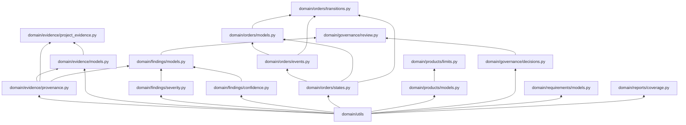

The arrows above mean **"is consumed by"**. A lower-level module must never import a higher-level module merely to reuse convenience logic.

### 2.2 Layer boundary

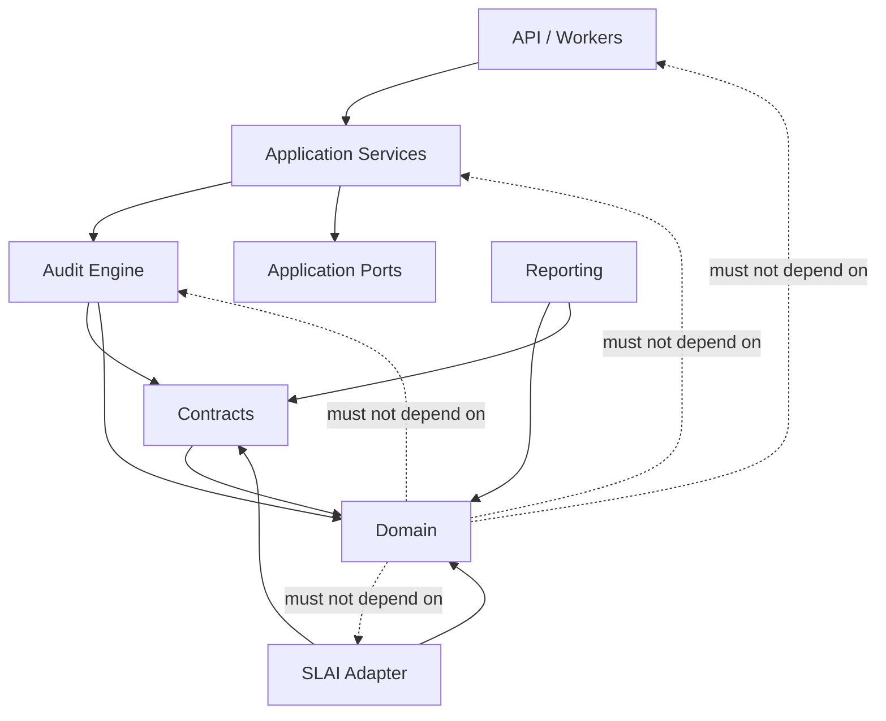

The intended rule is simple:

> **Higher layers consume the domain. The domain does not consume higher layers.**

---

## 3. Package structure

```text
bimap/domain/
├── __init__.py
│
├── evidence/
│   ├── __init__.py
│   ├── provenance.py
│   ├── models.py
│   └── project_evidence.py
│
├── findings/
│   ├── __init__.py
│   ├── severity.py
│   ├── confidence.py
│   ├── models.py
│   └── schema_export.py        # legacy/empty placeholder; do not extend
│
├── governance/
│   ├── __init__.py
│   ├── decisions.py
│   └── review.py
│
├── orders/
│   ├── __init__.py
│   ├── states.py
│   ├── events.py
│   ├── models.py
│   └── transitions.py
│
├── products/
│   ├── __init__.py
│   ├── models.py
│   └── limits.py
│
├── reports/
│   ├── __init__.py
│   └── coverage.py
│
├── requirements/
│   ├── __init__.py
│   └── models.py
│
└── utils/
    ├── __init__.py
    ├── domain_errors.py
    └── domain_helpers.py
```

`findings/schema_export.py` should not become an active domain responsibility. External JSON-schema generation belongs to `bimap/contracts/schema_export.py`, because schemas version the external interchange contract rather than the internal domain model.

---

## 4. Module responsibilities

| Module | Responsibility | Allowed BIMAP dependencies | Must not own |
|---|---|---|---|
| `domain/utils/domain_errors.py` | Stable domain exception hierarchy | Standard library only | HTTP mapping, logging policy, retry policy |
| `domain/utils/domain_helpers.py` | Shared deterministic validation, time, hash, mapping, and immutable JSON-value helpers | `domain_errors.py` | File I/O, persistence, network calls |
| `domain/evidence/provenance.py` | Source identity, integrity, extraction/version metadata, timestamps, traceability | domain utils | Evidence aggregation, ingestion |
| `domain/evidence/models.py` | Canonical normalized evidence units and logical source locations | domain utils, provenance | Project aggregation, parsing |
| `domain/evidence/project_evidence.py` | Immutable project-scoped evidence aggregate and aggregate invariants | domain utils, evidence models, provenance | Ingestion/normalization |
| `domain/findings/severity.py` | Potential impact classification | domain utility primitives only | Confidence policy |
| `domain/findings/confidence.py` | Certainty representation independent from impact | domain utility primitives only | Severity policy |
| `domain/findings/models.py` | Canonical immutable findings and finding aggregation | severity, confidence, provenance, domain utils | Report rendering, SLAI reasoning |
| `domain/orders/states.py` | Authoritative order-state vocabulary | domain utils | Transition legality |
| `domain/orders/events.py` | Append-only domain events associated with order lifecycle changes | states, domain utils | Persistence/event transport |
| `domain/orders/models.py` | Canonical immutable Order aggregate | states, events, domain utils | Transition graph, payment SDKs |
| `domain/orders/transitions.py` | Sole structural authority for valid state-to-state movement | states, events, models, domain utils | Commercial authorization/refund policy |
| `domain/products/models.py` | Product identity, scope, tier/catalog concepts | domain utils | Hard-coded prices or unverified limits |
| `domain/products/limits.py` | Validated product-limit definitions and deterministic evaluation | product models, domain utils | Final commercial thresholds |
| `domain/governance/decisions.py` | Governance outcomes and append-only decision history | domain utils | SLAI-specific implementation details |
| `domain/governance/review.py` | Review state and relationships between findings and governance decisions | findings, governance decisions, domain utils | API/admin workflow |
| `domain/requirements/models.py` | Canonical requirement/source/status model boundary | domain utils | Document parsing, requirement extraction |
| `domain/reports/coverage.py` | Domain representation of evidence/requirement coverage results | domain utils | Coverage computation or report rendering |

---

## 5. Evidence model

BIMAP treats traceability as a domain invariant rather than report decoration. Evidence is therefore separated into provenance, normalized evidence items, and project aggregation.

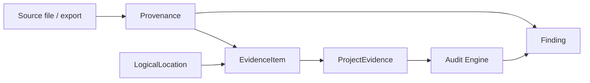

### 5.1 `evidence/provenance.py`

`provenance.py` owns source identity and source-integrity semantics. An original filename is descriptive metadata, not authoritative identity; stable internal IDs and content hashes provide the stronger traceability mechanism.

The module should remain below `models.py` and `project_evidence.py` so provenance can be reused without importing complete evidence aggregates.

### 5.2 `evidence/models.py`

`models.py` owns the smallest canonical evidence units after ingestion/normalization. Logical locations preserve where evidence came from, using one or more source-specific locators such as page, row, element, or path.

### 5.3 `evidence/project_evidence.py`

`ProjectEvidence` is the project-scoped aggregate. Its current implementation explicitly protects invariants such as unique evidence IDs and consistent source identity/hash/type relationships. It does not parse source files and it does not normalize raw input; those responsibilities remain in `audit_engine/ingestion` and `audit_engine/normalization`.

---

## 6. Finding model

The finding model deliberately separates **severity** from **confidence**.

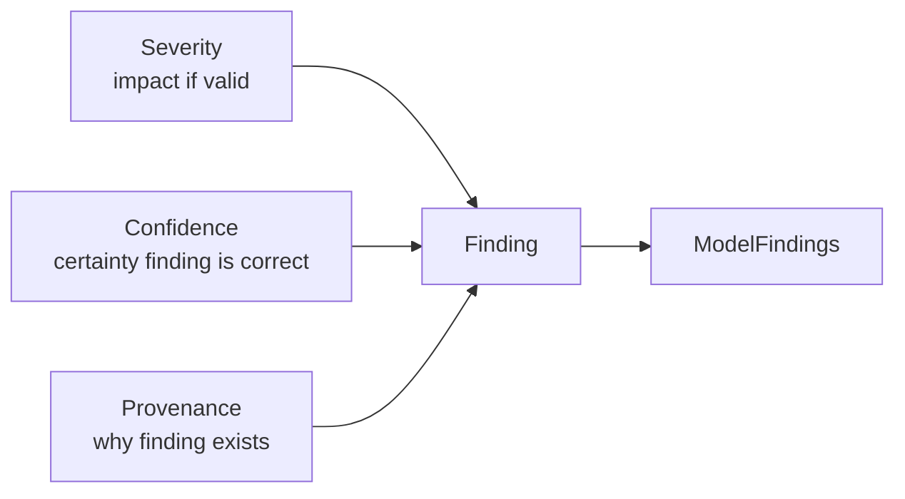

This distinction is fundamental:

- **Severity** answers: *How significant would this issue be if the finding is valid?*
- **Confidence** answers: *How certain is BIMAP that the finding is correct?*

A highly severe finding with weak evidence must not be represented as certain merely because its potential impact is large. Likewise, a completely certain naming deviation should not automatically become critical.

The external customer/report contract is broader than the internal `Finding` value object and belongs in `bimap/contracts/finding.py`. Fields such as versioned `rule_id`, automation type, evidence references, expected/observed values, remediation, and verification method are external audit-contract concerns and should not be duplicated independently across multiple layers.

---

## 7. Order domain

The order domain is explicitly separated into state identity, events, the aggregate, and transition authority.

### 7.1 Dependency chain

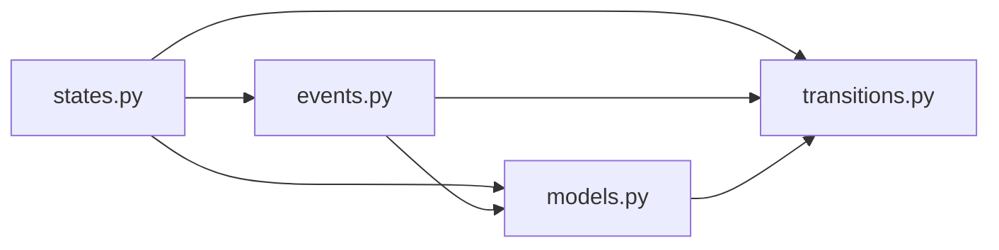

The reverse imports are forbidden. In particular:

```text
models.py       MUST NOT import transitions.py
states.py       MUST NOT import models.py/events.py/transitions.py
events.py       MUST NOT import models.py/transitions.py
```

### 7.2 State machine

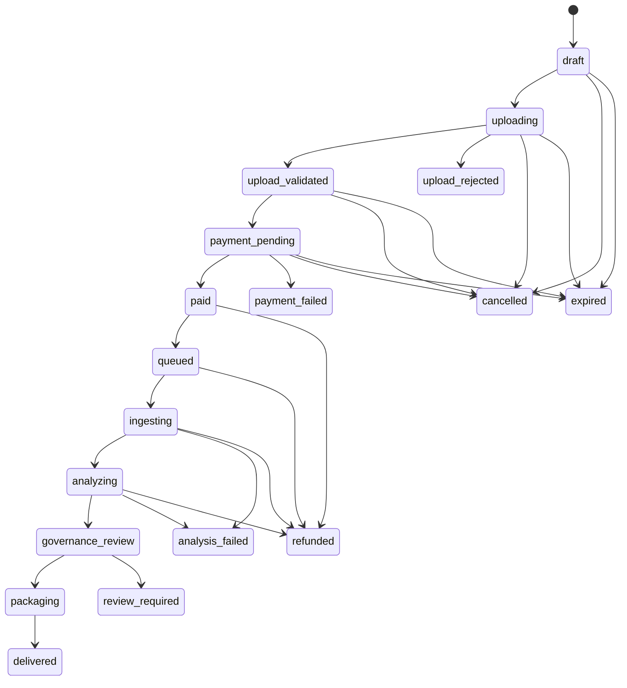

The state graph is structural. Whether a user is *authorized* to cancel, whether a refund is contractually allowed, or whether a payment provider accepted a refund belongs to the application/service layer.

### 7.3 Idempotency and event history

Order transitions should remain timestamped and represented through append-only domain events. Cross-process idempotency still requires persistence-level uniqueness/transactional guarantees; the domain layer can represent an idempotency key but cannot by itself guarantee distributed exactly-once execution.

---

## 8. Product domain

BIMAP exposes three primary product identities:

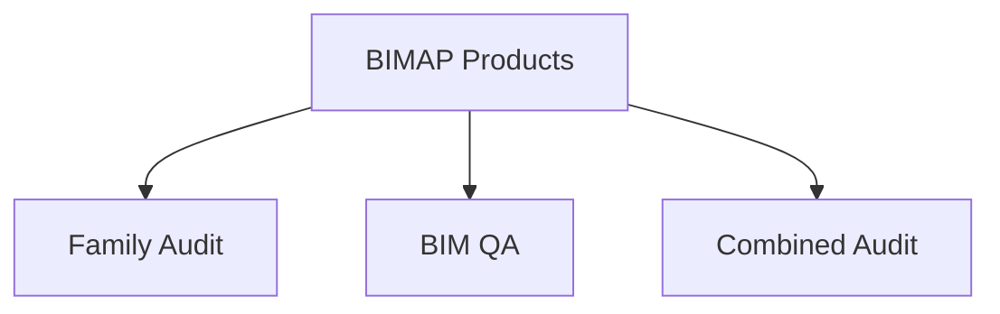

`products/models.py` owns product identity, product scope, tier/catalog concepts, and catalog integrity. `products/limits.py` depends on those identities and represents bounded product constraints.

Final prices, accepted-input quotas, family counts, document counts, and upload-size thresholds must **not** be invented in the domain layer. Those values belong in product configuration once commercially selected and validated. The domain should validate configured values rather than create them.

---

## 9. Governance domain

Governance data is separate from the technical finding itself.

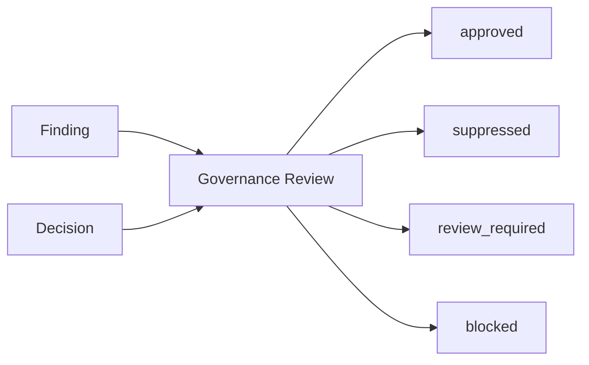

Governance decisions record release policy; they do not rewrite severity, confidence, or source provenance. Decision history should remain append-only so overrides are auditable rather than silently mutating prior conclusions.

The `domain/governance` package contains BIMAP-owned governance semantics. The separate `bimap/slai/governance.py` integration layer may translate SLAI Quality/Privacy/Safety/Evaluation outcomes into these domain types, but the domain must never import SLAI.

---

## 10. Requirements and coverage

### `requirements/models.py`

This module is the intended canonical home for requirement identity, requirement source, assessment state, and related requirement-domain value objects. The current file is still a light scaffold and should be completed before `audit_engine/bim_qa/requirement_matrix.py` begins relying on it heavily.

### `reports/coverage.py`

This module is the intended domain representation of evidence/requirement coverage results. It must remain separate from `audit_engine/validation/coverage.py`:

```text
domain/reports/coverage.py
    = coverage result/value model

audit_engine/validation/coverage.py
    = coverage calculation / validation logic
```

The current file is still a light scaffold and should not yet be treated as a complete customer-facing metric implementation.

---

## 11. Domain utilities

### 11.1 `utils/domain_errors.py`

The domain error hierarchy provides stable machine-readable error codes and contextual diagnostic fields without importing HTTP, persistence, logging policy, or retry policy. Higher layers should map these errors rather than inspect exception-message text.

### 11.2 `utils/domain_helpers.py`

The helper module centralizes deterministic primitives that would otherwise be duplicated across evidence, findings, orders, products, and governance. Its responsibilities include:

- timezone-aware UTC normalization;
- deterministic text validation;
- stable unique text values;
- probability normalization;
- content-hash algorithm and digest validation;
- bytes hashing and digest verification;
- string-keyed mapping validation;
- immutable JSON-compatible domain values;
- reversible conversion of frozen JSON-domain values back to ordinary JSON-ready data.

File loading, object storage, malware scanning, document parsing, and network access do not belong here.

---

## 12. Error-handling policy

Domain errors should describe violations of domain rules rather than transport failures.

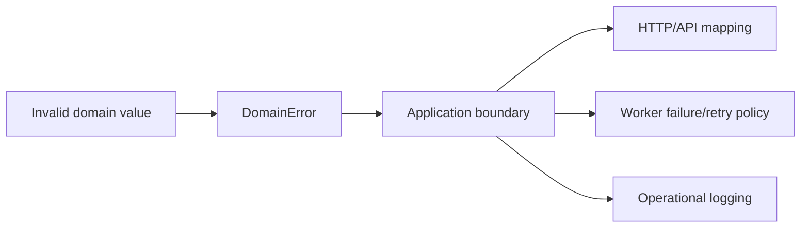

Examples of domain-appropriate failures include:

- invalid domain identifiers;
- invalid confidence values;
- naive or ambiguous timestamps;
- duplicate evidence IDs;
- conflicting source hash/type information;
- invalid order transitions;
- invalid product-limit definitions;
- governance invariant violations.

Examples that **do not** belong in `domain_errors.py` include:

- S3 connection failures;
- Stripe/API errors;
- PostgreSQL exceptions;
- FastAPI request errors;
- Redis worker errors;
- SLAI agent execution errors.

Those failures should be translated at the relevant higher boundary.

---

## 13. Logging and PrettyPrinter policy

The domain implementation currently uses SLAI's `get_logger` and `PrettyPrinter` in several modules. Where method-start status output is retained, it must remain content-free and must not expose customer evidence, source document text, authentication material, or other sensitive payloads.

Recommended pattern:

```python
logger = get_logger("BIMAP Domain <Area>")
printer = PrettyPrinter()


def _announce(action: str) -> None:
    printer.status("<AREA>", action, "info")
    logger.debug({"event": "domain_method_start", "action": action})
```

Do not log full evidence values or raw project content. IDs, rule identifiers, state names, counts, versions, and non-sensitive timing/diagnostic metadata are preferable.

---

## 14. Immutability and determinism

The domain should prefer immutable dataclasses/value objects where practical.

Why:

1. audit results must remain reproducible;
2. provenance must not silently change after a finding is created;
3. append-only histories are easier to reason about than mutable audit logs;
4. immutable aggregates reduce accidental cross-request/shared-state mutation;
5. deterministic serialization supports hashing, report manifests, regression testing, and later external schema validation.

Mutation-like operations should therefore generally return validated replacement objects rather than modify an instance in place.

---

## 15. Relationship to `contracts/`

The domain and contracts layers are related but not interchangeable.

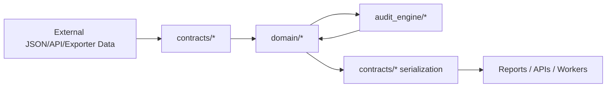

### Domain owns

- internal business meaning;
- immutable business values;
- invariants;
- state transitions;
- evidence identity/provenance semantics;
- severity/confidence semantics;
- governance meaning.

### Contracts own

- schema versions;
- external field names;
- interchange DTOs;
- backward/forward compatibility policy;
- JSON Schema generation;
- machine-readable report/job/order/evidence representations.

A JSON field should not be added to a domain object solely because one external client wants it. Likewise, an external contract must not redefine domain concepts such as severity independently.

---

## 16. Relationship to the audit engine

The audit engine consumes the domain; the domain does not know that the audit engine exists.

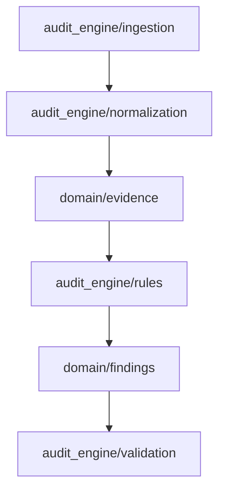

`domain/evidence/project_evidence.py` therefore represents normalized project evidence, but does not implement parsing. `domain/findings/models.py` represents findings, but does not decide which audit rules execute.

---

## 17. Circular-import prevention rules

The following rules should be treated as architectural constraints:

1. `domain/utils/domain_errors.py` imports no other BIMAP module.
2. `domain/utils/domain_helpers.py` may import domain errors but no concrete domain model.
3. Evidence provenance does not import evidence models or project aggregates.
4. Evidence models do not import `project_evidence.py`.
5. Severity and confidence do not import finding models.
6. Order states do not import events, models, or transitions.
7. Order models do not import transitions.
8. Product models do not import product limits.
9. Governance decisions do not import review orchestration.
10. The domain never imports `contracts`, `audit_engine`, `app`, `api`, `reporting`, `workers`, or `slai`.
11. Package `__init__.py` files should avoid broad wildcard aggregation when it would eagerly load sibling modules.
12. Shared behavior belongs in `domain/utils`, not in cross-imports between sibling packages.

### Example of a safe order import chain

```text
states.py
   ↑
events.py
   ↑
models.py
   ↑
transitions.py
```

### Example of a forbidden cycle

```text
models.py
   ↓
transitions.py
   ↓
models.py
```

---

## 18. Extension rules

When adding a new domain concept:

1. Determine whether it is truly domain/business meaning or an external representation.
2. Place leaf enums/value objects below aggregates.
3. Prefer dependency inversion over importing a higher layer.
4. Reuse `domain_helpers.py` instead of implementing another normalization function.
5. Use `DomainError` subclasses for domain failures.
6. Keep customer/raw evidence out of logs by default.
7. Use immutable dataclasses/value objects when practical.
8. Add deterministic `to_dict`/`from_dict` behavior only where the domain itself benefits from it; external schema compatibility remains a contracts concern.
9. Do not hard-code commercial values that remain configurable or unverified.
10. Add regression tests for every new invariant.

---

## 19. Testing expectations

Domain tests should run without requiring:

- FastAPI;
- PostgreSQL;
- object storage;
- Redis;
- payment-provider credentials;
- external network access;
- SLAI agent execution.

Recommended test categories:

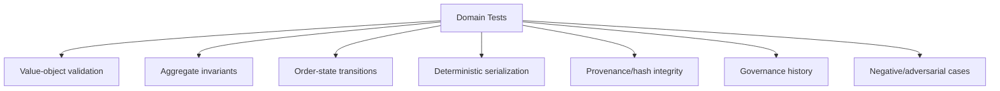

For evidence and findings, negative tests are particularly important because BIMAP must represent unsupported, unknown, contradictory, or invalid states explicitly rather than silently manufacturing certainty.

---

## 20. Current implementation status

The domain package is not uniformly complete yet. At the current repository state:

- `evidence/` contains substantial canonical evidence, provenance, and project-aggregate implementations;
- `findings/` contains implemented severity, confidence, finding, and finding-aggregate logic;
- `orders/` contains a substantial order-state, event, aggregate, and transition implementation;
- `products/` contains implemented product/catalog and configurable limit models without inventing final commercial thresholds;
- `governance/` contains substantial decision and review models;
- `requirements/models.py` remains a scaffold;
- `reports/coverage.py` remains a scaffold;
- `findings/schema_export.py` is an empty legacy placeholder and should not become an active schema authority;
- `contracts/schema_export.py` should remain the single external JSON-schema authority.

This README therefore documents both the implemented lower-level architecture and the boundary that remaining domain work should preserve.

---

## 21. Architectural source documents

The domain model should remain aligned with the project architecture and evidence-first boundaries defined in:

- [`../docs/whitepaper.pdf`](../docs/whitepaper.pdf)
- the R3D BIM Audit Platform implementation report;
- the versioned external schemas under `../contracts/` as they stabilize.

Where implementation and documentation disagree, the discrepancy should be resolved explicitly through code review rather than silently changing domain meaning.

---

## 22. Summary

`bimap.domain` is BIMAP's stable semantic core. It should remain small in dependency surface but strict in invariants:

```text
Evidence provenance
        ↓
Normalized evidence
        ↓
Project aggregates
        ↓
Deterministic audit logic (outside domain)
        ↓
Findings
        ↓
Governance decisions
        ↓
Contracts / reporting / application workflows (outside domain)
```

The domain does not perform the audit by itself. It defines the trustworthy objects on which the rest of BIMAP operates.
