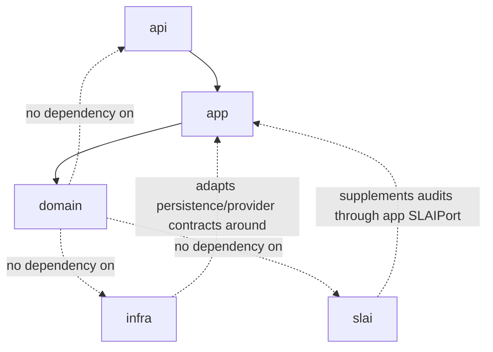

# BIMAP Domain Layer

> **Repository path:** `domain/`  
> **Runtime package:** `applications.bimap.domain`  
> **Architectural role:** canonical business vocabulary, aggregates, value objects, lifecycle rules, invariants, and policy semantics for BIMAP

---

## 1. Purpose

The `domain/` package contains BIMAP's provider-independent business model. It is the place where concepts such as customer accounts, account plans, rewards, orders, products, evidence, findings, reviews, report coverage, and requirements acquire canonical meaning.

The domain layer must remain independent of:

- FastAPI and HTTP;
- databases/object stores/message brokers;
- payment-provider SDKs;
- e-mail/SMS providers;
- IfcOpenShell, Blender, Trimesh, Revit, DWG/CAD backends;
- SLAI agents and orchestration;
- frontend state.

The central rule is:

> **If a rule defines what a BIMAP business object is or which state is valid, it belongs in the domain. If it defines how a use case is coordinated or persisted, it belongs elsewhere.**

---

## 2. Architectural position



Domain objects may be consumed by the application layer, Audit Engine, reporting/governance code, and contracts where appropriate. Runtime implementations must adapt to the domain rather than forcing provider-specific semantics into it.

---

## 3. Package structure

```text
domain/
├── README.md
├── __init__.py
│
├── accounts/
│   ├── __init__.py
│   ├── models.py
│   ├── plans.py
│   └── rewards.py
│
├── evidence/
│   ├── __init__.py
│   ├── models.py
│   ├── project_evidence.py
│   └── provenance.py
│
├── findings/
│   ├── __init__.py
│   ├── confidence.py
│   ├── models.py
│   ├── schema_export.py
│   └── severity.py
│
├── governance/
│   ├── __init__.py
│   ├── decisions.py
│   └── review.py
│
├── orders/
│   ├── __init__.py
│   ├── events.py
│   ├── models.py
│   ├── states.py
│   └── transitions.py
│
├── products/
│   ├── __init__.py
│   ├── limits.py
│   └── models.py
│
├── reports/
│   ├── __init__.py
│   └── coverage.py
│
├── requirements/
│   ├── __init__.py
│   └── models.py
│
└── utils/
    ├── __init__.py
    ├── domain_errors.py
    └── domain_helpers.py
```

The `accounts/` package is a current first-class domain area and must be included in all architectural documentation. Older domain documentation that starts directly at evidence/findings/orders is incomplete.

---

## 4. Domain design principles

### 4.1 Canonical ownership

Each business fact should have one canonical owner.

Examples:

- `Account.plan_code` owns the account's current plan assignment.
- order lifecycle legality belongs to the order state/transition model.
- product audit scope belongs to `domain.products`, not account-plan quotas.
- finding severity/confidence semantics belong to `domain.findings`.
- recurring account usage quota semantics belong to `domain.accounts.plans`.

Higher layers may project these values but should not create competing mutable mappings.

### 4.2 Immutable value-rich models

Most domain models are validated dataclasses/enums/value objects. Construction and semantic mutation should preserve invariants immediately, not rely on a later database or API validation pass.

### 4.3 Provider neutrality

Domain models may carry identifiers for external systems when business identity requires them, but they must not carry provider sessions, secrets, SDK objects, HTTP request state, file handles, or runtime clients.

### 4.4 Explicit time

Domain timestamps are normalized to coherent UTC values using domain helpers. Temporal invariants should be enforced where the business meaning is known.

---

## 5. Accounts domain

`domain/accounts/` is the largest material addition compared with the older README.

### 5.1 `accounts/models.py` — canonical account aggregate

`Account` is BIMAP's canonical customer-account aggregate.

It owns BIMAP-specific profile and identity state such as:

- `account_id`;
- external/reusable `auth_user_id` binding;
- username;
- normalized e-mail;
- E.164 phone number;
- ISO country code;
- name/surname;
- occupation/business/avatar profile fields;
- `plan_code`;
- account lifecycle status;
- verification timestamps;
- optimistic-concurrency `version`.

It deliberately does **not** store:

- plaintext credentials;
- password hashes;
- verification codes;
- access/refresh tokens;
- authentication-provider secrets.

Current account states are:

```text
pending_verification
active
suspended
closed
```

Important invariants include:

- active/suspended accounts require verified e-mail and phone channels;
- a fully verified account cannot remain `pending_verification`;
- verification timestamps cannot precede creation or exceed `updated_at`;
- account timestamps must be coherent;
- every semantic mutation increments the optimistic-concurrency version exactly once.

### 5.2 Canonical plan ownership

`Account.plan_code` is the source of truth for the account-level plan assignment. Application services that need the account's plan must resolve this field from the canonical account repository instead of maintaining an independent mutable entitlement-plan map.

---

## 6. Account plans and recurring usage

`accounts/plans.py` owns account-plan semantics only. It must not absorb audit-product limits, individual audit product pricing, payment-provider behavior, authentication, or points-ledger state.

### 6.1 Current plan codes

```text
basic
pro
plus
business
```

### 6.2 Current usage kinds

```text
audit
conversion
data_extraction
```

These usage kinds represent recurring account-level service entitlements. They are distinct from product-specific audit scope.

### 6.3 Renewal cadences

```text
weekly
monthly
none
```

The domain intentionally defines the cadence category, not the calendar interpretation. Whether `weekly` means ISO week, subscription anniversary, or another contractual window is a deployment/application policy supplied through the entitlement service's renewal resolver.

### 6.4 Quota modes

```text
finite
unlimited
```

`UsageQuota` enforces:

- finite quotas require a positive integer limit and a real renewal cadence;
- unlimited quotas cannot carry a finite limit;
- unlimited quotas use `RenewalCadence.NONE`.

`AccountPlan` binds:

- plan code;
- display name;
- base purchase discount;
- maximum effective purchase discount;
- a quota for every supported `UsageKind`.

The base discount cannot exceed the effective discount cap.

---

## 7. Rewards domain

`accounts/rewards.py` owns reward event and point-redemption semantics.

### 7.1 Reward event types

Current events include:

```text
audit_completed
conversion_completed
data_extraction_completed
purchase_completed
```

### 7.2 Redemption types

Current redemption intents include:

```text
extra_audit
extra_conversion
extra_data_extraction
purchase_discount
```

Extra-use redemptions map back to the corresponding `UsageKind`.

### 7.3 Points ledger

`PointsLedgerEntry` is a validated immutable ledger value containing:

- entry identity;
- account identity;
- signed non-zero points delta;
- reason;
- source identity; and
- UTC occurrence time.

The domain defines point meaning and reward cost policy; persistence and atomic account balance handling belong to the application/infrastructure layers.

---

## 8. Orders domain

`domain/orders/` owns the canonical order aggregate and lifecycle rules.

| Module | Responsibility |
|---|---|
| `models.py` | Order aggregate and validated order state |
| `states.py` | Canonical lifecycle state vocabulary and state groupings |
| `events.py` | Domain events/intents associated with order lifecycle changes |
| `transitions.py` | Legal transition authority and transition invariants |

Higher layers must not mutate order state arbitrarily. Application services/commands should use the domain transition authority and persist the resulting aggregate revision using optimistic concurrency.

The order is also the authoritative commercial/audit work anchor used by application services to verify:

- product identity;
- account ownership;
- lifecycle admission;
- audit job revision binding.

---

## 9. Products domain

`domain/products/` owns BIMAP audit-product meaning and limits.

This area is distinct from account-plan quotas:

```text
Account plan quota:
    "How many uses may this account consume in a renewal window?"

Product definition/limit:
    "What does this purchased/audited product contain or permit?"
```

Do not move product-specific audit scope into `AccountPlan`, and do not use account quota configuration as an audit-engine rule source.

---

## 10. Evidence domain

`domain/evidence/` owns normalized evidence identity/provenance semantics used by deterministic auditing.

| Module | Responsibility |
|---|---|
| `models.py` | Core evidence item/value definitions |
| `project_evidence.py` | Project-oriented evidence representation |
| `provenance.py` | Evidence origin/traceability metadata |

Evidence should remain grounded and traceable. A finding that claims support from evidence should reference canonical evidence identifiers rather than embedding unverifiable free-form assertions.

---

## 11. Findings domain

`domain/findings/` owns authoritative finding semantics.

| Module | Responsibility |
|---|---|
| `models.py` | Finding domain model |
| `severity.py` | Canonical severity vocabulary/ordering/validation |
| `confidence.py` | Canonical confidence semantics |
| `schema_export.py` | Reserved/export-related schema surface; currently minimal |

The deterministic Audit Engine is the primary producer of authoritative findings. SLAI may supplement interpretation, but it must not mutate canonical finding identity/evidence linkage through the application boundary.

This is protected operationally by `SLAIRequest`/`invoke_slai()` in `app/ports/slai.py`.

---

## 12. Governance domain

`domain/governance/` owns human/governance review semantics.

- `review.py` defines canonical review state/values.
- `decisions.py` defines governance decision semantics.

This domain is separate from SLAI runtime governance. SLAI's internal execution gating decides whether supplemental agent output may be used; BIMAP domain governance represents BIMAP business/review decisions.

Do not conflate these two forms of governance.

---

## 13. Requirements domain

`domain/requirements/models.py` owns normalized requirement semantics used by applicable audit products.

Requirements are audit inputs/business values. They are not HTTP payload definitions and not SLAI prompts.

The deterministic audit path should normalize/validate requirement meaning before supplemental reasoning consumes grounded results.

---

## 14. Reports domain

`domain/reports/coverage.py` owns report/coverage-related business values at the domain level.

Binary rendering, PDF generation, download URLs, e-mail transport, storage keys, and provider-specific report delivery belong outside the domain.

---

## 15. Domain errors and helpers

### `utils/domain_errors.py`

Defines the domain-specific error vocabulary, including validation/invariant failures. Domain errors should express business invalidity without HTTP status codes or provider semantics.

### `utils/domain_helpers.py`

Provides shared domain normalization helpers such as:

- text validation;
- mapping validation;
- UTC datetime normalization;
- optional value normalization.

These helpers should remain deterministic and side-effect-light.

---

## 16. Boundary with the application layer

The application layer may:

- create/transition validated domain aggregates;
- persist them through ports;
- coordinate multiple aggregates/providers;
- choose when a use case is attempted;
- translate domain failures to application errors.

The domain layer should not know:

- which API endpoint triggered the operation;
- whether persistence is in-memory, PostgreSQL, or another provider;
- which payment/authentication provider is active;
- which SLAI agents are available;
- whether an IFC file was parsed with IfcOpenShell.

---

## 17. Boundary with SLAI

SLAI is not a domain authority.

The safe direction is:

```text
Domain + deterministic Audit Engine
        ↓ authoritative result
Application SLAIRequest
        ↓
SLAI anti-corruption/runtime integration
        ↓ supplemental mapped result
Application invariant validation
```

SLAI must not create competing account plans, order states, product limits, requirement truth, evidence identity, or finding identity.

---

## 18. Persistence considerations

Domain aggregates may contain optimistic-concurrency versions, but persistence behavior belongs to app ports/infrastructure.

Examples:

- `Account.version` supports canonical account write concurrency.
- `Order.version` supports authoritative order lifecycle concurrency.

The domain defines valid object revisions; a repository adapter enforces persistence preconditions.

Do not add database transaction objects, ORM sessions, SQL fragments, or storage clients to domain models.

---

## 19. Security and privacy rules

Domain models should contain only information that is part of the business object itself.

In particular:

- credentials and session tokens are not account fields;
- verification codes are not account fields;
- payment secrets are not order fields;
- raw uploaded binary data is not evidence metadata;
- agent prompts/internal traces are not findings;
- provider error strings are not governance decisions.

Sensitive values should be minimized and normalized at the correct boundary.

---

## 20. Testing expectations

Domain tests should be deterministic and require no network/provider infrastructure.

Priority cases include:

- valid/invalid account identity fields;
- account lifecycle and verification invariants;
- account optimistic-concurrency version increments under semantic mutation;
- plan code parsing;
- complete quota coverage for every `UsageKind`;
- finite/unlimited quota invariants;
- plan discount-cap invariant;
- rewards award/redemption calculations;
- order transition legality;
- evidence provenance consistency;
- finding severity/confidence normalization;
- requirement validation;
- UTC timestamp ordering.

A domain unit test should not need FastAPI, SMTP, Twilio, IfcOpenShell, Blender, a database, or SLAI.

---

## 21. Current documentation corrections

Compared with the older domain README, the current repository requires these corrections:

1. `accounts/` is now a major domain package and must appear in the package tree and architecture narrative.
2. Account plan assignment is canonical on `Account.plan_code`.
3. Recurring account quotas now explicitly cover audits, conversions, and data extractions.
4. Rewards/points semantics are represented in `accounts/rewards.py`.
5. Account verification/lifecycle invariants are part of the domain, while credentials/session mechanics remain outside it.
6. Account plan quotas and product audit limits are separate concepts and must remain separate.

---

## 22. Extension checklist

When adding a domain concept:

1. Confirm it is genuinely business meaning rather than application/provider behavior.
2. Identify one canonical owner package/model.
3. Prefer validated enums/value objects/immutable dataclasses where appropriate.
4. Enforce invariants during construction or canonical mutation.
5. Keep provider/network/HTTP concerns out.
6. Define explicit serialization only when a stable cross-layer representation is required.
7. Add domain-specific tests with no external services.
8. Update package exports and this README.

---

## 23. Summary

`domain/` is BIMAP's semantic foundation. The updated domain model now includes a mature customer-account area alongside the existing order, product, evidence, finding, governance, requirement, and report concepts.

The layer should remain strict:

> **Domain defines truth and valid state; application coordinates use cases; infrastructure persists/integrates; API transports; SLAI supplements but does not redefine domain truth.**
