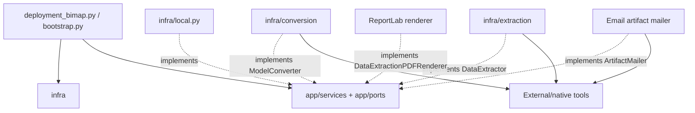

# BIMAP Infrastructure Layer

> **Repository path:** `infra/`  
> **Runtime package:** `applications.bimap.infra`  
> **Architectural role:** concrete adapters that implement BIMAP application ports for local persistence, authentication integration, storage, queues, payment/malware boundaries, model conversion, structured data extraction, PDF rendering, and artifact delivery

---

## 1. Purpose

The `infra/` package contains concrete runtime implementations of provider-neutral contracts defined in `app/ports/` and selected application-owned structural boundaries.

This package is where BIMAP is allowed to know **how** an external capability is performed:

- process-local persistence;
- process-local object storage;
- process-local audit queueing;
- SLAI authentication/phone-verification integration used by the local deployment;
- fail-closed payment behavior when no provider is configured;
- development-only upload malware admission;
- IFC/FBX/mesh conversion;
- native-backend boundaries for proprietary Revit and DWG/CAD conversion;
- IFC/DXF/FBX/mesh structured data extraction;
- native-backend boundaries for Revit and DWG where required;
- ReportLab PDF rendering; and
- attachment-capable e-mail delivery.

The central dependency rule is:

> **Infrastructure implements application ports. Application/domain code must never depend on a concrete infrastructure adapter.**

---

## 2. Architectural position



`infra/` is not a second application layer. It should implement existing contracts faithfully and fail clearly when a required external capability is not configured.

---

## 3. Package structure

```text
infra/
├── README.md
├── __init__.py
├── local.py
├── email_artifact_mailer.py
├── reportlab_data_extraction_renderer.py
│
├── conversion/
│   ├── __init__.py
│   ├── dwg_converter.py
│   ├── fbx_converter.py
│   ├── ifc_converter.py
│   ├── mesh_converter.py
│   └── revit_converter.py
│
└── extraction/
    ├── __init__.py
    ├── dwg_extractor.py
    ├── fbx_extractor.py
    ├── ifc_extractor.py
    ├── mesh_extractor.py
    └── revit_extractor.py
```

---

## 4. Infrastructure principles

### 4.1 Implement ports; do not redefine them

Concrete adapters consume the contracts defined in `app/ports/`. Infrastructure may validate that provider output satisfies those contracts, but it must not create alternative business semantics.

### 4.2 Capability advertisement is authoritative

Conversion and extraction availability is deployment-dependent. BIMAP should expose only capabilities actually advertised by the configured adapters.

There is deliberately no hidden rule such as:

```text
unknown format -> try IFC
```

or:

```text
.rvt exists in enum -> therefore this deployment can process Revit
```

### 4.3 Proprietary formats require honest backend boundaries

RVT/RFA and DWG cannot be treated as though a generic Python package provides a complete native implementation. Where native tooling is required, the adapter exposes a deployment-owned protocol and advertises support only when that backend is configured.

### 4.4 Local adapters are not production substitutes

`infra/local.py` exists for development, integration testing, and single-process evaluation. It is intentionally non-durable and must not be silently promoted to production.

### 4.5 Fail closed where pretending success would be unsafe

Examples:

- `DisabledPayment` raises unavailable rather than faking successful checkout.
- `DevelopmentMalware` is indeterminate by default unless an explicit local trust override is enabled.
- Revit/DWG adapters do not advertise unsupported native capabilities.

---

## 5. Root `infra/__init__.py`

The package root uses lazy imports so importing `applications.bimap.infra` does not eagerly import optional/heavy provider dependencies such as model parsers/renderers.

The current root convenience export surface includes:

- `EmailArtifactMailer`;
- `ReportLabDataExtractionPDFRenderer`;
- `DevelopmentMalware`;
- `DisabledPayment`;
- `InMemoryAuditResultStore`;
- `InMemoryRepository`;
- `InMemoryStorage`;
- `InProcessQueue`;
- `SystemClock`.

`local.py` contains additional concrete adapters that are intentionally imported directly by the deployment composition, including:

- `InMemoryAccounts`;
- `LocalSLAIAuthentication`;
- `InMemoryEntitlementStore`;
- `CalendarUTCRenewalWindowResolver`.

Likewise, conversion/extraction implementations should normally be imported from their subpackages:

```python
from applications.bimap.infra.conversion import MultiFormatModelConverter
from applications.bimap.infra.extraction import MultiFormatDataExtractor
```

Documentation should not confuse “not re-exported from the package root” with “not implemented.”

---

# Part I — Local/development infrastructure

## 6. `local.py`

`local.py` provides deterministic, dependency-light adapters used by the current development deployment. The module explicitly documents that production must replace its process-local implementations.

Current local classes are:

```text
SystemClock
InMemoryAccounts
LocalSLAIAuthentication
InMemoryEntitlementStore
CalendarUTCRenewalWindowResolver
InMemoryRepository
InMemoryAuditResultStore
InMemoryStorage
InProcessQueue
DisabledPayment
DevelopmentMalware
```

---

## 7. `SystemClock`

Implements the application `Clock` boundary using UTC system time.

Time sourcing is isolated behind a port so application/domain tests can substitute deterministic clocks without monkey-patching global time.

---

## 8. `InMemoryAccounts`

Thread-safe process-local implementation of the account persistence boundary.

It maintains canonical lookup indexes for account identity fields such as:

- account ID;
- authentication user ID;
- username;
- e-mail;
- phone number.

It also preserves optimistic-concurrency behavior through `Account.version` and must reject conflicting identity/index updates rather than allowing duplicate canonical identifiers.

Use cases:

- local development;
- application integration tests;
- deterministic single-process demos.

Not suitable for:

- multi-process coordination;
- restart durability;
- production account persistence.

---

## 9. `LocalSLAIAuthentication`

`LocalSLAIAuthentication` implements BIMAP's `Authentication` application port by adapting reusable SLAI/core functions plus BIMAP notification services.

Current integration includes:

- `src.functions.auth.AuthService` for credential/session identity operations;
- BIMAP `EmailService` for signup verification e-mail;
- optional `src.functions.phone_verification.PhoneVerificationService` for SMS verification.

It maintains local session/contact coordination needed by the adapter, while the application `AuthenticationService` remains responsible for BIMAP account orchestration.

The direction is:

```text
app AuthenticationService
    ↓ Authentication port
LocalSLAIAuthentication
    ↓
SLAI reusable AuthService / EmailService / optional PhoneVerificationService
```

The application must not import these concrete SLAI/provider classes directly.

### Verification policy note

When SMS verification is disabled in this local adapter, the phone channel can be considered satisfied by explicit deployment policy. That is a deployment choice, not a domain rule and must not be generalized into `domain/accounts/`.

---

## 10. `InMemoryEntitlementStore`

Provides local, lock-protected entitlement persistence used by `EntitlementService`.

It supports:

- lookup by `(account_id, usage_kind, source_id)`;
- lookup by idempotency key;
- atomic-in-process recurring quota consumption;
- bonus-credit consumption;
- unlimited usage recording;
- bonus-credit granting;
- recurring usage counting; and
- bonus balance lookup.

The implementation follows the application service's requirement that capacity check + consumption mutation occur atomically relative to this process.

Production must replace this with a durable transactionally safe implementation capable of preventing over-consumption across multiple processes/workers.

---

## 11. `CalendarUTCRenewalWindowResolver`

Defines the explicit local-development interpretation of recurring quota windows:

- **weekly:** Monday 00:00 UTC → next Monday;
- **monthly:** first day 00:00 UTC → first day of the next month.

This is intentionally outside the domain because the domain only defines `WEEKLY`/`MONTHLY` cadence categories, not the contractual alignment rule.

A production subscription implementation may replace this with account/subscription-anniversary windows without changing `EntitlementService`.

---

## 12. `InMemoryRepository`

Thread-safe process-local implementation of the composite BIMAP repository port.

Current stores include:

- orders;
- evidence;
- findings;
- governance reviews;
- report manifests.

For order writes, it preserves optimistic-concurrency semantics whenever `expected_version` is supplied and refuses to overwrite a newer revision with an older aggregate.

It is deliberately non-durable.

---

## 13. `InMemoryAuditResultStore`

Persists completed Audit Workspaces in memory.

Behavior:

- one latest record is retained per order;
- re-saving the same job is idempotent only when product/payload are unchanged;
- rebinding the same completed job identity to different content raises an integrity error;
- a later job for the same order becomes the latest workspace;
- storage is process-local and non-durable.

This adapter implements `app/ports/audit_results.py:AuditResultStore` and is the current development backing for:

```text
AuditService
    ↓ save
InMemoryAuditResultStore
    ↓ read
GetAuditWorkspace
    ↓
GET /orders/{order_id}/audit/workspace
```

---

## 14. `InMemoryStorage`

Thread-safe process-local binary object storage implementing the application `Storage` port.

It verifies:

- binary payload type;
- computed content hash;
- expected hash when supplied;
- expected size when supplied.

It supports put/open/stat/delete semantics and returns `StoredObject` metadata.

Because payloads are retained in process memory, it is not appropriate for large-scale or durable production storage.

---

## 15. `InProcessQueue`

Process-local implementation of the `Queue` port for immutable `AuditJob` submission.

It provides idempotent enqueueing by binding one idempotency key to one job identity. Reusing a key for a different job is rejected as an integrity failure.

It retains submitted jobs only for the lifetime of the process and intentionally does not pretend to provide:

- durable broker semantics;
- retries/dead-letter queues;
- distributed workers;
- delivery guarantees across restarts.

`snapshot()` exists for local diagnostics.

---

## 16. `DisabledPayment`

Fail-closed `Payment` adapter used when no real payment provider is configured.

It allows the application graph to be constructed without inventing payment success. Checkout creation and event verification raise a payment-unavailable error.

This is the correct local behavior when settlement cannot be proven.

---

## 17. `DevelopmentMalware`

Development-only implementation of the `Malware` port.

Default behavior:

```text
trust_uploads = False
    -> INDETERMINATE
```

Explicit controlled local override:

```text
trust_uploads = True
    -> CLEAN
```

`trust_uploads=True` must never be treated as a production scanner.

---

# Part II — Model conversion infrastructure

## 18. `conversion/` overview

The conversion package implements the application `ModelConverter` contract.

`MultiFormatModelConverter` is the deployment-level dispatcher. It:

- requires at least one configured converter;
- reads each converter's advertised capabilities;
- allows one configured adapter owner per source format;
- rejects duplicate/ambiguous source-format ownership;
- performs no implicit fallback/default format selection;
- delegates `inspect()`/`convert()` to the adapter matching the already-resolved source format.

Source-format resolution from the filename is owned by `ModelConversionService` using these advertised capabilities.

### Shared conversion helpers

`conversion/__init__.py` also owns infrastructure-level helpers for:

- materializing binary streams into temporary files when provider tooling requires paths;
- normalizing safe output stems;
- detaching temporary artifacts into stable application artifacts with SHA-256/size metadata;
- packaging generated sidecar files into ZIP archives.

---

## 19. Current conversion adapter matrix

| Adapter | Source | Current target support | Runtime dependency / note |
|---|---|---|---|
| `IfcOpenShellModelConverter` | IFC | GLB, OBJ package | Concrete IfcOpenShell implementation |
| `BlenderFbxModelConverter` | FBX | GLB, OBJ package | Requires resolvable Blender executable; runs headless |
| `TrimeshModelConverter` | OBJ | GLB | Requires `trimesh` |
| `TrimeshModelConverter` | GLB | OBJ package | Requires `trimesh` |
| `TrimeshModelConverter` | STL | GLB, OBJ package | Requires `trimesh` |
| `TrimeshModelConverter` | PLY | GLB, OBJ package | Requires `trimesh` |
| `RevitModelConverter` | RVT/RFA | Backend-advertised only | Requires deployment-owned native `RevitConversionBackend` |
| `DwgDxfModelConverter` | DWG/DXF | Backend-advertised only | Requires deployment-owned real CAD `DwgDxfConversionBackend` |

“Defined in the adapter” does not mean “configured in the current deployment.” The capability endpoint must reflect the instantiated adapter graph.

---

## 20. IFC conversion

`IfcOpenShellModelConverter` performs real IFC inspection/conversion with IfcOpenShell.

Inspection verifies that:

- the model is readable IFC;
- an IFC schema is available; and
- at least one `IfcProduct` exists.

Current outputs:

- GLB as `model/gltf-binary`;
- OBJ + related material files packaged as ZIP.

Generated artifacts are detached from temporary directories before returning through the application port.

---

## 21. FBX conversion

`BlenderFbxModelConverter` uses a resolved Blender executable in background/factory-startup mode.

It:

- imports the FBX through Blender;
- verifies mesh geometry exists during inspection;
- exports GLB or OBJ;
- packages OBJ-related generated files when needed;
- enforces a subprocess timeout;
- translates launch/timeout/conversion failures into application errors.

Blender is therefore an explicit infrastructure dependency, not an application or API concern.

---

## 22. Generic mesh conversion

`TrimeshModelConverter` handles the current generic mesh source/target pairs.

It imports `trimesh` lazily during adapter construction and verifies the loaded scene contains geometry.

The adapter intentionally advertises only the supported direction for each source. For example, OBJ currently advertises GLB output while GLB advertises OBJ output.

---

## 23. Revit conversion boundary

`RevitModelConverter` does not pretend to decode proprietary RVT/RFA itself.

It adapts an injected `RevitConversionBackend` with:

```text
capabilities
inspect_file(path, source_format=...)
convert_file(path, source_format=..., target_format=..., output_stem=...)
```

The backend could be implemented by a controlled Revit/RevitCoreConsole worker or another legitimate Autodesk/native processing service.

The adapter validates that the backend advertises only RVT/RFA sources and that capability metadata is coherent.

---

## 24. DWG/DXF conversion boundary

`DwgDxfModelConverter` similarly requires a real CAD-capable `DwgDxfConversionBackend`.

It does not claim that a lightweight parser can losslessly process arbitrary 3D DWG data. Supported source/target pairs are exactly those advertised by the injected backend.

---

# Part III — Structured data extraction infrastructure

## 25. `extraction/` overview

The extraction package implements `app/ports/data_extraction.py:DataExtractor`.

Current canonical source-format vocabulary includes:

```text
ifc, rvt, rfa, dwg, dxf, fbx, obj, glb, stl, ply
```

Canonical selectable dataset types are:

```text
elements
properties
quantities
materials
```

Every advertised `DataExtractionCapability` must include both PDF and JSON artifacts in its package contract.

`MultiFormatDataExtractor` is the deployment dispatcher and follows the same strict rules as conversion:

- no implicit source default;
- no duplicate source-format ownership across configured extractors;
- source format is resolved at the application service layer from advertised capabilities;
- delegation occurs to exactly one configured adapter.

---

## 26. Current extraction adapter matrix

| Adapter | Source support | Backend/dependency model |
|---|---|---|
| `IfcOpenShellDataExtractor` | IFC | Concrete IfcOpenShell implementation |
| `RevitDataExtractor` | RVT/RFA as advertised | Requires deployment-owned `RevitExtractionBackend` |
| `DwgDxfDataExtractor` | DXF always; DWG only when backend configured | DXF via `ezdxf`; DWG requires `DwgToDxfBackend` |
| `BlenderFbxDataExtractor` | FBX | Blender-backed extraction |
| `TrimeshDataExtractor` | Generic mesh formats advertised by adapter | Trimesh-backed extraction |

The API/application must publish the capabilities returned by the configured dispatcher instead of assuming this entire theoretical matrix is available.

---

## 27. IFC structured extraction

`IfcOpenShellDataExtractor` parses IFC with IfcOpenShell and emits provider-neutral `DataSourceInspection` and `ExtractedModelData` values.

It can extract the canonical BIMAP datasets:

- element identity/type/container data;
- property sets;
- quantities;
- materials.

It also derives project/unit/class-count metadata where available.

IFC-specific object types are normalized into JSON-safe BIMAP-owned records before crossing the infrastructure/application boundary.

---

## 28. DXF/DWG structured extraction

`DwgDxfDataExtractor` is intentionally asymmetric:

### DXF

DXF is parsed directly using `ezdxf`.

### DWG

DWG is advertised **only** if an injected `DwgToDxfBackend` exists. The adapter first obtains a genuine DXF conversion from that backend and then performs the structured extraction.

Therefore:

> A deployment without a DWG backend must not advertise `.dwg` extraction support.

This is an important truthfulness invariant for the frontend capability UI.

---

## 29. Revit structured extraction

`RevitDataExtractor` adapts an injected native `RevitExtractionBackend`.

Required backend surface:

```text
capabilities
inspect_file(path, source_format=...)
extract_file(path, source_format=..., datasets=...)
```

Only RVT/RFA capabilities explicitly advertised by the backend are accepted.

---

## 30. FBX and generic mesh extraction

The FBX and mesh extractors normalize provider-specific geometry/model metadata into the same application-owned extraction contracts used by IFC/DXF.

This keeps `DataExtractionService` independent from Blender/Trimesh object models and allows one API package format even when the source parser differs.

---

# Part IV — Rendering and delivery

## 31. `ReportLabDataExtractionPDFRenderer`

Implements `DataExtractionPDFRenderer` using ReportLab.

The renderer intentionally produces a **human-readable summary**, not a complete replacement for the JSON dataset.

The current PDF includes summary concepts such as:

- extraction identity;
- generation time;
- source file/size/hash;
- project/schema metadata;
- selected datasets;
- dataset row counts;
- class distribution;
- project units where available;
- scope note directing consumers to the JSON artifact for complete data.

The renderer validates that the generated bytes begin with a PDF signature before returning them.

### Current format-specific note

The current renderer still includes IFC-oriented field names such as `ifc_schema` and `ifc_class_counts` in its expected document structure. Because the extraction layer now supports more than IFC, this should be treated as a current implementation constraint to revisit if non-IFC summaries need fully source-neutral presentation.

---

## 32. `EmailArtifactMailer`

Implements the application `ArtifactMailer` port using BIMAP's existing `EmailService` and binary attachments.

Current method:

```text
send_data_extraction_package(...)
```

It:

- validates extraction/source/hash metadata;
- verifies the supplied package SHA-256 shape;
- constructs an `EmailAttachment`;
- sends a service-result e-mail using an idempotency key;
- returns a provider/message receipt.

### Runtime wiring status

The adapter exists, but the current `DataExtractionService` still reports `email_available = False` and does not inject/use `ArtifactMailer`. Therefore this module must currently be documented as **implemented infrastructure awaiting deliberate application-service integration**, not as an active API feature.

---

## 33. Current development composition

`deployment_bimap.py` currently composes local/development infrastructure directly from this package.

Among the currently imported local adapters are:

```text
CalendarUTCRenewalWindowResolver
DevelopmentMalware
DisabledPayment
InMemoryAccounts
InMemoryAuditResultStore
InMemoryEntitlementStore
InMemoryRepository
InMemoryStorage
InProcessQueue
LocalSLAIAuthentication
SystemClock
```

The development conversion graph imports:

```text
BlenderFbxModelConverter
IfcOpenShellModelConverter
MultiFormatModelConverter
TrimeshModelConverter
```

The development extraction graph imports:

```text
BlenderFbxDataExtractor
DwgDxfDataExtractor
IfcOpenShellDataExtractor
MultiFormatDataExtractor
TrimeshDataExtractor
```

The presence of Revit/DWG native adapter classes in `infra/` does not imply that a native backend is configured by default.

Production mode is expected to fail closed until production-grade adapters/configuration are supplied rather than silently falling back to these in-memory development components.

---

## 34. Dependency and import rules

### Allowed

```text
infra -> app/ports
infra -> app/utils errors/helpers
infra -> domain/contracts only when required by the port contract
infra -> provider/native libraries
```

### Forbidden direction

```text
app -> infra

domain -> infra

api/routes -> infra concrete classes

slai agents -> infra local persistence
```

Concrete selection belongs to deployment/bootstrap composition.

---

## 35. Error handling

Infrastructure adapters should translate provider/native failures into the application error vocabulary at the adapter boundary whenever possible.

Examples:

- missing Blender/Trimesh dependency → application configuration error;
- unreadable source model → unsupported-input/application validation error;
- provider conversion corruption → application integrity error;
- storage hash mismatch → storage integrity error;
- disabled payment → payment unavailable error;
- duplicate queue idempotency binding → queue integrity error.

Raw provider exceptions should not escape into API routes unchecked.

---

## 36. Resource ownership

Infrastructure code owns cleanup of resources it creates.

Examples:

- temporary conversion/extraction directories;
- generated intermediate model files;
- returned artifact streams when their contract transfers ownership;
- subprocess timeout/termination boundaries;
- in-memory locks/data structures.

Application callers should use documented `close()` semantics for conversion/extraction result artifacts/packages when applicable.

---

## 37. Security considerations

Infrastructure is the highest-risk layer for untrusted model files and external tools.

Required principles:

1. materialize files only into controlled temporary locations;
2. normalize output names rather than trusting source filenames as paths;
3. never execute content from a user-supplied path directly;
4. bound subprocess execution time;
5. validate provider output type/identity before returning it;
6. preserve malware-gate semantics from the application service;
7. do not log source-file contents, credentials, OTPs, access tokens, provider secrets, or e-mail attachment bytes;
8. advertise only capabilities that are genuinely configured.

---

## 38. Production replacement requirements

Before a production deployment, at minimum replace or explicitly harden:

- `InMemoryAccounts` with durable account persistence and atomic unique indexes;
- `InMemoryEntitlementStore` with durable atomic quota/credit transactions;
- `InMemoryRepository` with durable aggregate persistence and optimistic concurrency;
- `InMemoryAuditResultStore` with durable workspace persistence;
- `InMemoryStorage` with durable object storage + integrity metadata;
- `InProcessQueue` with a durable broker/outbox-aware strategy;
- `DisabledPayment` with a verified payment provider adapter;
- `DevelopmentMalware` with a real scanning service;
- local authentication/session persistence as required by deployment scale/security;
- any native Revit/DWG backend needed for advertised capabilities.

Production should never activate a feature simply because an enum or adapter type exists.

---

## 39. Testing strategy

Infrastructure tests should verify that concrete adapters satisfy application-port contracts.

### Local adapters

Test:

- thread-safe/idempotent writes;
- optimistic concurrency;
- uniqueness indexes;
- queue idempotency rebinding rejection;
- storage size/hash verification;
- Audit Workspace replay/replacement semantics;
- quota/bonus/unlimited consumption behavior;
- fail-closed payment;
- malware default indeterminate behavior.

### Conversion/extraction

Test:

- accurate capability advertisement;
- duplicate dispatcher capability rejection;
- no fallback format inference;
- valid inspection result types;
- generated artifact integrity/hash/size;
- cleanup of temporary resources;
- native backend contract validation;
- absent backend means absent advertised capability.

### Rendering/delivery

Test:

- valid `%PDF-` output;
- summary rendering with bounded/expected structures;
- SHA-256 validation for attachment delivery;
- idempotent e-mail dispatch semantics where supported.

---

## 40. Current implementation observations

The present infrastructure is architecturally stronger than a simple “in-memory persistence” package. It now contains three distinct infrastructure families:

1. **local development adapters** (`local.py`);
2. **model-processing adapters** (`conversion/`, `extraction/`); and
3. **artifact presentation/delivery adapters** (ReportLab renderer, e-mail mailer).

Important current caveats are:

- local persistence/queue/storage is non-durable;
- payment is intentionally unavailable in local mode;
- malware scanning is not production-grade;
- proprietary Revit/DWG support depends on deployment-provided native backends;
- data-extraction e-mail infrastructure exists but is not yet wired into the application service;
- the ReportLab extraction summary still contains IFC-oriented presentation fields despite the broader multi-format extraction architecture;
- the root `infra/__init__.py` convenience exports are narrower than the actual contents of `local.py` and the conversion/extraction subpackages.

These caveats should be kept explicit rather than hidden behind optimistic capability claims.

---

## 41. Extension checklist

When adding a new infrastructure adapter:

1. Start from an existing application port; do not invent a parallel contract in `infra/`.
2. Define a new app port first if the external capability is genuinely new.
3. Advertise only capabilities the adapter can execute successfully.
4. Translate provider exceptions into application errors.
5. Validate provider output before returning it.
6. Define resource ownership/cleanup.
7. Keep provider secrets/configuration outside domain/application values.
8. Add the adapter to deployment composition explicitly.
9. Do not add it to capability output until it is actually configured.
10. Update the relevant `__init__.py` export surface intentionally.
11. Update this README's adapter matrix.

---

## 42. Summary

`infra/` is BIMAP's implementation boundary. It makes application ports real without allowing provider technology to leak inward.

The intended production relationship is:

```text
Application contract
    ↓ implemented by
Infrastructure adapter
    ↓ delegates to
Local/durable/provider/native technology
```

The most important rule for this package is accuracy: **BIMAP must never advertise a persistence guarantee, payment state, malware verdict, conversion pair, extraction format, or delivery path that the configured infrastructure cannot actually provide.**
