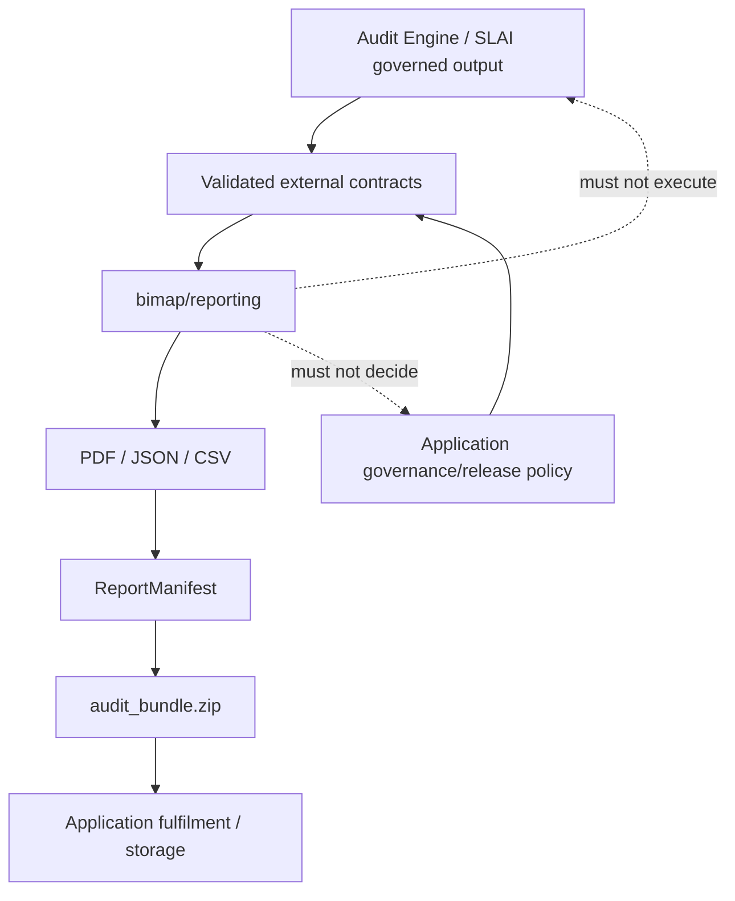
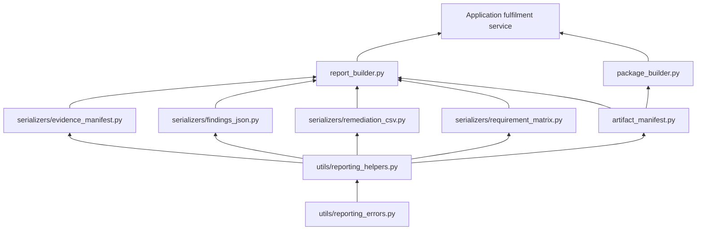
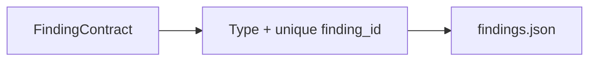
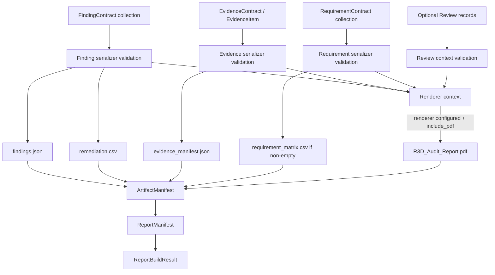
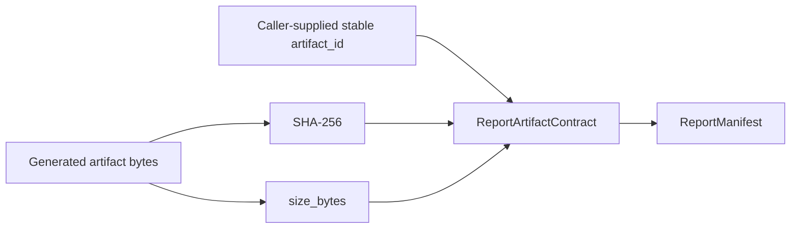
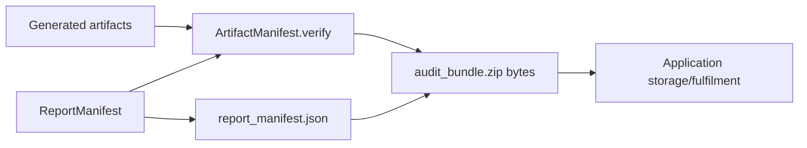
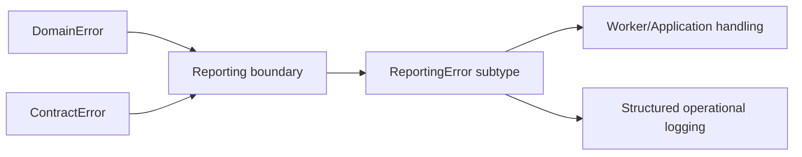

# BIMAP Reporting Layer

> **Package:** `bimap.reporting`  
> **Architectural role:** Deterministic customer-deliverable generation, integrity manifesting, and package assembly for the R3D BIM Audit Platform (BIMAP)  
> **Runtime position:** Above validated domain/contracts and below fulfilment/storage publication; independent from audit-rule execution, SLAI orchestration, API routing, and persistence

---

## 1. Purpose

The `reporting/` package converts already validated BIMAP audit results into stable customer-facing artifacts. Its primary responsibility is reproducibility: the same approved findings, evidence, requirements, version metadata, and renderer inputs must produce a traceable set of structured outputs whose membership, byte size, and cryptographic hashes are recorded in a versioned `ReportManifest`.

The reporting layer exists to answer questions such as:

- How are validated `FindingContract` records emitted as `findings.json` without losing rule, evidence, severity, confidence, remediation, or verification semantics?
- How is the actionable remediation view projected into a spreadsheet-compatible CSV without inventing owner, effort, or priority fields that the audit model does not contain?
- How are source hashes, source identity, extractor versions, logical locations, and evidence IDs preserved in `evidence_manifest.json`?
- How is the BIM QA Requirement-Evidence Matrix serialized while preserving `unknown` as distinct from `fail`?
- Which generated files belong to a report release, and how is each file's size and SHA-256 digest recorded?
- How is `audit_bundle.zip` constructed without creating self-referential manifest hashes?
- Where does human-readable PDF rendering plug in without coupling reporting to a particular template engine?
- Which concerns remain upstream (governance/release policy) and downstream (object storage/download fulfilment)?

The package does **not** decide whether a finding is technically correct, whether a finding may be released, which rule should run, which SLAI agent should be invoked, where artifacts are stored, or how a customer is authorized to download them. Those responsibilities belong to the audit engine, application/governance services, SLAI integration, storage ports, and API/infrastructure layers.

---

## 2. Architectural principles

### 2.1 Reporting consumes approved data; it does not create audit meaning



The governing rule is:

> **Reporting renders and packages already-authorized audit state; it must not silently alter, infer, suppress, reprioritize, or invent findings.**

### 2.2 Dependency direction inside `reporting/`



The arrows mean **"is consumed by"**.

Important reverse imports are forbidden:

```text
serializers/*            MUST NOT import report_builder.py
artifact_manifest.py     MUST NOT import report_builder.py/package_builder.py
package_builder.py       MUST NOT import report_builder.py
utils/*                  MUST NOT import serializers or builders
contracts/*              MUST NOT import reporting/*
domain/*                 MUST NOT import reporting/*
```

### 2.3 One authoritative owner per concept

| Concept | Authoritative owner |
|---|---|
| Finding interchange schema | `bimap/contracts/finding.py` |
| Evidence interchange schema | `bimap/contracts/evidence.py` |
| Requirement-Evidence row schema | `bimap/contracts/requirement.py` |
| Report-package manifest schema | `bimap/contracts/report_manifest.py` |
| Reporting error vocabulary | `reporting/utils/reporting_errors.py` |
| Reporting serialization helpers | `reporting/utils/reporting_helpers.py` |
| `findings.json` projection | `reporting/serializers/findings_json.py` |
| `remediation.csv` projection | `reporting/serializers/remediation_csv.py` |
| `evidence_manifest.json` projection | `reporting/serializers/evidence_manifest.py` |
| `requirement_matrix.csv` projection | `reporting/serializers/requirement_matrix.py` |
| Artifact byte-integrity manifesting | `reporting/artifact_manifest.py` |
| Report deliverable orchestration | `reporting/report_builder.py` |
| ZIP package construction/verification | `reporting/package_builder.py` |
| PDF/template implementation | `reporting/templates/` once defined |

No sibling module should reimplement those responsibilities.

---

## 3. Package structure

```text
bimap/reporting/
├── __init__.py
├── README.md
│
├── artifact_manifest.py
├── package_builder.py
├── report_builder.py
│
├── serializers/
│   ├── __init__.py
│   ├── evidence_manifest.py
│   ├── findings_json.py
│   ├── remediation_csv.py
│   └── requirement_matrix.py
│
├── templates/
│   └── README.md
│
└── utils/
    ├── __init__.py
    ├── reporting_errors.py
    └── reporting_helpers.py
```

The current repository does not yet define a concrete renderer in `templates/`. `ReportBuilder` therefore accepts an injected `ReportRenderer` rather than fabricating a template class or embedding ReportLab/HTML assumptions into the orchestration layer.

---

## 4. Module responsibilities

| Module | Primary responsibility | Allowed BIMAP dependencies | Must not own |
|---|---|---|---|
| `utils/reporting_errors.py` | Stable reporting exception hierarchy, safe/redacted diagnostics | standard library, SLAI logger/PrettyPrinter | domain/contract semantics, HTTP mapping |
| `utils/reporting_helpers.py` | Method-start diagnostics, typed iterable checks, stable-ID validation, canonical JSON delegation, deterministic/safe CSV helpers | reporting errors, contract serialization helpers | concrete serializers, report rendering |
| `serializers/findings_json.py` | Deterministic JSON array of `FindingContract` records | finding contract, reporting utilities | rule execution, finding generation |
| `serializers/remediation_csv.py` | Fixed-column remediation projection from `FindingContract` | finding contract, reporting utilities | separate Remediation domain model, invented owner/effort/priority |
| `serializers/evidence_manifest.py` | Evidence/source inventory preserving provenance and external evidence records | evidence contract/domain evidence, reporting utilities | source parsing, alternate evidence model |
| `serializers/requirement_matrix.py` | Requirement-Evidence Matrix rows and CSV | requirement contract, reporting utilities | requirement extraction/evaluation |
| `artifact_manifest.py` | Compute artifact SHA-256/size metadata; create and verify `ReportManifest` | report-manifest contract, reporting utilities | alternate manifest schema, storage publication |
| `report_builder.py` | Coordinate structured serializers, optional PDF renderer, and manifest creation | serializers, artifact manifest, contracts, governance review context | audit reasoning, release decisions, ZIP/storage |
| `package_builder.py` | Verify artifact set and build/verify deterministic delivery ZIP bytes | artifact manifest, report-manifest contract | object storage, signed URLs, retention policy |
| `templates/` | Future concrete human-readable report renderer(s) | reporting-safe inputs only | audit logic, customer authorization |

---

## 5. Required and conditional deliverables

The implementation specification identifies the report as the primary product and separates human-readable and machine-readable outputs.

```text
R3D_Audit_Report.pdf      Human-readable audit report
findings.json             Machine-readable finding objects
remediation.csv           Action-oriented remediation projection
evidence_manifest.json    Evidence/source provenance manifest
requirement_matrix.csv     BIM QA / Combined only
audit_bundle.zip          Delivery container containing the report manifest + generated artifacts
```

`ReportBuilder` always creates the three structured core artifacts:

- `findings.json`;
- `remediation.csv`;
- `evidence_manifest.json`.

`requirement_matrix.csv` is emitted only when `RequirementContract` records are supplied, matching its BIM QA / Combined Audit role.

`R3D_Audit_Report.pdf` is emitted only when `include_pdf=True` and a concrete `ReportRenderer` is injected. The launch architecture requires the PDF, but the current repository does not yet define its renderer/template implementation; the builder fails explicitly rather than pretending that a renderer exists.

---

## 6. Structured serializer semantics

### 6.1 `findings.json`



The serializer consumes `FindingContract`, not the smaller canonical domain `Finding`. The external contract contains fields required by the customer artifact that the domain object does not currently carry, including `rule_id`, scope, automation type, assessment status, observed/expected values, evidence references, remediation, and verification method.

The serializer must not fabricate those missing semantics from the domain object.

### 6.2 `remediation.csv`

`remediation.csv` is a projection of the existing `FindingContract`; there is no separate remediation model in the current repository.

The serializer deliberately does not invent:

- action owner;
- estimated effort;
- cost;
- due date;
- dependency order;
- priority score.

If those concepts are later introduced through a validated audit/planning contract, the serializer may consume them then.

### 6.3 `evidence_manifest.json`

The evidence manifest contains:

- a deduplicated source inventory;
- stable source IDs;
- SHA-256/source hash metadata already validated by the evidence contract;
- source types and versions;
- extractor names/versions where available;
- evidence IDs;
- logical locations;
- extracted values;
- extraction confidence when probabilistic extraction supplied one.

One `source_file_id` may not resolve to conflicting hash/type/version provenance in a single generated manifest.

### 6.4 `requirement_matrix.csv`

The Requirement-Evidence Matrix preserves the shared contract vocabularies:

```text
assessment
├── pass
├── warn
├── fail
├── unknown
└── not_applicable

automation_type
├── deterministic
├── inferred
└── manual-review-required
```

`unknown` is not rewritten as `fail`. Missing evidence and failed evidence-based assessment are distinct states.

---

## 7. ReportBuilder flow



### 7.1 Release-policy boundary

`ReportBuilder` does not determine whether governance allows a finding to be released. The application/review service must supply the approved external findings. Optional `Review` objects are accepted as renderer context so the human-readable report can show governance information where the renderer chooses to do so; the builder does not reinterpret their decisions.

### 7.2 Renderer boundary

The renderer protocol is intentionally narrow:

```python
class ReportRenderer(Protocol):
    def render(self, *, context: Mapping[str, Any]) -> bytes:
        ...
```

The renderer receives structured, reporting-ready context and returns the final PDF bytes. It must not query the database, call SLAI, run BIM rules, or modify report contracts.

---

## 8. Artifact integrity and `ReportManifest`

`contracts/report_manifest.py` remains the authoritative external report manifest. `ArtifactManifest` computes the data required to populate it from the final artifact bytes.



Artifact IDs are caller-supplied. The current BIMAP specification requires stable identity but does not define an artifact-ID generation algorithm, so the reporting layer does not create an undocumented format.

### 8.1 Exact-membership verification

Before packaging, `ArtifactManifest.verify()` requires:

- every manifest artifact to exist;
- no extra managed artifacts;
- exact byte-size equality;
- exact SHA-256 equality.

This catches post-build mutation or mismatched artifact sets before delivery.

### 8.2 Version metadata

`ReportBuilder` derives schema versions that it can verify directly from the actual contracts used in the build:

- `finding`;
- `evidence`;
- `requirement` when present;
- `report_manifest`.

Software and ruleset versions are caller-supplied because the reporting layer cannot correctly infer deployment/ruleset identity from the artifact data alone.

---

## 9. Package construction

`PackageBuilder` produces ZIP bytes; it does not write the bundle to storage.



### 9.1 Self-reference rule

Two files are deliberately **not** listed as managed artifacts inside the manifest that they would otherwise recursively describe:

- `report_manifest.json` itself;
- the outer `audit_bundle.zip` container.

The manifest describes the generated customer artifacts **inside** the delivery package. The package builder embeds the manifest alongside them. This avoids impossible recursive hash dependencies such as a ZIP containing a manifest that contains the SHA-256 of that same ZIP.

### 9.2 Deterministic ZIP metadata

The package builder normalizes ZIP entry metadata and sorts managed artifact names. This reduces non-semantic package drift caused by filesystem modification timestamps or caller mapping order. The report manifest remains the authoritative integrity mechanism for individual contained files.

### 9.3 Verification

`verify_package()` validates:

- ZIP readability;
- no duplicate entries;
- no directory/path-bearing entries;
- presence and validity of `report_manifest.json`;
- exact entry membership;
- optional equality with an expected manifest;
- each managed artifact's size and SHA-256 digest.

---

## 10. Error-handling policy

Reporting errors describe failures introduced at the reporting boundary, not lower-layer business violations.



Relevant error families include:

- `ReportingValidationError` — incorrect reporting input or configuration;
- `ReportingSerializationError` — deterministic encoding failure;
- `ArtifactManifestError` — artifact membership/hash/size inconsistency;
- `ReportManifestValidationError` — invalid external report manifest;
- `ReportBuilderError` — report orchestration failure;
- `ReportTemplateError` — human-readable renderer failure/missing renderer;
- `PackageBuilderError` — delivery ZIP construction/verification failure;
- serializer-specific errors such as `FindingJSONError`, `RemediationCSVError`, and `RequirementMatrixError`.

Exception construction does not emit duplicate error logs. The boundary that actually handles an error may call `ReportingError.announce()` once.

Raw customer report/evidence content must not be copied into error context.

---

## 11. Logging and PrettyPrinter policy

Reporting public operations emit a content-free method-start status through the shared helper:

```python
announce_reporting_action(
    printer,
    logger,
    component="report_builder",
    action="Building BIMAP report deliverables",
    event="report_builder_build_start",
)
```

Operational logs may contain stable identifiers and counts, for example:

- report ID;
- order ID;
- artifact count;
- finding/evidence/requirement counts;
- artifact byte size;
- serializer/component identity.

Logs should not contain:

- raw source documents;
- extracted evidence values;
- requirement text;
- observed/expected finding values;
- remediation text;
- generated PDF text;
- credentials or signed URLs.

---

## 12. CSV safety and determinism

Spreadsheet-facing CSV artifacts use a fixed column order and shared CSV encoding helpers. Text beginning with spreadsheet formula prefixes (`=`, `+`, `-`, `@`) is escaped by default to reduce formula-injection risk when customer/generative content is opened in spreadsheet software.

Numeric values remain numeric. Nested JSON-compatible values such as evidence-reference arrays are encoded deterministically rather than relying on Python's `repr()` output.

---

## 13. Testing strategy

Reporting should be tested at multiple levels.

### 13.1 Serializer unit tests

Verify:

- empty and non-empty collections;
- duplicate finding/evidence/requirement IDs;
- wrong object types;
- deterministic JSON ordering;
- CSV fixed-column order;
- CSV formula hardening;
- evidence-source provenance conflicts;
- preservation of `unknown` requirement states.

### 13.2 Artifact-manifest tests

Verify:

- exact membership;
- stable SHA-256 calculation;
- byte-size validation;
- duplicate normalized artifact IDs/filenames;
- mutation detection after manifest creation;
- canonical manifest JSON round trip.

### 13.3 Package tests

Verify:

- package build/verify round trip;
- missing manifest;
- modified artifact;
- unexpected ZIP entry;
- duplicate/path-bearing entry rejection;
- expected-manifest mismatch.

### 13.4 Report-builder integration tests

Use synthetic/non-confidential BIMAP contracts and a deterministic test renderer. Verify that:

- Family Audit can omit the requirement matrix;
- BIM QA/Combined output includes it when requirements are present;
- PDF generation fails explicitly when requested without a renderer;
- artifact IDs must match the exact generated file set;
- manifest references match source contract IDs;
- generated structured artifacts pass their own parser/contract checks.

Customer project files should not be committed as regression fixtures unless explicitly approved and sanitized.

---

## 14. Integration boundaries

### 14.1 Upstream

Expected upstream producers include:

- audit-engine deterministic findings/evidence;
- SLAI-grounded explanations already mapped into `FindingContract`;
- governance/review services that decide release eligibility;
- BIM QA requirement assessments;
- application configuration providing version identifiers and stable artifact IDs.

### 14.2 Downstream

Expected downstream consumers include:

- fulfilment service;
- storage port/object-store adapter;
- signed-download service;
- customer portal;
- retention/deletion workflow;
- internal admin/review tooling.

Reporting does not import those downstream implementations.

---

## 15. Current implementation constraints

The current reporting architecture deliberately does not claim functionality that is not yet present elsewhere in the repository:

1. **No concrete PDF renderer is currently committed under `reporting/templates/`.** `ReportBuilder` therefore uses dependency injection and fails closed when PDF output is requested without one.
2. **The current canonical domain `Finding` is smaller than the external finding contract.** Customer `findings.json` and remediation output therefore consume `FindingContract` rather than inventing missing fields.
3. **Artifact ID generation is not specified.** Callers provide stable artifact IDs explicitly.
4. **Ruleset/software versions cannot be inferred reliably by reporting.** They are supplied by the composition/application layer and recorded in the manifest.
5. **Report release is a governance/application concern.** Reporting does not automatically suppress or approve findings.
6. **Storage is external to reporting.** Builders return bytes and immutable metadata; object storage and signed URLs remain downstream responsibilities.

---

## 16. Example orchestration

```python
report_builder = ReportBuilder(renderer=pdf_renderer)

result = report_builder.build_report(
    findings=approved_finding_contracts,
    evidence=evidence_contracts,
    requirements=requirement_contracts,
    reviews=review_records,
    report_id=report_id,
    order_id=order_id,
    report_version=report_version,
    generated_at=generated_at,
    expires_at=expires_at,
    artifact_ids={
        "R3D_Audit_Report.pdf": pdf_artifact_id,
        "findings.json": findings_artifact_id,
        "remediation.csv": remediation_artifact_id,
        "evidence_manifest.json": evidence_artifact_id,
        "requirement_matrix.csv": matrix_artifact_id,
    },
    software_versions=software_versions,
    ruleset_versions=ruleset_versions,
)

package_builder = PackageBuilder()
audit_bundle = package_builder.build_package(
    result.manifest,
    result.artifacts,
)
```

For a Family Audit with no requirement assessments, omit `requirement_matrix.csv` from `artifact_ids`; the builder will not generate that conditional artifact.

---

## 17. Design summary

The reporting package follows five core rules:

1. **Preserve source semantics.** Serialize authoritative contracts; do not recreate them in reporting.
2. **Separate rendering from release policy.** Governance decides what may be published; reporting renders what it receives.
3. **Make artifacts verifiable.** Every managed file is associated with stable identity, byte size, and SHA-256 in the authoritative `ReportManifest`.
4. **Avoid recursive manifests.** The report manifest and outer ZIP are package-control/container objects rather than artifacts that hash themselves.
5. **Keep side effects downstream.** Reporting returns deterministic bytes and metadata; storage, download authorization, retention, and customer notification remain application/infrastructure responsibilities.
