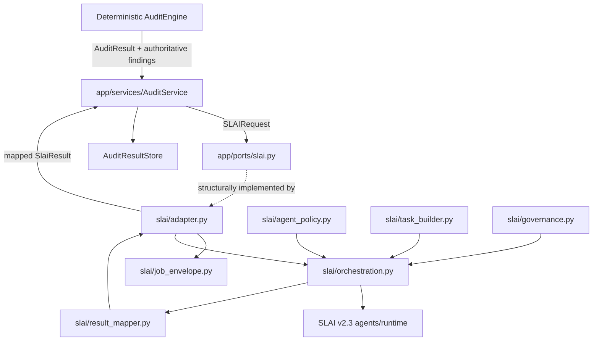
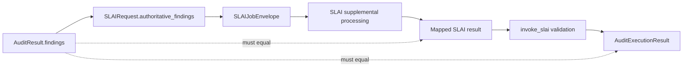

# BIMAP ↔ SLAI Integration Layer

> **Repository path:** `slai/`  
> **Runtime package:** `applications.bimap.slai`  
> **Architectural role:** governed anti-corruption layer between authoritative BIMAP audit output and the heterogeneous SLAI v2.3 agent runtime

---

## 1. Purpose

The `slai/` package integrates SLAI intelligence into BIMAP without allowing SLAI to become the owner of BIM audit truth, customer business state, or deterministic compliance findings.

Its responsibilities are deliberately narrow:

- validate and bound the BIMAP context sent to SLAI;
- decide which SLAI agents are permitted for a BIMAP job;
- translate grounded BIMAP audit data into verified SLAI-native task payloads;
- create/invoke only approved agents through the SLAI runtime;
- apply privacy/quality/safety/governance gates around supplemental processing;
- perform health/readiness checks;
- map runtime outputs into a stable BIMAP-facing result; and
- preserve the deterministic authoritative `FindingContract` set unchanged.

The central rule is:

> **SLAI enhances a completed grounded BIMAP audit; it does not replace the deterministic Audit Engine.**

---

## 2. Architectural position



The app-facing contract is now explicitly defined in `app/ports/slai.py`. The `SLAIAdapter` is the runtime implementation of that structural port.

---

## 3. Package structure

```text
slai/
├── README.md
├── __init__.py
├── adapter.py
├── agent_policy.py
├── governance.py
├── health.py
├── job_envelope.py
├── orchestration.py
├── result_mapper.py
├── task_builder.py
│
└── utils/
    ├── __init__.py
    ├── slai_errors.py
    └── slai_helpers.py
```

`task_builder.py` is a current first-class part of the integration and must appear in the package tree and dependency description. Older documentation that omits it is incomplete. The utilities package uses `utils/__init__.py`; there is no architectural `utils/__all__.py` module.

---

## 4. What this layer is — and is not

### It is

- an anti-corruption layer;
- a runtime safety/governance boundary;
- a task-translation boundary;
- a health/readiness boundary;
- a result-mapping boundary;
- a controlled place where BIMAP may invoke selected SLAI agents.

### It is not

- the deterministic BIM audit engine;
- a parser for raw customer RVT/RFA/IFC/DWG files;
- an order/account/payment/entitlement service;
- a persistence layer;
- a report renderer;
- a replacement for domain governance/review;
- a general-purpose gateway exposing every SLAI agent to the BIMAP frontend.

---

## 5. Application-facing SLAI port

The stable public boundary consumed by `AuditService` lives in `app/ports/slai.py`, not in this package.

Current port concepts are:

```text
SlaiResult
SlaiHealth
SLAIRequest
SLAIPort
invoke_slai(...)
```

`SLAIPort` exposes only:

```text
process_audit_job(...)
check_liveness()
check_readiness(...)
close()
shutdown()
```

This prevents the application layer from depending on:

- `AgentFactory`;
- `SharedMemory`;
- orchestration phases;
- raw SLAI exceptions;
- individual agent methods;
- SLAI-native result classes.

`invoke_slai()` also validates the mapped result before the application accepts it.

---

## 6. `adapter.py` — narrow runtime façade

`SLAIAdapter` is the application-facing façade over this package.

Its intended responsibilities are:

1. accept a validated `AuditJob` plus grounded deterministic audit context;
2. preserve the authoritative finding sequence supplied by the application;
3. construct/validate the SLAI job envelope;
4. delegate controlled execution to `SLAIOrchestrator`;
5. map the orchestration result through `result_mapper.py`;
6. expose liveness/readiness; and
7. own shutdown/cleanup of resources it was constructed to own.

`adapter.py` should not duplicate orchestration logic or construct business-domain findings.

### Current documentation correction

The current module header in `adapter.py` contains stale wording claiming that `app/ports/slai.py` does not yet define a concrete Protocol/ABC. That is no longer true: `SLAIPort`, `SLAIRequest`, `SlaiResult`, `SlaiHealth`, and the safe invocation helpers now exist in the application layer. The implementation should be treated as satisfying that formal structural port.

---

## 7. `job_envelope.py` — bounded grounded input

`SLAIJobEnvelope` is the validated runtime envelope passed into SLAI orchestration.

Its role is to carry stable BIMAP execution identity and grounded context without passing arbitrary application objects or unbounded customer state into agents.

The envelope is expected to preserve concepts such as:

- job identity;
- order identity;
- product identity/version context;
- correlation identity;
- grounded deterministic payload;
- authoritative finding linkage;
- requested/allowed agent scope;
- bounded context size and task overrides where configured.

The envelope must be integrity-checkable before agent execution.

---

## 8. `agent_policy.py` — which agents may participate

`SLAIAgentPolicy` owns BIMAP's allow/deny policy for SLAI agent participation.

The policy is a safety and architecture mechanism, not a frontend preference list. Requested agents must still be compatible with:

- the BIMAP integration profile;
- runtime availability/readiness;
- the task builder's verified translation support; and
- the allowed orchestration phase.

The orchestrator creates only agents authorized by the effective policy for the validated envelope.

A client must never be able to bypass this policy by supplying an arbitrary agent name in HTTP data.

---

## 9. `task_builder.py` — semantic translation boundary

`BIMAPSLAITaskBuilder` is one of the most important current additions to the integration.

It translates already-grounded BIMAP audit context into the heterogeneous task shapes expected by verified SLAI public agent APIs.

It explicitly does **not**:

- create findings;
- create requirements;
- create evidence;
- execute deterministic rules;
- instantiate agents;
- call `AgentFactory`;
- use `SharedMemory` directly;
- persist customer data;
- route agents;
- bypass `SLAIAgentPolicy`;
- fabricate incompatible task inputs.

### 9.1 Resolution precedence

Task resolution follows this order:

```text
phase-specific task_overrides
        ↓
agent-specific task_overrides
        ↓
BIMAPSLAITaskBuilder automatic translation
        ↓
explicit failure
```

This is intentional. Legitimate SLAI-native inputs that cannot be derived safely from a normal BIMAP post-audit result can still be supplied explicitly by a trusted caller, while automatic translation remains conservative.

---

## 10. Automatically supported agents

The current task builder automatically supports only agents whose public task contracts can consume normal grounded BIMAP audit context without semantic fabrication:

| Agent | Allowed automatic phase(s) | Role in BIMAP integration |
|---|---|---|
| `quality` | ingress quality, egress quality | Quality checks around grounded payload/output |
| `privacy` | ingress privacy, egress privacy | Privacy gate/sanitization path |
| `collaborative` | analysis | Structured collaborative assessment |
| `knowledge` | analysis | Knowledge/retrieval/prediction path compatible with grounded context |
| `reasoning` | analysis | Supplemental reasoning over grounded audit context |
| `language` | analysis | Language-level processing over grounded context |
| `safety` | egress safety | Safety gate over supplemental output |
| `observability` | observability | Runtime/telemetry-oriented observation |

Automatic support is intentionally narrower than “agents available in SLAI.”

---

## 11. Explicit-input-only agents

The current builder refuses to fabricate normal BIMAP tasks for these agents:

| Agent | Why automatic BIMAP task construction is rejected |
|---|---|
| `reader` | Requires reader-native file/document inputs not present in the normal post-audit context |
| `perception` | Requires valid perception/image/tensor-style inputs |
| `planning` | Current public execution surface does not expose a verified domain-remediation planning contract |
| `execution` | Executable work must be explicitly constructed and separately authorized; findings must never imply automatic action |
| `evaluation` | Current `execute_validation_cycle()` evaluates SLAI/system dimensions and is not a domain-neutral BIM audit-result evaluator |
| `learning` | Live customer audits must not implicitly become training/learning events |
| `adaptive` | Live audit execution must not implicitly adapt policy |
| `qnn` | No verified implicit BIMAP audit task contract exists |

This restriction is an architectural safety feature, not missing functionality to be “worked around.”

If one of these agents becomes appropriate later, its task contract should first be verified and documented explicitly rather than fed a fabricated generic mapping.

---

## 12. `orchestration.py` — the only agent-construction/invocation module

`SLAIOrchestrator` is the only module in `applications.bimap.slai` that should construct and invoke SLAI agents.

It consumes:

- a validated `SLAIJobEnvelope`;
- `SLAIAgentPolicy`;
- runtime factory/shared-memory dependencies;
- task-builder behavior; and
- governance/health boundaries.

It creates only authorized agents, performs readiness checks, coordinates shared-memory handoff, executes ordered phases, records invocation telemetry, and returns `SLAIOrchestrationResult`.

It must not parse raw BIM model files, run deterministic BIM rules, mutate canonical findings, render reports, or own worker retry/exactly-once semantics.

---

## 13. Current orchestration phases

Stable orchestration phase names are:

```text
ingress_quality
ingress_privacy
analysis
egress_quality
egress_evaluation
egress_safety
egress_privacy
observability
```

These phase names provide deterministic telemetry/governance structure around heterogeneous agents.

Not every phase must invoke an agent for every job. Effective execution is constrained by policy, requested/default agent scope, readiness, task availability, gate decisions, and early termination.

---

## 14. Invocation records and orchestration results

`AgentInvocationRecord` captures auditable metadata for one SLAI agent invocation, including:

- agent;
- phase;
- start/completion time;
- duration;
- success flag;
- output type/output where explicitly included;
- structured error metadata.

Raw output is excluded by default from the normal serialized invocation metadata.

`SLAIOrchestrationResult` captures the complete runtime result prior to BIMAP result mapping, including:

- job/order/correlation identity;
- requested agent sequence;
- invocation records;
- agent outputs;
- phase outputs;
- gate outputs;
- health report;
- early-termination state/reason;
- privacy-sanitized payload where applicable.

The result validates timestamp/identity/gate shape and early-termination consistency.

---

## 15. `governance.py` — runtime gates, not domain decisions

This module governs whether SLAI processing/output is acceptable to proceed through the integration runtime.

It should be understood separately from `domain/governance/`:

```text
slai/governance.py
    -> runtime safety/privacy/quality acceptance of supplemental agent processing

domain/governance/
    -> canonical BIMAP review/decision business semantics
```

SLAI runtime governance must not emit authoritative compliance decisions merely because an agent produced persuasive text.

---

## 16. `health.py` — SLAI liveness/readiness

The health layer reports whether the integration is alive and whether the required agent/runtime dependencies are ready for use.

The app-facing `SLAIPort` exposes both:

```text
check_liveness()
check_readiness(required_agents=..., prepare=...)
```

Readiness should account for the explicit/default agent set relevant to the deployment rather than equating “Python process exists” with “all required SLAI capability is usable.”

Health data is projected through the API health route; the API does not inspect `AgentFactory` directly.

---

## 17. `result_mapper.py` — stable BIMAP-facing result

The result mapper converts internal `SLAIOrchestrationResult` into the stable result surface expected by the application port.

Its most important responsibility is preserving the separation between:

- **authoritative deterministic findings**; and
- **supplemental SLAI outputs/metadata**.

The mapper should normalize runtime-specific values into JSON-safe BIMAP-owned structures and expose mapping warnings when information cannot be projected safely.

It must not synthesize deterministic findings from free-form agent text.

---

## 18. Authoritative finding invariant

The full protection chain is:



`app/ports/slai.py:invoke_slai()` rejects a mapped result if its authoritative finding tuple differs from the input request.

`AuditExecutionResult` validates the invariant again against the deterministic `AuditResult`.

This redundancy is deliberate because it protects BIMAP's authority boundary at both the SLAI port and complete audit-result levels.

---

## 19. Grounded-context rule

SLAI receives the deterministic audit context produced by BIMAP, not an independently re-parsed interpretation of the customer's model.

Current application behavior uses:

```text
AuditResult.to_dict()
    ↓
SLAIRequest.grounded_context
```

This prevents the supplemental layer from silently using a different source-of-truth representation than the deterministic audit path.

If privacy ingress modifies the runtime payload, the task builder receives the sanitized current payload supplied by the orchestrator rather than reaching around the privacy gate to reconstruct the original data.

---

## 20. Shared memory and AgentFactory

`AgentFactory` and `SharedMemory` belong inside the SLAI runtime integration and deployment composition.

They must not leak into:

- API route constructors;
- application services;
- domain models;
- persisted Audit Workspace schema as opaque Python objects.

Only `orchestration.py` should construct/invoke agents inside this package.

---

## 21. Task overrides

Task overrides exist for trusted cases where an agent requires legitimate SLAI-native input that cannot be derived automatically from normal grounded audit output.

They are not a way to bypass:

- agent policy;
- allowed phases;
- envelope integrity;
- privacy/safety gates;
- application finding invariants.

Overrides must remain bounded, explicit, and validated.

---

## 22. Error model

`slai/utils/slai_errors.py` defines the SLAI-integration-specific error vocabulary.

Errors should capture integration/runtime contract failures without exposing raw agent internals to the API.

The expected translation direction is:

```text
SLAI/native agent/runtime exception
        ↓
slai integration error
        ↓
app/ports/slai.py invocation wrapper
        ↓
AppPortOperationError / AppPortUnavailableError / AppPortTimeoutError etc.
        ↓
API safe mapping
```

Application code should not need to know specific SLAI internal exception classes.

---

## 23. Helpers

`slai/utils/slai_helpers.py` centralizes normalization required by the integration, including concepts such as:

- agent name/sequence normalization;
- JSON-safe mapping projection;
- bounded text/context handling;
- UTC datetime formatting/validation;
- reusable logging/action helpers.

Helpers should not become hidden orchestration logic.

---

## 24. Data privacy and customer-data constraints

The SLAI integration is especially sensitive because it handles derived customer audit context.

Required principles:

1. do not pass raw customer files to agents unless an explicitly verified reader/perception workflow is designed;
2. do not use live audit data for implicit learning/adaptation;
3. do not persist agent-private runtime objects in the Audit Workspace;
4. sanitize through the privacy phase where configured;
5. include only JSON-safe projections of prior outputs in automatically generated downstream tasks;
6. do not log full grounded payloads by default;
7. maintain explicit correlation/job/order identity for traceability.

---

## 25. Early termination

The orchestrator may terminate supplemental processing early when governance/readiness/runtime conditions require it.

Early termination must be explicit:

```text
terminated_early = True
termination_reason = non-empty reason
```

A terminated SLAI pass does not invalidate or erase the already-produced deterministic audit result. The application can still distinguish deterministic audit truth from incomplete supplemental intelligence.

---

## 26. Dependency direction and circular-import boundary

The internal dependency direction should remain one-way:

```text
utils
  ↓
agent_policy / job_envelope / health / governance / task_builder
  ↓
orchestration
  ↓
result_mapper
  ↓
adapter
```

`orchestration.py` must not import `result_mapper.py` or `adapter.py`. This is an intentional circular-import boundary.

`task_builder.py` may depend on integration primitives and orchestration phase vocabulary, but it must not instantiate agents or perform routing.

---

## 27. Deployment composition

The current development deployment imports and injects `BIMAPSLAITaskBuilder` explicitly from this package.

The deployment/bootstrap layer is responsible for selecting:

- SLAI profile/configuration;
- required/default agents;
- `AgentFactory`/`SharedMemory` dependencies;
- task builder;
- policy/governance settings;
- adapter ownership/lifecycle.

`slai/` should not read frontend state or silently choose deployment policy from environment variables that belong to the composition root.

---

## 28. Testing expectations

### Unit tests

Cover:

- envelope identity/context-size validation;
- agent policy allow/deny behavior;
- task builder automatic agent mappings;
- rejection of explicit-input-only agents without trusted overrides;
- phase restrictions;
- JSON-safe prior-output projection;
- governance gate behavior;
- health result validation;
- orchestration invocation ordering;
- early termination invariants;
- result mapper serialization/warnings;
- exact authoritative finding preservation;
- adapter lifecycle/health behavior.

### Integration tests

Use controlled fake agents/factories where possible to verify:

- only authorized agents are instantiated;
- readiness is checked before execution;
- privacy-modified payload is used downstream;
- no raw agent object leaks into mapped results;
- a changed authoritative finding sequence is rejected by `invoke_slai()`;
- completed mapped results can be persisted inside the application Audit Workspace.

---

## 29. Current implementation/documentation corrections

The current repository requires these corrections to older `slai/README.md` content:

1. `task_builder.py` now exists and is a central semantic translation boundary.
2. `app/ports/slai.py` now formally defines the application-facing port and validation helpers.
3. `adapter.py` should be described as the structural implementation of that port, not as a temporary façade waiting for a port to exist.
4. `utils/` contains `__init__.py`, `slai_errors.py`, and `slai_helpers.py`; documentation should not list a non-existent `utils/__all__.py` module.
5. Automatic task translation is deliberately limited to quality, privacy, collaborative, knowledge, reasoning, language, safety, and observability.
6. Reader, perception, planning, execution, evaluation, learning, adaptive, and QNN remain explicit-input-only under the current verified contracts.
7. Evaluation is specifically not auto-used because the current SLAI `execute_validation_cycle()` is system/SLAI-oriented rather than a domain-neutral BIM audit-result evaluator.

---

## 30. Extension checklist

Before increasing SLAI involvement in BIMAP:

1. Confirm the deterministic Audit Engine remains authoritative for the target decision.
2. Identify the exact public SLAI agent API being used.
3. Verify that normal grounded BIMAP data can satisfy that API without fabrication.
4. Add automatic task translation only when semantics are safe and testable.
5. Otherwise require an explicit trusted task override.
6. Define the allowed orchestration phase.
7. Update `SLAIAgentPolicy`/profile configuration deliberately.
8. Add readiness checks for the required agent.
9. Normalize result data through the mapper; do not persist raw runtime objects.
10. Preserve the exact authoritative finding tuple.
11. Add tests for gate/early-termination/error behavior.
12. Update this README.

---

## 31. Summary

`slai/` is the controlled intelligence boundary that lets BIMAP benefit from SLAI without making the integration intrusive or authoritative over deterministic audit truth.

The intended flow is:

```text
Deterministic BIMAP AuditResult
    ↓
SLAIRequest + authoritative findings
    ↓
validated envelope + policy
    ↓
verified task translation
    ↓
governed SLAI orchestration
    ↓
BIMAP result mapping
    ↓
application invariant validation
    ↓
persisted Audit Workspace
```

The safest way to increase SLAI's involvement is therefore **not** to call more agents indiscriminately. It is to extend verified, phase-specific task mappings and result projections while preserving the application port, governance gates, and deterministic finding authority.
