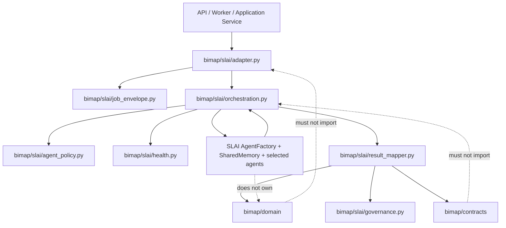
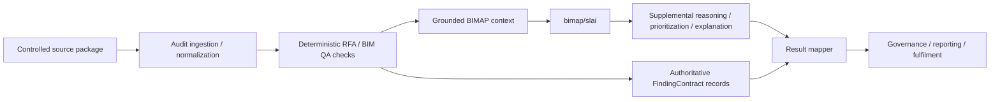
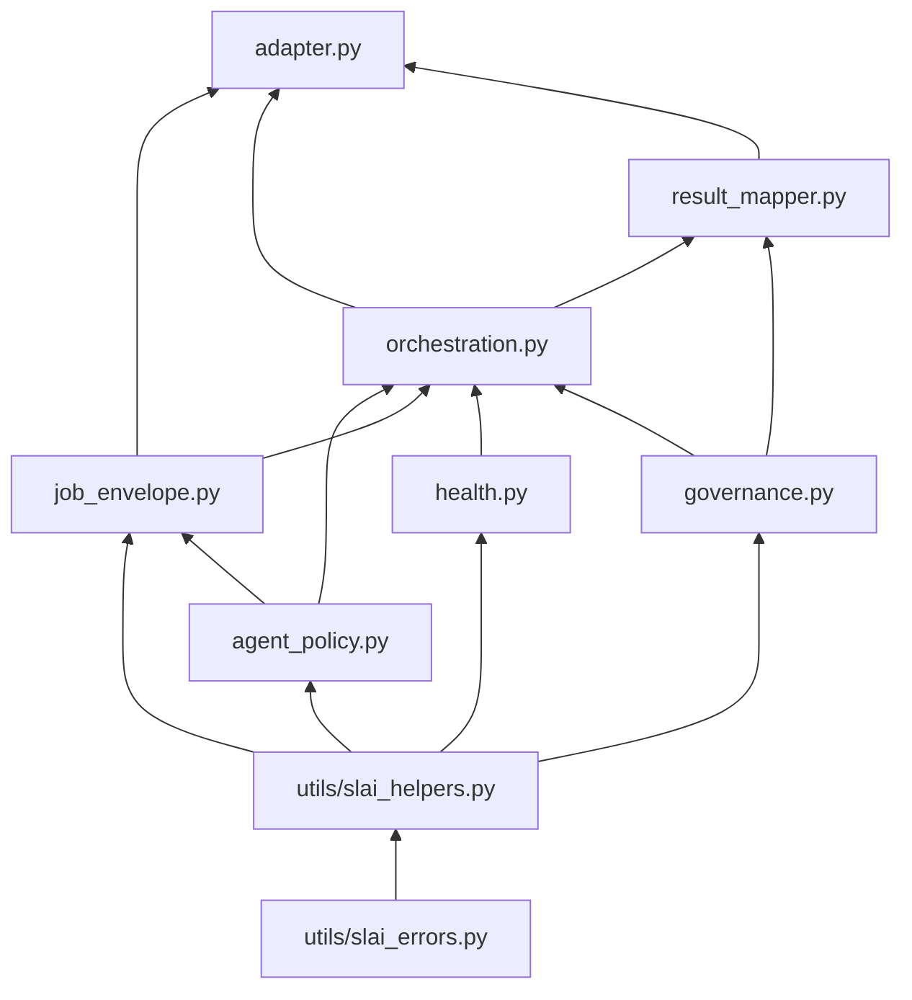
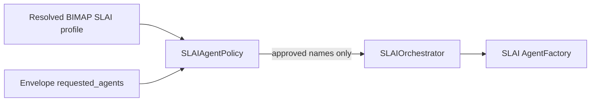
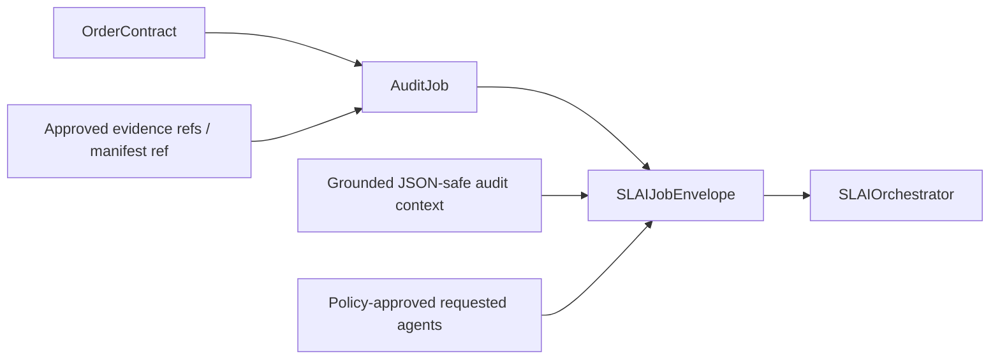
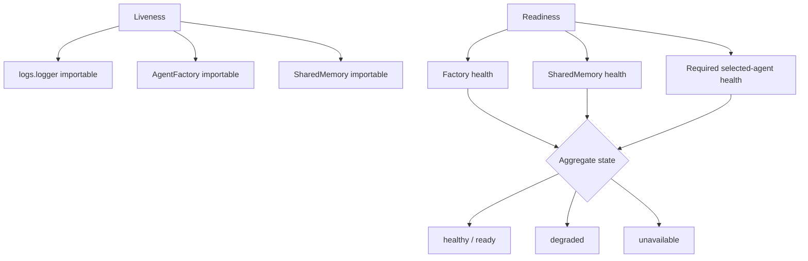
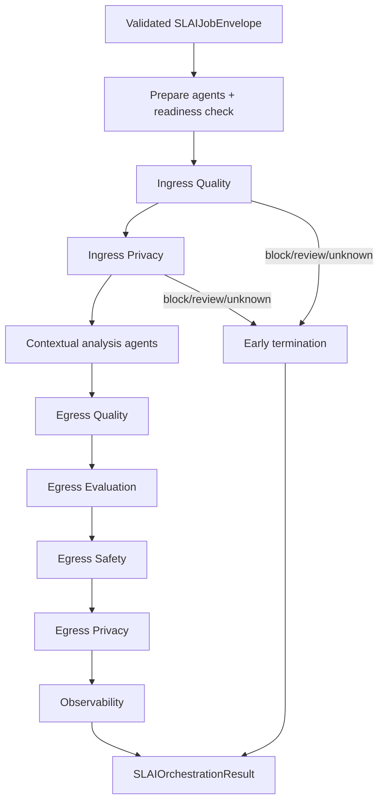
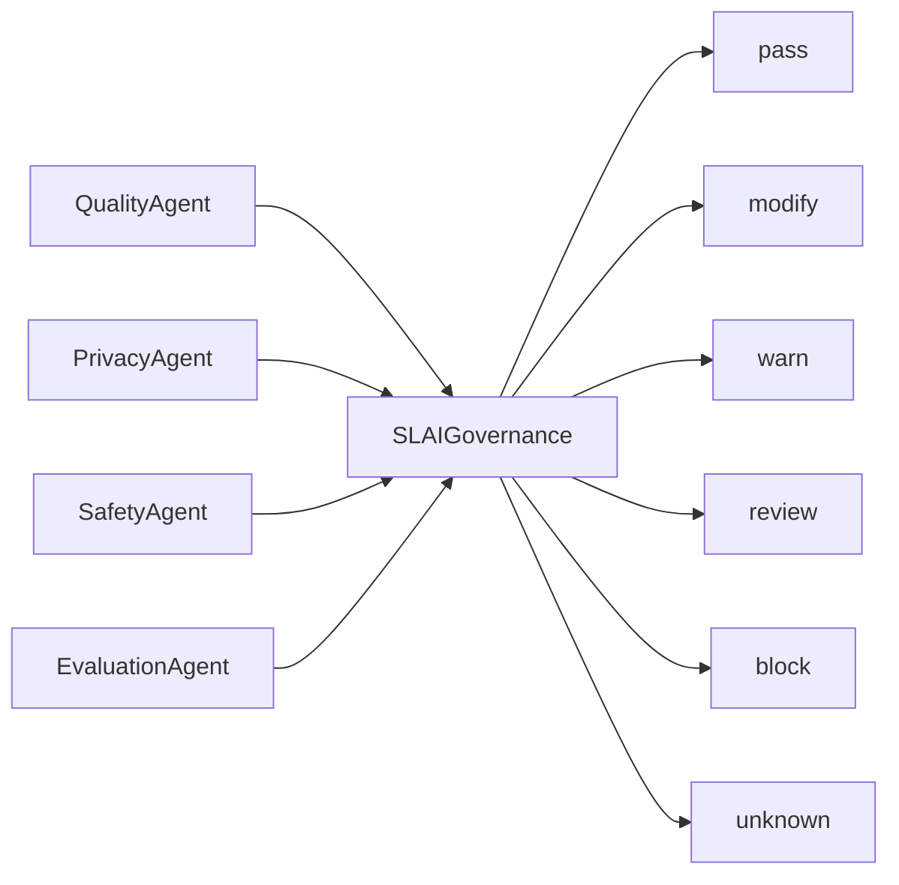
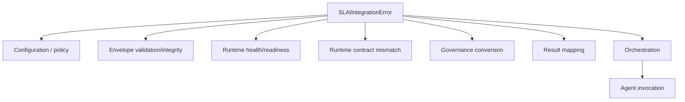
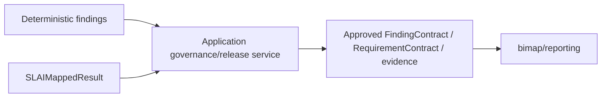

# BIMAP SLAI Integration Layer

> **Package:** `bimap.slai`  
> **Architectural role:** Governed anti-corruption and runtime-integration boundary between the R3D BIM Audit Platform (BIMAP) and SLAI v2.3  
> **Runtime position:** Above BIMAP domain/contracts and the deterministic audit engine; below application services/workers; adjacent to the SLAI runtime installed at the SLAI repository root

---

## 1. Purpose

The `slai/` package is BIMAP's controlled boundary into SLAI. It allows BIMAP to use selected SLAI capabilities for contextual analysis, cross-evidence reasoning, quality/privacy/safety/evaluation gating, language synthesis, observability, and other explicitly authorized functions without allowing the SLAI runtime to become the owner of BIMAP's domain model, deterministic audit rules, order lifecycle, or report contracts.

The package exists to answer questions such as:

- Which SLAI agents may BIMAP invoke for a particular deployment profile?
- How is a versioned BIMAP `AuditJob` converted into an immutable runtime envelope without embedding raw files or application objects?
- How does BIMAP verify SLAI liveness and readiness before a paid audit job starts?
- How are SLAI agents created through the existing SLAI `AgentFactory` without duplicating factory lifecycle logic?
- How does BIMAP pass job-scoped grounded state through SLAI `SharedMemory` without using global unscoped keys?
- How are ingress and egress governance stages kept distinct from contextual analysis stages?
- How are SLAI-native Quality, Privacy, Safety, and Evaluation outcomes translated into stable BIMAP governance dispositions?
- How are SLAI outputs mapped back into BIMAP without rewriting authoritative deterministic findings?
- Which object does an application service or worker call so it does not need to know about `AgentFactory`, `SharedMemory`, or individual agents?
- How are failures represented with stable error codes and non-sensitive diagnostics?

The package does **not** own raw-file upload security, BIM/RFA parsing, deterministic rule execution, requirement extraction, order/payment state transitions, queue retry/exactly-once guarantees, report rendering, object-storage publication, or customer authorization. Those concerns remain in their corresponding BIMAP layers.

The governing architectural principle is:

> **BIMAP owns audit meaning; SLAI supplies policy-approved reasoning and governance capabilities around grounded BIMAP evidence.**

---

## 2. Architectural principles

### 2.1 SLAI is a governed runtime dependency, not BIMAP's domain model

BIMAP is installed inside the SLAI repository and runs from the SLAI root, but source-tree proximity does not collapse the architectural layers.



The intended rule is one-way:

> **Higher BIMAP integration code may consume SLAI; lower BIMAP domain/contracts must not depend on the SLAI integration package.**

### 2.2 Evidence first, contextual reasoning second

The integration layer assumes that BIMAP has already established a grounded audit context from controlled evidence. It must not allow generative or probabilistic reasoning to silently replace deterministic facts.



SLAI output is therefore supplemental unless a future explicit contract defines a new inferred-finding workflow. The current mapper does not manufacture findings from arbitrary agent text.

### 2.3 One authoritative owner per concept

| Concept | Authoritative owner |
|---|---|
| SLAI integration error vocabulary | `slai/utils/slai_errors.py` |
| SLAI boundary validation/serialization helpers | `slai/utils/slai_helpers.py` |
| BIMAP SLAI agent authorization | `slai/agent_policy.py` |
| External audit work contract | `contracts/audit_job.py` |
| BIMAP-to-SLAI runtime envelope | `slai/job_envelope.py` |
| SLAI liveness/readiness interpretation | `slai/health.py` |
| SLAI-native gate normalization | `slai/governance.py` |
| SLAI agent construction/invocation sequence | `slai/orchestration.py` |
| SLAI-to-BIMAP supplemental result projection | `slai/result_mapper.py` |
| Application-facing SLAI façade | `slai/adapter.py` |
| Canonical BIMAP finding interchange schema | `contracts/finding.py` |
| Canonical finding severity/confidence/provenance | `domain/findings/*` |
| Canonical governance decisions/reviews | `domain/governance/*` |
| SLAI agent construction/cache/lifecycle internals | SLAI `src/agents/agent_factory.py` |
| SLAI shared runtime memory internals | SLAI `src/agents/collaborative/shared_memory.py` |

No sibling integration module should recreate these responsibilities.

---

## 3. Package structure

```text
bimap/slai/
├── __init__.py
├── README.md
│
├── adapter.py
├── agent_policy.py
├── governance.py
├── health.py
├── job_envelope.py
├── orchestration.py
├── result_mapper.py
│
└── utils/
    ├── __all__.py
    ├── slai_errors.py
    └── slai_helpers.py
```

Configuration is intentionally external to the package implementation:

```text
bimap/configs/slai_profile.yaml
        ↓
bimap/bootstrap.py
        ↓
SLAIAgentPolicy(profile=...)
```

`agent_policy.py` does not independently reopen the YAML file. Bootstrap/application composition owns configuration loading and passes the resolved profile into the integration layer.

---

## 4. Module responsibilities

| Module | Primary responsibility | Allowed BIMAP/SLAI dependencies | Must not own |
|---|---|---|---|
| `utils/slai_errors.py` | Stable integration exception hierarchy, retry metadata, redacted diagnostic context | standard library, SLAI logger/PrettyPrinter | orchestration logic, HTTP mapping, raw evidence logging |
| `utils/slai_helpers.py` | Shared validation, UTC timestamps, canonical JSON, hashing, safe diagnostics, health/decision normalization | SLAI integration errors, standard library | agent construction, domain rules |
| `agent_policy.py` | Allow/deny and tier policy for BIMAP's SLAI agent surface | integration utils, injected profile data | AgentFactory construction, YAML I/O, audit sequencing |
| `job_envelope.py` | Immutable integrity-checked runtime envelope around `AuditJob` and grounded context | `contracts/audit_job.py`, agent policy, integration utils | raw files, database clients, SLAI agents, queue retries |
| `health.py` | Side-effect-free liveness/readiness assessment of SLAI runtime components and selected agents | integration utils; injected factory/memory/agents | constructing runtime components, application monitoring backend |
| `governance.py` | Translate native Quality/Privacy/Safety/Evaluation outputs into neutral BIMAP gate dispositions and canonical finding governance | domain governance/findings, integration utils | agent invocation, product threshold invention |
| `orchestration.py` | Construct selected agents through SLAI `AgentFactory`, coordinate phase ordering, shared-memory handoff, native invocation and runtime result capture | policy/envelope/health/governance, SLAI factory/shared memory | deterministic BIM rules, result rendering, report release decisions |
| `result_mapper.py` | Project orchestration outputs into BIMAP-owned supplemental results while preserving authoritative `FindingContract` records unchanged | orchestration, governance, finding contract | inferred finding fabrication, deterministic rule mutation |
| `adapter.py` | Narrow application-facing façade combining envelope creation, orchestration, mapping, health and lifecycle | orchestration, result mapper, audit/finding contracts | API routing, worker retry policy, formal app-port semantics not yet defined |

---

## 5. Internal dependency direction

The package is intentionally layered to prevent circular imports.



The arrows mean **"is consumed by"**.

Important reverse imports are forbidden:

```text
utils/*               MUST NOT import any higher slai module
agent_policy.py       MUST NOT import orchestration.py/adapter.py
job_envelope.py       MUST NOT import orchestration.py/result_mapper.py/adapter.py
health.py             MUST NOT import orchestration.py/adapter.py
governance.py         MUST NOT import orchestration.py/result_mapper.py/adapter.py
orchestration.py      MUST NOT import result_mapper.py/adapter.py
result_mapper.py      MUST NOT import adapter.py
contracts/*           MUST NOT import bimap/slai/*
domain/*              MUST NOT import bimap/slai/*
```

---

## 6. Agent policy

`SLAIAgentPolicy` is the authorization boundary between the BIMAP product and SLAI's broader research/runtime surface.

### 6.1 Baseline agent tiers

The baseline profile is deliberately narrower than the complete SLAI agent registry.

| Tier | Baseline agents | Meaning |
|---|---|---|
| **Core** | collaborative, evaluation, reader, knowledge, language, observability, planning, privacy, quality, reasoning, safety | Required baseline BIMAP SLAI capabilities |
| **Conditional** | perception | Allowed only when the job genuinely contains relevant image/screenshot evidence |
| **Supporting** | execution | Available for controlled approved execution/packaging roles, not a default reasoning requirement |
| **Deferred** | learning, adaptive | Disabled until a separately governed feedback/learning design is established |
| **Disabled** | qnn | No demonstrated BIMAP requirement; hard-disabled in the baseline policy |

The policy is fail-closed: unknown agents are not implicitly authorized, and hard-disabled entries cannot be turned into a normal enabled agent through accidental profile data.

### 6.2 Policy versus factory



`AgentFactory` answers *how* to construct a registered SLAI agent. `SLAIAgentPolicy` answers *whether BIMAP is allowed to request it*. The two responsibilities must not be merged.

---

## 7. Job envelope

`SLAIJobEnvelope` is the stable BIMAP runtime work unit consumed by orchestration.

It composes rather than replaces the existing external `AuditJob` contract.



The envelope carries:

- the immutable `AuditJob`;
- policy-approved requested agents;
- grounded JSON-safe BIMAP context;
- a correlation identifier;
- a UTC creation timestamp;
- a deterministic context digest.

It intentionally does **not** carry:

- raw customer file bytes;
- database/storage clients;
- `AgentFactory` or agent instances;
- complete application aggregates;
- report renderer state;
- queue retry state.

`assert_integrity()` verifies that the grounded context still matches its recorded digest. `assert_policy()` revalidates the requested agent set against the effective policy before runtime execution.

---

## 8. Health model

`SLAIHealthCheck` separates **liveness** from **readiness**.



A process can be alive while a required agent is not ready. Application/worker code should therefore use readiness before starting an audit job that depends on a declared agent set.

Health checking does not instantiate agents by itself. Runtime creation remains the orchestrator/factory responsibility.

---

## 9. Orchestration lifecycle

`SLAIOrchestrator` is the only BIMAP SLAI module that constructs and directly invokes SLAI agents.

### 9.1 Runtime construction

The orchestrator creates a single `SharedMemory` and `AgentFactory` when they are not injected. It requests only envelope-authorized agents through:

```text
AgentFactory.get_agent(agent_name, shared_memory=shared_memory)
```

It does **not** manually call every agent's `initialize()` method. SLAI v2.3 `AgentFactory` already owns construction, dependency resolution, caching, constructor injection, lifecycle state, fallback handling, and release/shutdown behavior. Repeating that lifecycle inside BIMAP would create duplicate initialization and ownership ambiguity.

### 9.2 Phase sequence



The contextual analysis order is deterministic within BIMAP:

```text
collaborative
→ reader
→ perception       # only if requested/allowed
→ knowledge
→ reasoning
→ planning
→ language
→ execution        # only if requested/allowed
```

The order does not imply that every product must invoke every optional agent. `requested_agents` and policy remain authoritative.

### 9.3 Ingress versus egress gates

Ingress gates evaluate whether the grounded payload is fit to enter the SLAI analysis path. Egress gates evaluate the resulting analysis state before downstream release handling.

An ingress Privacy `modify` decision replaces the current orchestration payload with the returned `sanitized_payload`; it does not mutate the immutable job envelope or original external evidence contract.

### 9.4 Early termination

`review`, `block`, and `unknown` ingress dispositions prevent the normal analysis sequence. The orchestration result records:

- `terminated_early=True`;
- an explicit `termination_reason`;
- all invocations completed before termination;
- whatever governance gates actually returned.

Missing later gates remain missing at orchestration time and become explicit `UNKNOWN` results when `SLAIGovernance.evaluate_gates()` evaluates the required gate set. They are never silently interpreted as approval.

---

## 10. Agent-native task contract boundary

This boundary is intentionally strict because the current repository does not yet define a canonical BIMAP application-level SLAI task DTO in `app/ports/slai.py` or `audit_engine/result.py`.

SLAI v2.3 agents do not all consume the same task schema. For example:

| Agent | Verified invocation surface used by BIMAP | Important shape constraint |
|---|---|---|
| Quality | `perform_task(task_data)` | mapping; normal batch evaluation expects records plus dataset/source identity |
| Privacy | `perform_task_privacy(input_data, context=None)` | privacy-specific mapping; may contain payload, purpose, identifiers, retention/policy inputs |
| Evaluation | `execute_validation_cycle(params)` | mapping/dict parameters |
| Other selected agents | `perform_task(task_data)` | agent-specific task semantics remain owned by SLAI agent implementation |

BIMAP therefore does **not** create a universal fake wrapper such as `{"operation": "bimap_audit"}` and assume every agent understands it.

Instead `SLAIOrchestrator.orchestrate()` resolves each invocation task from one of two explicit sources:

1. `task_overrides` supplied by the caller, or
2. an injected phase-aware `task_builder`.

Task keys may be:

```text
agent
```

or the more specific:

```text
phase:agent
```

Examples:

```text
ingress_quality:quality
ingress_privacy:privacy
analysis:reasoning
egress_evaluation:evaluation
egress_safety:safety
egress_privacy:privacy
observability:observability
```

A phase-specific value takes precedence over the generic agent key.

If neither an explicit task nor a task builder can produce the native payload, orchestration raises `SLAIRuntimeContractError`. This is deliberate. Fabricating a Quality dataset identifier, a Privacy processing purpose, an Evaluation parameter set, or an agent-specific task schema would make the integration appear functional while changing product semantics without evidence.

### 10.1 Recommended next contract step

When BIMAP's simple first implementation stabilizes, a dedicated application-level task-plan contract may be introduced above `bimap/slai/` if recurring task shapes become stable. That future contract should be derived from actual audit-engine outputs and SLAI call requirements. It should not be invented inside `orchestration.py` merely for convenience.

---

## 11. Shared-memory ownership

The orchestrator uses a correlation-scoped namespace for BIMAP-owned handoff values:

```text
bimap.<correlation_id>.envelope
bimap.<correlation_id>.grounded_context
bimap.<correlation_id>.output.<phase>.<agent>
```

This prevents unrelated BIMAP jobs from deliberately sharing the same BIMAP integration keys.

By default, the orchestrator deletes the BIMAP-owned keys it created when a job completes or fails. `retain_shared_memory=True` may be used only when an enclosing runtime explicitly owns retention/cleanup.

Important boundary:

> The orchestrator can only clean keys that **BIMAP itself created and recorded**. Individual SLAI agents may publish their own internal shared-memory records according to their SLAI configuration. Their TTL/retention behavior remains an SLAI-agent/runtime responsibility and must be included in deployment-level privacy/retention validation.

---

## 12. Governance translation

`governance.py` acts as an anti-corruption layer between SLAI-native terminology and BIMAP governance semantics.



The native vocabularies remain agent-specific. The mapper does not force all SLAI agents to emit one undocumented common schema.

The normalized dispositions have distinct release meanings:

- `pass`: gate cleared;
- `modify`: Privacy permits continuation only with its sanitized payload;
- `warn`: warning information exists but does not itself force review/block;
- `review`: human or higher-level review is required;
- `block`: release/workflow must stop;
- `unknown`: required evidence/decision could not be established and must not become implicit approval.

`governance.py` also composes normalized gate results with the existing domain `GovernanceDecision`/`Review` model when a canonical domain `Finding` is available.

Product-specific confidence thresholds remain caller supplied. The integration layer does not invent a universal value.

---

## 13. Result mapping and finding authority

`SLAIResultMapper` preserves the distinction between **authoritative audit findings** and **supplemental SLAI outputs**.

### 13.1 Authoritative findings

The current complete customer-facing finding representation is `contracts/finding.py::FindingContract`. It includes fields that the smaller canonical domain `Finding` does not currently contain, including:

- `rule_id`;
- `scope`;
- `automation_type`;
- `status`;
- `observed_value`;
- `expected_value`;
- `evidence_refs`;
- `remediation`;
- `verification_method`.

For that reason, `result_mapper.py` does not attempt a lossy `FindingContract -> domain Finding -> FindingContract` round trip and does not create a second finding schema.

The supplied `FindingContract` objects are preserved unchanged.

### 13.2 Supplemental agent outputs

Every orchestration invocation becomes a `MappedAgentOutput` containing:

- agent name;
- phase;
- success state;
- source output type;
- whether the payload was safely JSON-projectable;
- the JSON-safe payload when possible;
- structured integration error metadata when present;
- an explicit note when an output is opaque/non-JSON.

Non-JSON supplemental outputs are never serialized using `repr()` as if that were canonical data. In permissive mode they become an explicit opaque record; in strict mode mapping fails.

### 13.3 No inferred-finding fabrication

The mapper deliberately does not inspect arbitrary `ReasoningAgent` or `LanguageAgent` text and synthesize a `FindingContract` from it. A future inferred-finding workflow would need, at minimum, a defined schema, evidence linkage policy, automation type, confidence semantics, validation rules, and governance path.

---

## 14. Application adapter

`SLAIAdapter` is the façade higher BIMAP layers should call.


Primary operations are:

```text
build_job_envelope(...)
orchestrate_job(...)
process_job(...)
process_audit_job(...)
check_liveness()
check_readiness(...)
close()/shutdown()
```

`process_audit_job()` is the convenience path when the caller already owns:

- a validated `AuditJob`;
- grounded JSON-safe context;
- authoritative `FindingContract` records, if any;
- the requested agent set, if different from policy defaults;
- agent-native task payloads or an orchestrator configured with a task builder.

### 14.1 Current application-port status

`bimap/app/ports/slai.py` is currently an empty scaffold. `SLAIAdapter` therefore implements the intended integration boundary structurally; it does not import or invent a Protocol/ABC that the application layer has not yet defined.

Once `app/ports/slai.py` is formalized, it should describe this narrow façade rather than moving orchestration logic into the port interface.

---

## 15. Error model

All integration failures derive from `SLAIIntegrationError` and use stable machine-readable codes.



Errors contain bounded diagnostic context and expose a structured `to_dict()` representation. Exception construction itself does not automatically spam logs; handled failures should be logged once at the architectural boundary that can act on them.

Raw customer evidence, credentials, authorization tokens, and similar sensitive values must not be added to error context.

### 15.1 Retry semantics

An exception's `retryable` flag is advisory metadata for the **application/worker layer**. The SLAI integration package does not implement distributed retry or exactly-once job submission.

In particular:

```text
queue retry / dead-letter policy      -> worker/application infrastructure
payment webhook idempotency           -> service/application layer
SLAI agent invocation error metadata  -> bimap/slai
```

Keeping those responsibilities separate prevents an internal agent retry from accidentally duplicating a commercial order/job.

---

## 16. Logging and PrettyPrinter convention

Every integration module uses the SLAI logging stack:

```python
from logs.logger import PrettyPrinter, get_logger

logger = get_logger("...")
printer = PrettyPrinter()
```

Public operations and important internal boundaries begin with a `PrettyPrinter.status(...)` diagnostic through the shared `announce_method_start(...)` helper. Structured Python logging is then used for lifecycle, completion, warnings, and failures.

Correct logger usage is:

```text
logger.debug(...)
logger.info(...)
logger.warning(...)
logger.error(...)
```

`get_logger()` returns a standard `logging.Logger`; the logger object itself is not callable.

Method-start diagnostics should contain operation names and stable IDs only. They must not echo raw customer evidence.

---

## 17. Lifecycle and ownership

`SLAIOrchestrator` and `SLAIAdapter` support explicit `close()` / `shutdown()` and context-manager usage.

```python
with SLAIAdapter(...) as slai:
    result = slai.process_audit_job(...)
```

Ownership rules:

- if the orchestrator constructs its own `AgentFactory`, it owns factory shutdown;
- if it constructs its own `SharedMemory`, it owns that memory object's shutdown;
- injected factory/memory objects remain owned by the injector;
- an adapter created without an orchestrator owns and closes its orchestrator;
- an injected orchestrator is not closed by default unless `close_orchestrator=True` is explicitly supplied.

These rules prevent double shutdown and make test/application dependency injection predictable.

---

## 18. Failure semantics

The integration layer fails explicitly at ambiguous boundaries.

| Condition | Required behavior |
|---|---|
| Unknown/disallowed agent requested | reject before AgentFactory invocation |
| Job context digest mismatch | reject before agent execution |
| Required SLAI runtime/agent unavailable | readiness failure; do not start audit analysis |
| No agent-native task payload/task builder | runtime-contract failure; do not invent task semantics |
| Quality/Privacy ingress review/block/unknown | terminate normal analysis path explicitly |
| Governance agent returns non-mapping output | runtime-contract failure |
| Privacy `modify` without usable sanitized payload | governance/runtime-contract failure |
| Supplemental output cannot be made JSON-safe | explicit opaque mapping, or fail in strict mode |
| Required governance gate absent | map to `UNKNOWN`, never implicit pass |
| SLAI free-form output resembles a finding | do not create a `FindingContract` automatically |

---

## 19. Minimal integration pattern

The following shows the intended dependency direction. The actual task payloads are deliberately represented as placeholders because they must follow the native SLAI agent contracts and BIMAP's grounded audit data.

```python
from bimap.slai import SLAIAdapter

adapter = SLAIAdapter()

envelope = adapter.build_job_envelope(
    audit_job,
    grounded_context=grounded_context,
)

result = adapter.process_job(
    envelope,
    authoritative_findings=findings,
    task_overrides={
        "ingress_quality:quality": quality_ingress_task,
        "ingress_privacy:privacy": privacy_ingress_task,
        "analysis:collaborative": collaborative_task,
        "analysis:reader": reader_task,
        "analysis:knowledge": knowledge_task,
        "analysis:reasoning": reasoning_task,
        "analysis:planning": planning_task,
        "analysis:language": language_task,
        "egress_quality:quality": quality_egress_task,
        "egress_evaluation:evaluation": evaluation_task,
        "egress_safety:safety": safety_task,
        "egress_privacy:privacy": privacy_egress_task,
        "observability:observability": observability_task,
    },
)
```

If the task construction becomes repetitive, inject one phase-aware `task_builder` into `SLAIOrchestrator` instead of duplicating task-shape logic in API routes or workers.

---

## 20. Testing and validation expectations

A production release of this package should cover at least the following test classes.

### 20.1 Policy and envelope

- default/required agent resolution;
- conditional/supporting/deferred/disabled policy behavior;
- hard-disabled QNN behavior;
- context size bounds;
- envelope serialization round trip;
- context digest tamper detection;
- policy revalidation at execution time.

### 20.2 Health

- import liveness;
- healthy/degraded/unavailable factory state;
- shared-memory health failure;
- missing required agent;
- degraded-agent policy;
- `assert_ready()` behavior.

### 20.3 Orchestration

- exact requested-agent creation through `AgentFactory`;
- no manual duplicate agent initialization;
- native method-surface validation;
- task resolution precedence (`phase:agent` before `agent`);
- explicit failure when no task is defined;
- ingress Quality early termination;
- ingress Privacy modify/block/review behavior;
- deterministic analysis order;
- egress gate order;
- correlation-scoped shared-memory cleanup;
- invocation failure translation;
- owned versus injected resource shutdown.

### 20.4 Governance and mapping

- Quality pass/warn/block normalization;
- Privacy allow/modify/block/escalate normalization;
- Safety allow/review/block normalization;
- Evaluation approval/decision normalization;
- missing required gate -> `UNKNOWN`;
- authoritative finding identity/value preservation;
- duplicate finding rejection;
- JSON-safe supplemental output projection;
- explicit opaque-output handling;
- strict mapping mode;
- no inferred finding fabrication.

### 20.5 Adapter

- envelope-only path;
- orchestration-only path;
- end-to-end map path with injected fakes;
- liveness/readiness delegation;
- closed-adapter behavior;
- context-manager shutdown semantics.

---

## 21. Security and privacy boundaries

The `slai/` package operates after infrastructure upload controls but still handles customer-derived project context. The integration must therefore retain the following constraints:

- do not place raw file bytes in the SLAI job envelope;
- do not place secrets or credentials in grounded context;
- use stable internal references rather than customer filenames as authority;
- keep diagnostic logs content-minimized;
- let Privacy `modify` replace the active runtime payload before downstream analysis;
- do not preserve BIMAP-owned shared-memory state beyond the configured lifecycle without an explicit owner;
- treat missing/unknown governance data as non-clearance;
- never expose internal chain-of-thought or unrestricted agent traces as customer report content;
- maintain tenant/order authorization outside SLAI in the service/application layer.

---

## 22. Relationship to reporting

The SLAI integration package does not directly call the reporting package.



This preserves the reporting-layer rule that report generation consumes already-authorized audit state and does not become a second governance engine.

---

## 23. Relationship to future Revit/APS integration

Revit extraction and Autodesk Platform Services processing belong upstream of this package. Whether evidence came from:

- controlled CSV/XLSX/PDF exports;
- the future R3D Revit Exporter;
- IFC/openBIM processing;
- later APS Revit Automation;

the SLAI boundary should consume the same stable BIMAP evidence/contracts wherever possible.

This keeps SLAI orchestration independent from the mechanism used to obtain source evidence.

---

## 24. Current deliberate constraints

The current repository still has two intentionally unresolved higher-level contracts:

1. `bimap/app/ports/slai.py` does not yet define a formal application Protocol/ABC.
2. `bimap/audit_engine/result.py` does not yet define a canonical phase-aware SLAI task-plan representation.

The integration layer handles those gaps conservatively:

- `SLAIAdapter` exposes a narrow structural façade without inventing an application interface;
- `SLAIOrchestrator` requires explicit agent-native tasks or an injected task builder rather than guessing a universal task schema.

These are not placeholders inside the implemented runtime logic. They are explicit architecture boundaries waiting for the corresponding application/audit-engine contracts to become defined by actual use.

---

## 25. Extension rules

When extending `bimap/slai/`:

1. Reuse `slai_errors.py` and `slai_helpers.py`; do not create module-local duplicate error/helper systems.
2. Add agent permissions to `agent_policy.py`, not directly to `orchestration.py`.
3. Keep `AuditJob` as the external job contract; extend `SLAIJobEnvelope` only for SLAI-bound runtime metadata that cannot live in the external work contract.
4. Do not import higher BIMAP layers into lower SLAI modules to gain convenience access to services.
5. Do not instantiate SLAI agents outside `orchestration.py` unless a separate, explicitly justified integration boundary is introduced.
6. Do not call `initialize()` merely because an agent exposes it; respect `AgentFactory` lifecycle ownership.
7. Add new native agent invocation surfaces only after verifying them against the targeted SLAI version.
8. Keep governance vocabularies explicit; do not silently coerce an unknown native token to pass.
9. Do not convert arbitrary agent prose into deterministic findings.
10. Keep report rendering and storage publication outside this package.
11. Preserve stable identifiers and evidence references across every mapping boundary.
12. Update this README and regression tests whenever the agent set, gate order, task contract, or ownership model changes.

---

## 26. Summary

`bimap/slai/` is a narrow, governed integration layer rather than a second application core. It:

- constrains BIMAP to an explicit SLAI agent policy;
- wraps the existing `AuditJob` in an integrity-checked runtime envelope;
- verifies runtime readiness;
- constructs agents through SLAI's own `AgentFactory`;
- coordinates ingress, analysis, egress and observability phases;
- requires explicit native agent task semantics instead of fabricating them;
- translates SLAI governance outputs into stable BIMAP dispositions;
- preserves deterministic findings as authoritative;
- maps supplemental outputs safely;
- exposes one application-facing adapter;
- owns only the runtime resources it constructs;
- keeps errors and logs structured, bounded and content-minimized.

The resulting dependency direction keeps BIMAP's evidence, findings, governance meaning, external contracts, and reporting reproducible even while SLAI provides the higher-order reasoning and governance capabilities around them.
