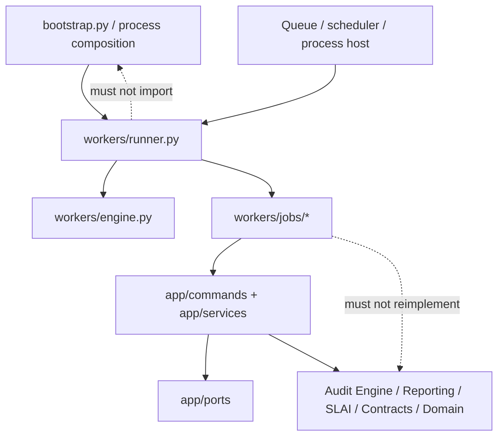
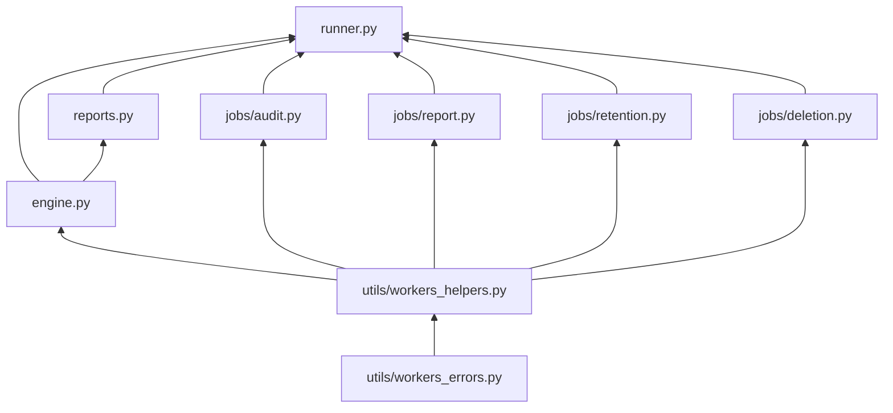
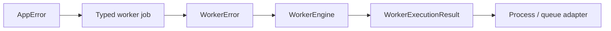
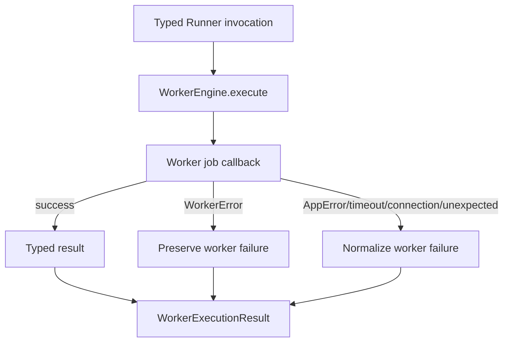
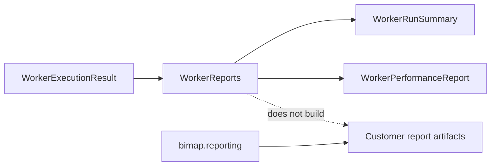
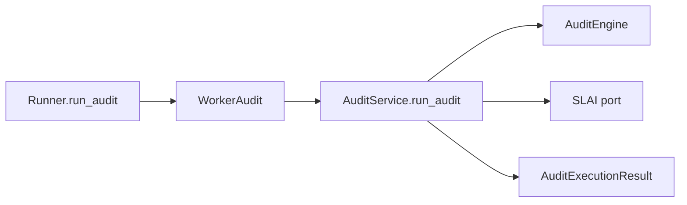
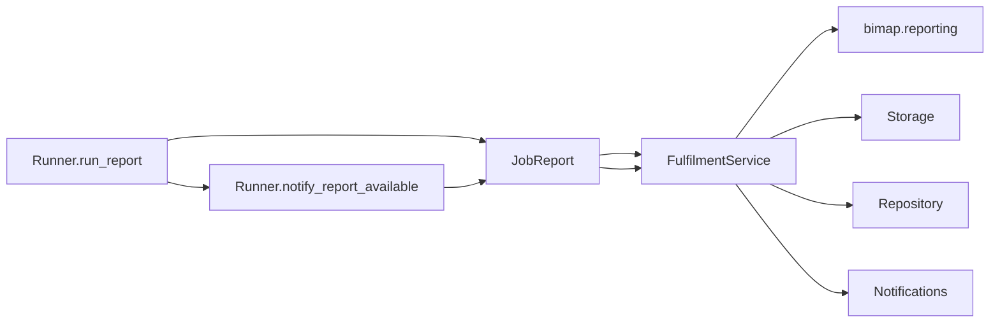
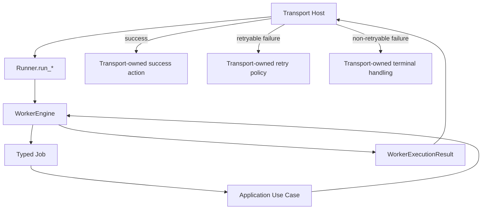
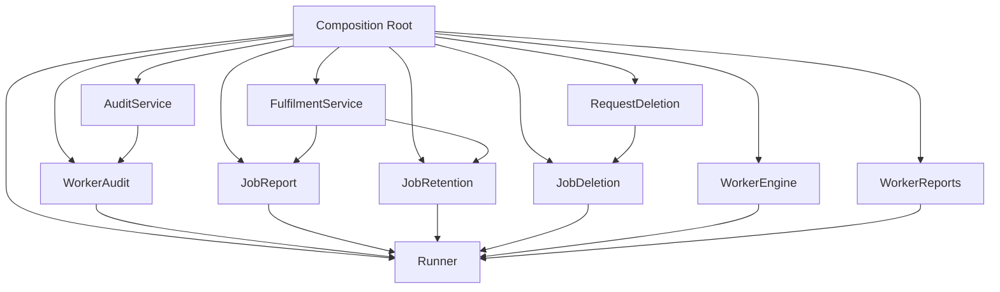

# BIMAP Workers Layer

> **Package:** `bimap.workers`  
> **Architectural role:** Outer asynchronous/scheduled execution-adapter layer for BIMAP application use cases  
> **Runtime position:** Level 6, above `bimap.app`; composed by `bootstrap.py` or another process host and independent from provider-specific queue-consumer implementations

---

## 1. Purpose

The `workers/` package adapts asynchronous or scheduled process execution into explicit BIMAP application commands and services. It is an outer execution layer: worker modules validate process-level invocation shape, call the authoritative application use case exactly once, normalize operational failures, verify returned identity/state, and expose content-safe execution metadata to the process owner.

The worker layer exists to answer questions such as:

- Which typed worker job executes an audit through `AuditService`?
- Which worker executes governed report release through `FulfilmentService`?
- How are retention checks and deletion requests delegated without inventing a second retention/deletion model?
- How are escaping application/provider failures represented consistently at the worker-process boundary?
- Which failures are marked retryable without automatically retrying them?
- How does a process host obtain a content-safe execution outcome suitable for acknowledgement/retry policy?
- How are execution durations and success/failure counts summarized without exposing customer data?
- Which responsibilities remain with the queue/provider process host rather than BIMAP's generic worker package?

The package does **not** define broker polling, queue leases, message acknowledgement, dead-letter routing, retry schedules, backoff algorithms, process supervision, distributed locks, cron infrastructure, customer report schemas, audit rules, governance thresholds, storage naming conventions, retention durations, or concrete SDK connections.

---

## 2. Architectural position

`workers/` occupies Level 6 of the canonical BIMAP dependency hierarchy.



The governing rule is:

> **Workers execute application use cases; they do not become a second application or business layer.**

---

## 3. Package structure

```text
bimap/workers/
├── __init__.py
├── README.md
│
├── engine.py
├── reports.py
├── runner.py
│
├── jobs/
│   ├── __init__.py
│   ├── audit.py
│   ├── deletion.py
│   ├── report.py
│   └── retention.py
│
└── utils/
    ├── __init__.py
    ├── workers_errors.py
    └── workers_helpers.py
```

The worker package is physically separate from `bimap.app`. Application commands/services are Level-5 dependencies consumed by the Level-6 worker adapters.

---

## 4. Dependency direction inside `workers/`



The arrows mean **"is consumed by"**.

Important reverse imports are forbidden:

```text
workers/utils/*       MUST NOT import runner.py, engine.py, reports.py, or jobs/*
workers/engine.py     MUST NOT import runner.py or concrete job modules
workers/reports.py    MUST NOT import runner.py or customer reporting builders
workers/jobs/*        MUST NOT import runner.py or bootstrap.py
workers/runner.py     MUST NOT import bootstrap.py
app/*                  MUST NOT import workers/*
domain/contracts/*    MUST NOT import workers/*
```

---

## 5. One owner per worker concern

| Concern | Authoritative owner |
|---|---|
| Worker failure vocabulary | `workers/utils/workers_errors.py` |
| Shared execution helpers and lower-error translation | `workers/utils/workers_helpers.py` |
| Stable worker job-type vocabulary | `workers/engine.py::WorkerJobType` |
| Single-invocation execution boundary and elapsed timing | `workers/engine.py::WorkerEngine` |
| Immutable process execution outcome | `workers/engine.py::WorkerExecutionResult` |
| Operational execution summary | `workers/reports.py::WorkerRunSummary` |
| Descriptive execution aggregate | `workers/reports.py::WorkerPerformanceReport` |
| Worker process orchestration facade | `workers/runner.py::Runner` |
| Audit execution adapter | `workers/jobs/audit.py::WorkerAudit` |
| Report-release execution adapter | `workers/jobs/report.py::JobReport` |
| Retention execution adapter | `workers/jobs/retention.py::JobRetention` |
| Deletion execution adapter | `workers/jobs/deletion.py::JobDeletion` |
| Customer report artifacts | `bimap.reporting` and `FulfilmentService` |
| Application business/use-case coordination | `bimap.app` |

No worker sibling should recreate an existing application service, reporting builder, queue port, or domain transition authority.

---

## 6. Worker error model

### 6.1 `utils/workers_errors.py`

Worker errors add execution-context semantics around lower-layer failures. They do not redefine application/domain errors.

The current hierarchy distinguishes:

```text
WorkerError
├── WorkerConfigurationError
├── WorkerValidationError
├── WorkerIntegrityError
└── WorkerExecutionError
    ├── WorkerDependencyError
    │   ├── WorkerDependencyUnavailableError
    │   └── WorkerDependencyTimeoutError
    ├── WorkerAuditError
    ├── WorkerReportError
    ├── WorkerRetentionError
    └── WorkerDeletionError
```

Each failure can carry:

- stable `code`;
- `component` and `operation`;
- optional field/job type/job ID;
- retryability metadata;
- bounded/redacted context;
- cause chaining without provider-message leakage.

Retryability is descriptive. An error marked retryable is **not** automatically retried by the worker package.

### 6.2 Error ownership



A process host may inspect `retryable` and `error_code` when applying transport-owned policy. The worker package does not decide acknowledgement timing, retry count, backoff, or dead-letter destination.

---

## 7. Shared worker helpers

`utils/workers_helpers.py` centralizes mechanics used throughout the worker package:

- method-start `PrettyPrinter`/logger diagnostics;
- safe lower-layer error identity extraction;
- required/optional worker text normalization;
- one-time iterable materialization with scalar/mapping traps rejected;
- dependency failure translation;
- typed result validation;
- retryability/code inspection.

The helpers do not implement audit sequencing, report generation, lifecycle transitions, deletion policy, retention durations, retry loops, or queue acknowledgement.

---

## 8. `engine.py` — process execution boundary

`WorkerEngine` executes one callback exactly once and produces a `WorkerExecutionResult`.



### 8.1 `WorkerJobType`

The job-type vocabulary contains only currently implemented worker categories:

```text
audit
report
retention
deletion
```

A report-availability notification remains an operation within the report worker rather than a new business job category.

### 8.2 `WorkerExecutionResult`

A worker execution result records:

- job type;
- operation name;
- optional stable job ID;
- success/failure state;
- monotonic elapsed duration in milliseconds;
- in-memory typed result on success;
- normalized `WorkerError` on failure.

`to_dict()` deliberately omits the successful result payload. Worker results can contain domain/application objects that require their own explicit serialization contracts. Operational metadata includes result type, error code, and retryability only.

### 8.3 Duration measurement

Elapsed duration uses `time.perf_counter_ns()`. This is appropriate for execution timing because it is monotonic and unaffected by wall-clock adjustments. The engine does not use wall-clock timestamps to infer elapsed time.

### 8.4 No automatic retry

`execute()` invokes its callback once. `execute_or_raise()` also invokes once and merely re-raises the normalized failure after execution. Neither method performs retry/backoff.

---

## 9. `reports.py` — worker operational reporting

`workers/reports.py` is intentionally distinct from `bimap.reporting`.



### 9.1 `WorkerRunSummary`

The single-run summary includes only process-safe metadata:

- job type;
- operation;
- job ID;
- succeeded;
- elapsed duration;
- result type;
- error code;
- retryable failure flag.

It contains no findings, evidence, report bytes, storage objects, provider payloads, or SLAI content.

### 9.2 `WorkerPerformanceReport`

The aggregate is descriptive and derived only from caller-supplied `WorkerExecutionResult` values. It reports:

- run count;
- success/failure counts;
- retryable failure count;
- total observed duration;
- arithmetic mean duration;
- maximum observed duration;
- per-job-type execution counts.

It does **not** infer an SLA/SLO, percentile target, anomaly threshold, utilization, throughput capacity, or future performance from the observed sample.

### 9.3 Customer report boundary

`JobReport` delegates report release to `FulfilmentService`, which consumes `bimap.reporting`. `WorkerReports` must not import `ReportBuilder` or SLAI result mappers to create an alternate customer-reporting pathway.

---

## 10. Worker job adapters

### 10.1 `jobs/audit.py`

`WorkerAudit` delegates complete audit execution to `AuditService.run_audit`.

It does not reconstruct:

- ingestion;
- normalization;
- deterministic rules;
- product audit selection;
- SLAI orchestration;
- SLAI result mapping;
- governance thresholds;
- order lifecycle transitions.

The authoritative order must already be in a state accepted by the application service.



### 10.2 `jobs/report.py`

`JobReport` delegates governed report release to `FulfilmentService.release_report`.

`FulfilmentService` remains responsible for:

- governance-aware release checks;
- deterministic report generation;
- package construction;
- storage publication;
- manifest persistence;
- packaging/delivery lifecycle transitions.

Notification is deliberately separate through `notify_available()`.



### 10.3 `jobs/retention.py`

`JobRetention` receives explicit object IDs and delegates due-time evaluation, cleanup, and supported order expiry behavior to `FulfilmentService.expire_delivery_if_due`.

A retention check before expiry is a successful no-op, not an error.

The worker does not define retention duration or schedule itself.

### 10.4 `jobs/deletion.py`

`JobDeletion` executes the already-authorized `RequestDeletion` application command. The current application model has no separate durable deletion-request aggregate, force-delete operation, pending-deletion repository API, or legal-hold model; the worker does not fabricate them.

---

## 11. `runner.py` — process orchestration facade

`Runner` is the highest object inside the worker package. It accepts optional, explicitly composed job handlers and routes typed invocations through `WorkerEngine`.

### 11.1 Partial worker composition

A deployment may configure only the jobs it serves:

```text
Audit-only process
    Runner(audit=WorkerAudit(...))

Report process
    Runner(report=JobReport(...))

Retention/deletion process
    Runner(
        retention=JobRetention(...),
        deletion=JobDeletion(...),
    )
```

Requesting an unconfigured job fails with `WorkerConfigurationError` rather than falling through to dynamic imports or arbitrary dispatch.

### 11.2 Explicit typed methods

The runner exposes:

```text
run_audit(...)
run_report(...)
notify_report_available(...)
run_retention(...)
run_deletion(...)
summarize(...)
performance_report(...)
```

A generic external `dict`/`**kwargs` worker envelope is intentionally absent. BIMAP currently defines an `AuditJob` contract, but no universal external contract for report, retention, and deletion process messages. Provider-specific hosts must validate their own transport input and call the typed runner method.

### 11.3 Runner result semantics

Each `run_*` method returns `WorkerExecutionResult` instead of hiding failures inside process-global state.



The diagram identifies ownership only; it does not prescribe a particular broker API.

---

## 12. Queue and transport boundary

The current `app/ports/queue.py` defines **submission** of an `AuditJob`. It does not define consumer-side receive/acknowledgement primitives. Consequently `bimap.workers` does not assume a specific queue framework.

A concrete deployment may place a provider-specific host around `Runner`:

```text
provider consumer / scheduler
        ↓
validate provider envelope
        ↓
resolve typed BIMAP invocation
        ↓
Runner.run_*
        ↓
WorkerExecutionResult
        ↓
provider-specific acknowledgement/retry/dead-letter action
```

Those provider actions remain outside this package until BIMAP defines an explicit consumer transport port.

---

## 13. Retry and idempotency model

The worker layer distinguishes **retryability metadata** from **retry execution**.

### 13.1 Retryability

Typical dependency timeout/unavailability failures are marked retryable. Validation/integrity/configuration failures are normally non-retryable unless a lower BIMAP error explicitly carries different metadata.

### 13.2 No hidden retries

Neither `WorkerEngine`, `Runner`, nor individual job adapters perform a generic retry loop. This avoids repeating non-idempotent effects without a transport/use-case-specific policy.

### 13.3 Idempotent inputs

Where an application use case exposes stable idempotency identities, a retry-capable process host should reuse them. Examples include queue submission, order transitions, report publication identities, retention/deletion keys, and notification idempotency keys.

The worker layer does not manufacture replacement identifiers for a retried semantic operation.

---

## 14. Logging and observability

Every public worker operation should emit a method-start diagnostic through `announce_worker_action()` or the relevant worker helper. `PrettyPrinter` provides operator-facing status while the logger carries structured metadata.

Allowed operational metadata includes stable identifiers and bounded counts such as:

- job type;
- job/order/report IDs;
- operation name;
- result type;
- success/failure state;
- duration;
- stable error code;
- retryability;
- artifact/evidence/finding counts already exposed by validated lower-layer results.

Worker logs must not include:

- raw uploaded files;
- report bytes;
- arbitrary SLAI payloads;
- full findings/evidence bodies merely for observability;
- credentials, tokens, cookies, or signatures;
- signed/presigned URLs;
- provider request/response bodies;
- unbounded arbitrary metadata.

The shared worker error/helper layer reuses BIMAP application redaction policy for diagnostic context.

---

## 15. Failure boundaries

Worker job adapters verify lower-layer results before returning them.

Examples include:

- audit result job/order identity must match the requested `AuditJob`;
- report release result must match requested order/report identity;
- retention result must belong to the requested order;
- deletion result must belong to the requested order and represent the supported expired state;
- engine outcomes must be internally consistent between success/result/error fields.

The worker layer should fail closed on identity corruption rather than logging and continuing.

---

## 16. Import policy

Allowed direction:

```text
bootstrap / process host
        ↓
workers/runner.py
        ↓
workers/engine.py + workers/reports.py + workers/jobs/*
        ↓
app/commands + app/services
        ↓
app/ports + audit_engine + reporting
        ↓
contracts
        ↓
domain
```

Forbidden shortcuts include:

```text
workers/runner.py   MUST NOT import bootstrap.py
workers/jobs/*      MUST NOT instantiate concrete infrastructure adapters
workers/jobs/*      MUST NOT duplicate domain state transition graphs
workers/jobs/*      MUST NOT implement report serializers/builders
workers/reports.py  MUST NOT become customer report generation
workers/engine.py   MUST NOT perform generic retry/backoff/acknowledgement
app/*                MUST NOT import workers/*
```

---

## 17. Composition

`bootstrap.py` or another explicit composition root is expected to create the worker graph from already-configured application dependencies.

Conceptually:



`Runner` itself does not create `AuditService`, `FulfilmentService`, storage adapters, payment adapters, repositories, or SLAI adapters.

---

## 18. Testing strategy

Worker tests should focus on execution-adapter semantics rather than retesting lower business logic.

Recommended categories are:

1. **Configuration tests** — wrong or missing handler types fail deterministically.
2. **Invocation validation tests** — typed worker jobs reject unsupported request/result values.
3. **Dependency translation tests** — application errors, timeouts, connection failures, and unexpected exceptions become appropriate worker failures.
4. **Retryability tests** — retryable metadata is preserved but no second callback invocation occurs.
5. **Execution-result invariant tests** — success/error/result states cannot contradict one another.
6. **Identity-binding tests** — job/order/report results cannot cross-bind to another request.
7. **Retention no-op tests** — a not-yet-due retention check remains successful.
8. **Operational-report tests** — aggregation reproduces supplied execution counts/durations exactly and exposes no result payload content.
9. **Runner routing tests** — each typed method calls only its configured job handler through the common engine.
10. **Transport separation tests** — runner/engine remain independent from provider-specific receive/ack APIs.

Lower application/domain/reporting/SLAI correctness should remain covered by their own package tests rather than duplicated in worker tests.

---

## 19. Non-responsibilities

`bimap.workers` must not become the owner of:

- HTTP routing;
- provider queue consumers;
- broker acknowledgement/dead-letter APIs;
- generic retry/backoff algorithms;
- order transition legality;
- payment processing semantics;
- source ingestion/normalization;
- deterministic BIM rules;
- SLAI agent selection policy beyond arguments already accepted by the application service;
- governance decision thresholds;
- report schemas/serializers/templates;
- storage naming and retention periods;
- persistence schemas;
- deletion authorization/legal-hold policy not represented by the application model;
- customer-facing execution status invented from unavailable telemetry.

The worker layer executes; authoritative business/application meaning remains below it.

---

## 20. Summary

`bimap.workers` is a thin, explicit execution-adapter layer around BIMAP application use cases. `WorkerEngine` provides one process-level execution boundary, `WorkerExecutionResult` preserves typed outcomes and normalized failure metadata, `WorkerReports` creates content-safe operational summaries, `Runner` routes explicitly composed job handlers, and `jobs/` delegates work to authoritative application commands/services. The package remains production-safe by refusing to fabricate transport contracts, retry policies, business rules, report logic, retention policy, or infrastructure behavior that belong elsewhere in the BIMAP architecture.
